---

layout: post

title: 基于深度学习的软件安全漏洞挖掘笔记

tags: [p]

author: author1

---

# **基于深度学习的软件安全漏洞挖掘笔记**

原文作者：顾绵雪 孙鸿宇 韩丹 杨粟 曹婉莹 郭祯 曹春杰 王文杰 张玉清

单位：海南大学网络空间安全学院，国家计算机网络入侵防范中心（中国科学院大学），西安电子科技大学网络与信息安全学院

## **Abstract**

目前将AI应用 于 安 全 漏 洞 挖 掘 领 域 主 要 是 利 用机器学 习、自然 语 言 处 理和 深 度 学 习，以实现软件安全漏洞的自动化和智能化研究

其中将机器学习应用于安全漏洞挖掘领域主要可以包括：

- 基于软件代码度量

  对软件的一些特征信息的量化表示，用作对软件质量的度量指标。常用的有开发者活动(developer activities)、复杂度(complexity)、代码变化(code churn)、继承深度(inheritance depth)、耦合度(coupling) 和内聚度(cohesion)等。

  这种模型通过选取软件的若干个度量指标量化程序特征来进行表示，在一定程度上能够体现程序的整体属性特征，检测速度较快。但是量化的程序特征信息与漏洞代码本身关联不强，细粒度不够，只能提供辅助性的漏洞判断，具有较高的误报率和漏报率。

- 基于代码属性

  在代码度量的基础上，针对具体的漏洞信息特征，从代码级别挖掘代码本身的特征信息。
  基于代码属性的漏洞挖掘工作主要是对Web端安全漏洞进行研究，应用ML进行漏洞挖掘，能检测出SQL注入、XSS、远程代码执行(remote code exection, RCE)、缓冲区溢出(buffer overflow)等漏洞。

- 基于代码相似性

  一般是在安全专家手工定义的特征提取之后，使用机器学习等方法计算并比较特征之间的相似度，从而判断是否属于同一类型漏洞。这种方法主要是能够检测出代码重复利用引起的漏洞问题，一定程度上提高了检测的准确率，但是主要依赖于手工定义，且只能发现已知的漏洞信息，比较局限。

- 基于代码模式

  可以理解为基于代码语法语义的挖掘模型。具体又可以分为基于词法分析的和基于语法分析的。

  - 词法：主要采用文本挖掘技术对源码的标识符、函数名、运算符等进行标记，对提取到的有效信息进行抽象表示(word embedding等)，得到供机器学习模型训练的特征集合。
  - 语法：对源码的数据流和数据依赖进行更深层次的特征表示，主要依据抽象语法树、数据流图、控制流图、程序依赖图等语法语义结构提取特征集合。

## **基于深度学习的漏洞挖掘框架**

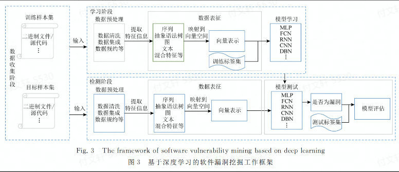

### **数据收集阶段**

目前大部分数据来源为：NVD、VCE、CNNVD和Github等主流开源网站，且以二进制和源代码为主要分析对象

### **学习阶段**

该阶段主要分为3个部分

1. 数据预处理 一般来说可以使用数据清洗、数据集成和数据规约等方法进行预处理

1. 数据表征 需要将数据集解析为合适的表示结构用于训练，目前常用的有：序列、抽象语法树、图、文本和混合特征等表征形式

1. 模型学习 将表征形式映射到向量空间，从而作为输入。然后就是炼丹

### **检测阶段**

运用模型进行检测，同样也需要对目标进行表征、向量化

## **数据表征技术**

代码表征技术大致可以分为5类：

1. 基于序列的表征方式 对源代码或者对二进制文件进行**词法分析**，提取与字符流相关的标识符、函数名和运算符等关键特征信息，同时兼顾执行路径、函数调用序列和语句调用序列等信息。

1. 基于抽象语法树的表征方式 从中提取树节点相关的语法信息

1. 基于图的表征方式 通过使用图数据结构对源代码的词法和语法属性进行表示，能够更有效的抽象出深层次代码特征信息

1. 基于文本的表征方式 直接抽特征词进行量化

1. 基于混合的表征方式

1. 融合多种表征方式

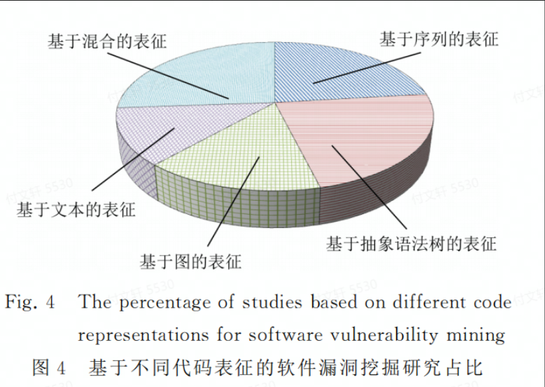

选择合适的向量编码模型将抽取的特征转换为向量表示在一定程度上将直接影响模型计算的性能。常用的编码有：One-hot，Word2vec和Sent2vec等。

### 模型学习技术

目前应用于漏洞挖掘的深度学习模型有：MLP、CNN、RNN、LSTM、门控循环单元（GRU）、GNN、深度置信网络（DBN）以及其他神经网络模型，如自编码器（auto encoder, AE）、GAN等。

- MLP在非线性数据上表现良好，但是该模型需要大量的训练数据实现拟合，且可解释性不强

- CNN可以用来学习结构化的空间数据，但是在池化过程中会丢失大量有价值的信息，忽略局部与整体之间的关联性

- RNN可以用来处理时序数据，来学习数据的上下文依赖关系；但是在处理较长序列的时候会出现梯度消失的问题。LSTM是RNN的一个变体，在RNN的基础上增加了记忆单元和遗忘门，使得其能够捕捉序列的长期依赖关系。GRU则是将LSTM的遗忘门、输入门和输出门合并转化成更新们和重置门，以较少的门函数将重要特征进行保存

- GNN可以用来学习图中节点、边或者子图的低维向量空间表示，以获得更加深层的程序数据表示。

- DBN可以对程序数据在不同概念的粒度上进行抽象，在自动化训练过程中通过调节自身的权重值持久化数据之间的依赖关系，具有更好的性能

- AE是一种无监督的学习方式，对高维输入信息进行降维、表征学习

- GAN包含一个生成器和一个判别器，分别用于自动学习真实的数据分布和正确判别输入数据是来自真实数据还是生成器

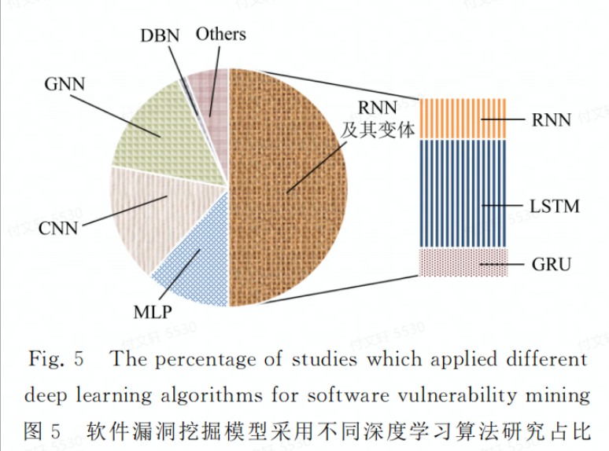

在对现有的文章分析之后发现，**大部分工作主要从数据表征方式的改进和学习模型的优化2个方面提出新的漏洞挖掘方法，且偏向于数据表征方式的改进，这也是文本侧重于以深度特征表示进行研究综述的依据**

## 深度特征表征方式

目前常见的代码表征方式有：序列表征、AST表征、图表征、文本表征和混合表征。

### 序列表征

对源代码或者二进制文件进行词法分析，提取与字符流相关的标识符、函数名和运算符等关键特征信息，同时还包含执行路径、函数调用序列和语句调用序列等特征信息。

这种表示方法的模型是通过利用DNN自动化提取序列特征信息进行漏洞挖掘，有两篇文献是从函数调用序列出发实现的漏洞挖掘。，其中有一篇文献是是首次将深度学习应用于序列特征提取，从库/API函数调用序列出发，采用BLSTM构建VulDeePecker漏洞检测系统。基于启发式的方法将程序源代码转化为"code gadget"代码集合，使其产生一组语义联系但不一定连续的多行代码（检测出了4种未在NVD中的漏洞，具有一定时效性），但是这个用例漏洞类型较少，误报率较大，只能给出一段代码种是否包含漏洞信息，无法精确提供与漏洞相关的位置信息。

但是在实际漏洞应用场景中，由于对全局特征和局部特征的学习偏差，准确获取漏洞特征信息不是易事。有两篇文献针对特征学习偏差问题，采用底层虚拟机中建技术表示（LLVMIR）和混合神经网络对源代码关键序列结构信息进行表征，用于自动化漏洞检测。该表征方法能够兼顾词法分析并从细粒度上进行漏洞挖掘，能精确识别出漏洞的具体位置。通过对比不同的单深度学习模型方法，发现**基于混合神经网络的漏洞挖掘模型具有较好的性能** 

为了解决二进制软件漏洞检测中高误报率和数据不平衡问题，有一篇文献结合内核方法和双向循环神经网络（BRNN）构建深度代价敏感内核机模型（DCKM），用于处理机器指令集序列。该研究将多种数据集进行切分，分别与6种开源软件进行对比。实验结果表明结合深度学习的代价敏感内核机模型能有效解决样本之间数据不平衡问题，将低误报率。并且本文发现该工作在**多源数据集漏洞收集方面能够对数据自动化标注**有一定借鉴意义。

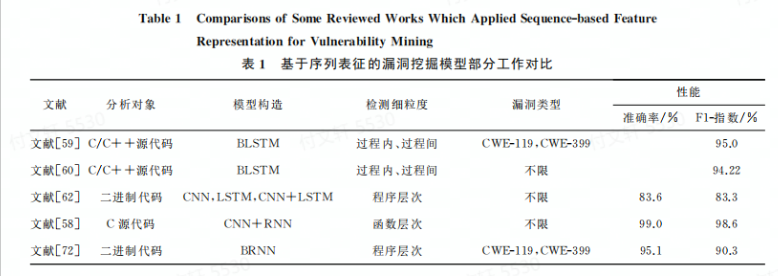

（[F1指数](https://blog.csdn.net/zjn295771349/article/details/84961596)）

**讨论1.** 对C/C++ + 源代码以及二进制代码中存在的漏洞挖掘是当前的研究热点。且相比于单模型来说，混合模型学习序列漏洞特征信息具有更好的漏洞检测能力。从粒度上来看，由于没有规范统一的漏洞数据集，不同漏洞挖掘工作架构的数据集在一定程度上对检测细粒度产生了不同的影响。

基于序列的能直接对代码进行词法分析，并且对字符流相关的关键特征信息、执行路径和调用序列等信息进行统计得到序列表征，然后映射到向量空间形成输入。同时作者发现：

1. 利用DNN学习得到的序列表征与漏洞特征的关联性较强，具有良好的漏洞检测能力；

1. 相较于单模型，混合模型学到的序列特征信息更加丰富，检测能力也相对较强；

1. 漏洞挖掘过程中，提取序列特征需要大量训练数据，再进行向量化输入到模型中，检测速度一般较慢。

### 抽象语法树

程序编译过程中对源代码抽象语法结构的一种树状表现形式，其中每个树节点表示实际代码的一种语法结构信息。基于抽象语法树尿症方式的漏洞挖掘模型通常是通过使用Clang，ANTLR和Lex等开源软件将程序源代码文件生成AST ---> 对AST节点进行遍历，转化成数据流结构 ---> 提取层次化特征信息

有研究结合双向门控循环单元(BGRU)提出了一种基于AST表征的具有可解释性的细粒度挖掘模型。该模型区分不同行和不同语法元素对于漏洞信息的重要性，对漏洞AST中节点关键信息进行标记，使得对漏洞的具体位置进行准确定位，达到细粒度的漏洞挖掘。然而：生成AST的时间很长，并且容易出现AST语义爆炸问题，难以应用到规模较大的软件系统，具有一定的局限性。

也有文献尝试缩减生成的AST规模，提出了一种新型切割AST神经网络模型ASTNN，用来捕捉词法和语义信息。该模型的想法是在语句级别上，将一个代码片段的AST切割成多个小的语句树，采用BGRU对生成的代码片段进行训练。这个研究有不错的实验性能，但是只能用于特等的代码克隆实验漏洞检测，无法实现多类型漏洞检测以及跨项目漏洞检测任务。

> WPVP：项目内漏洞预测
>
> CPVP：跨项目漏洞预测

经过调研发现，现有基于AST表征的漏洞挖掘研究工作中针对跨项目漏洞研究在文献数量上较少（也就是在一个项目上构造漏洞挖掘模型，从而实现在另一个项目上进行漏洞挖掘），在实际开发场景中，由于AST规模较大和容易出现语义爆炸等问题，尝尝导致模型的性能不佳。后续有实验发现结合DBN对AST的语法语义信息进行特征降维，能有效增强CPVP的能力。另有文献将迁移学习应用于CPVP漏洞挖掘，发现即使在小数量的数据标签项目中，也能取得不戳的检测效果。

为了能在CPVP中实现细粒度的漏洞挖掘，有研究提出了基于注意力机制的双向LSTM模型（attention-based bidierctional long short-term memory network, ABLSTM），用于漏洞特征提取，取得了较好的检测效果，但是在提取词法语义的特征模型中没有太大的变化。（因为本篇文章推测基于AST表征的漏洞挖掘模型在一定程度上虽然较好的保留了代码的语法语义特征，但在进行漏洞特征提取时效果有限）

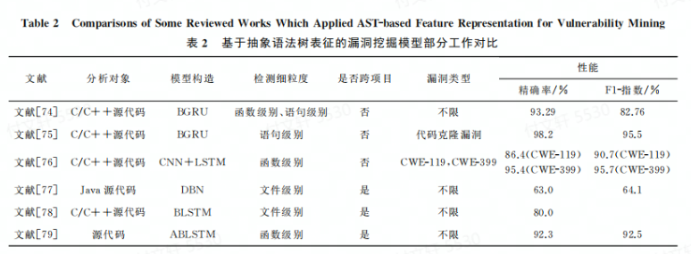

**讨论2.** 作者发现基于AST的挖掘模型：

1. 从分析对象来看主要是C/C++和Java源码为主，其他的编程语言相对较少；

1. 从模型构造方面，同样是混合>单一模型；

1. 从检测细粒度方面，粒度越细，模型的挖掘性能越高，即语句>函数>文件级别；

1. 从是否能跨项目方面，AST明显优于序列；

1. 从漏洞类型方面，AST不仅能实现某种特定类型，也能实现多种漏洞类型的挖掘。

通过分析发现，降维技术和迁移学习能在CPVP中取得不错的效果。虽然AST表征能够相对完整保留源码的词法和语义语法信息，检测能力相对较优，但是由于AST规模较大，在生成和提取函数节点过程中会花费较长的时间成本，检测速度也相对较慢。

### 图

通过图的方式对源代码的词法和语义属性进行表示，能够更加有效地抽象出深层次的代码特征信息。目前常用的图结构有：

- DFG，是一种结构化系统分析方法，以图形方式表示源代码在系统内部的逻辑流向

- CFG，用来描述代码语句的执行顺序，以及程序运行过程中遍历到的所有执行路径

- PDG，对源代码进行标记的有向多重图，能反映程序的控制依赖和数据依赖关系

- 数据依赖图（DDG），描述数据之间的相互制约关系，主要分为函数依赖和连接依赖关系

- 代码属性图（CPG），CFG和DDG的结合 

- ……

基于图表征的挖掘模型主要从不同程序的源代码或者二进制文件中进行安全漏洞挖掘，有从语句层次出发的，有采用静态代码属性从CFG和DDG提取源代码中与漏洞特征相关的信息，实现Web中SQLI和XSS漏洞挖掘。实验发现MLP的实验结果要比ML的要好很多，但是图的生成过程会引入不必要的重复节点问题（感觉这个的话，，，生成的时候重复节点能不能用状态机之类的，重复利用节点），降低了模型的有效性。

有的研究在数据预处理阶段将数据依赖和控制依赖关系通过严格的去重步骤，移除了重复编译的特征向量并生成系统依赖图（SDG），输入到CNN中进行学习得到图表征。SDG由去重后的最小中间代码表示生成而得，发现**具有中间表示学习阶段的方法具有更好的性能** 。

有研究中实现了单个函数中语句级别的漏洞检测，但是无法进行多个函数比对。为了同时实现多个函数比对和在语句级别上的漏洞检测，有研究将深度学习与程序切片技术相结合，提出了一种面向二进制代码漏洞检测的深度学习系统BVDetector。步骤为：对二进制程序的数据流和控制流分析 ---> 基于CFG提取库/API函数调用 ---> 基于PDG对多个库/API函数调用生成各自对应的程序切片 ---> 采用BGRU实现语句级别的漏洞挖掘。

以上这些都是从语句级别出发构建不同的深度学习模型用于漏洞挖掘，但是表现出来的性能有所不佳，表明图表征方式的优势没有完全挖掘出来，应该构建适合图语法语义的模型，实现挖掘性能的提升。

也有不少是采用GNN的方式从代码块级别和函数级别实现了漏洞挖掘，均取得了不错的效果。有从代码块级别预测每个代码块中含有的变量名是否被正确使用的。

有文献首次将深度学习技术和漏洞外推概念相结合，利用PDG提取已知漏洞函数级别的控制依赖和数据依赖关系，用GNN进行外推，发现了一些未公布的漏洞信息。但是这对研究人员要求有点高，需要构建合适的模型用于学习代码特征；同时漏洞外推只能针对某种特定的漏洞进行挖掘，可扩展性不强。

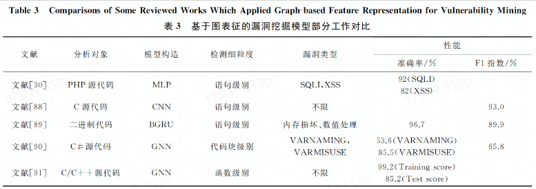

**讨论3.** 研究从不同程度上构建了基于图表征的漏洞挖掘模型

- 从分析对象而言，图可以实现多种编程语言以及二进制文件的漏洞挖掘

- 从检测细粒度而言，以基本快属性为检测细粒度的检测效果要比函数级和语句级别效果要差一些

- 从漏洞类型来看，图的适用性更广泛一些

### 文本表征

目前，基于文本表征方式的漏洞挖掘模型通常使用**分词**和**词频统计**等方法对源码进行表征，以提取有效的源代码特征信息。

有文献提出了构建程序向量化表示的编码标准，利用词频统计的方法对Java源文件的漏洞模式进行表征，采用单深层全卷积神经网络（FCN）对特征向量进行学习和训练。实验结果表明，深度学习模型能够获得比“浅层“学习模型更好的挖掘性能。*事实上，仅根据词法分析会忽略语义的上下文关系，只是对源码进行了粗糙的提取，限制了性能* 

有实验对比了不同深度学习模型在同一数据集上的表现效果，分别采用CNN和RNN进行漏洞特征提取，从函数级数据出发，设计了C/C++词法分析器归一化标识符信息，其实验结果发现在同一数据集上CNN>RNN。

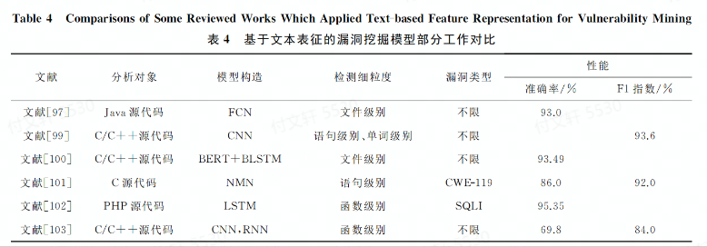

**讨论4.** 基于文本表征的相较于之前几种表征方式来看，更能抽象出隐藏在代码中的语法语义信息

- 从分析对象方面，文本表征能采用不同类型的网络结构，从各种输入数据中提取抽象特征

- 从模型方面，FCN可以拟合高度非线性和抽象的模式；CNN可以学习结构化的空间数据；RNN和其变体能捕获数据的长期依赖关系，对于理解多种类型漏洞的语义至关重要；最新研究中使用NMN来存储具有长期依赖关系的代码文本，取得了不错的效果。

从文献数量来看，目前将文本挖掘和深度学习集合的方法相对较少。针对不同的对象，如何构建合适的深度网络模型提取上下文依赖关系和设计统一公开的数据集方面仍然是一个值得研究的方向。

### 混合表征

即结合以上表征方式中的至少两种，相较于的那个表征方式，混合具有更好的性能。

有研究使用AST和图结合提取漏洞特征。从函数级数据出发，采用过一种复合流动挖掘模型，以AST为基础骨架，增加CFG和DFG用于追踪控制流和数据流的依赖关系，采用GNN对图表征进行建模。还有文献提出基于语义、语法和向量表示的漏洞挖掘框架SySeVR，侧重于抽象出与过程间与过程内漏洞相关的语法和语义信息的程序表示。

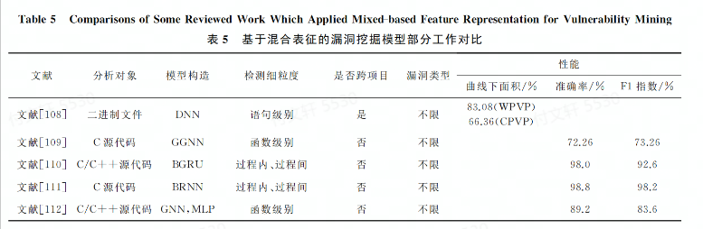

发展历程

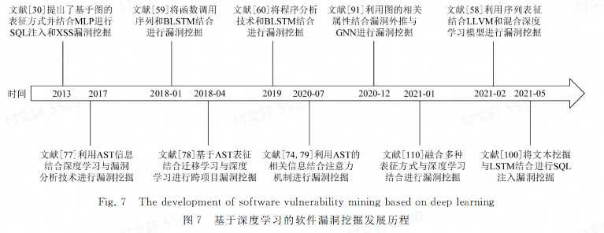

## 实际应用场景中的漏洞挖掘模型

### 物联网中的漏洞挖掘模型

> 本文中主要侧重于物联网中基于第三方库/API中存在的安全漏洞，采用**相似度检测方法** 或者**二进制关联算法** 实现跨平台二进制代码安全漏洞检进行对比和分析 

文献[124-126]以基本快为检测细粒度，其中文献[124]发现用图作为表征时，用GNN增强了漏洞挖掘效果，实验表明该方法能用于不同场景，但是依赖于手工提取漏洞特征，检测速度相对较慢且准确率较低。文献[125-126]将CFG和DFG结合，形成标记语义流图（labeled semantic flow graph, LSFG），并使用深度学习方法实现跨平台二进制相似性漏洞搜索工具，体现出较好的函数语义和搜索精度。但是仅以代码块为检测细粒度，没有考虑函数之间的依赖关系，降低了模型的检测性能。

文献[127]是从函数级出发，兼顾了函数间的依赖关系。该文献认为Gemini手工提取和压缩特征的过程会损失语义信息，发现在不同平台编译出的二进制代码的控制流图节点会非常相似，采用BERT和CNN提取语义信息，取得了较好的效果。但是检测细粒度上还是以代码块和函数为主。为了更细粒度挖掘，文献[129]分别从函数过程内核过程间进行特征提取，提出了新的检测方案，并采用CNN实现跨平台的漏洞挖掘，取得了不错的效果。

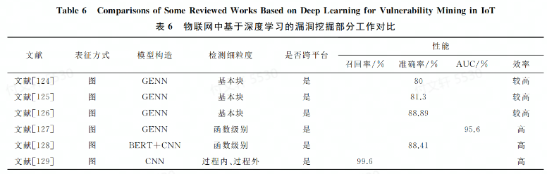

### 其他领域

文献[136]提出了一个轻量级的深度学习模型检测系统VDiscover，具有良好的性能。

文献[137]提出了基于深度学习的通用模糊测试框架SmartSeed，用于生成有价值的文件作为模糊测试工具的测试用例。在实际使用中发现了16个新的安全漏洞，表明该方法能有有效的提升模糊测试触发漏洞的能力。

文献[138]采用LSTM深度学习模型挖掘PDF文件对象的复杂结构，通过引入畸形数据对原样本域进行随机扰动，从而执行错误处理代码

## 未来研究展望

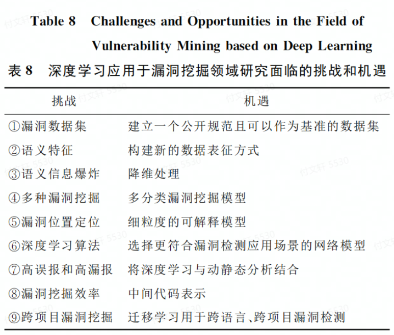