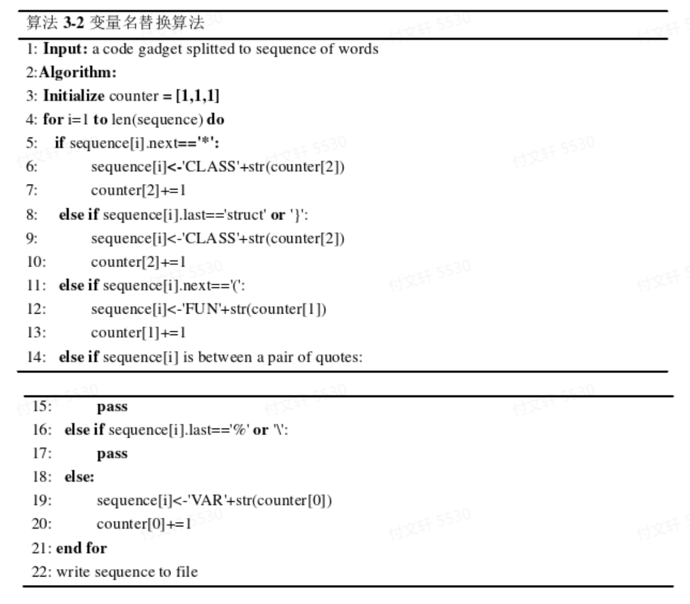
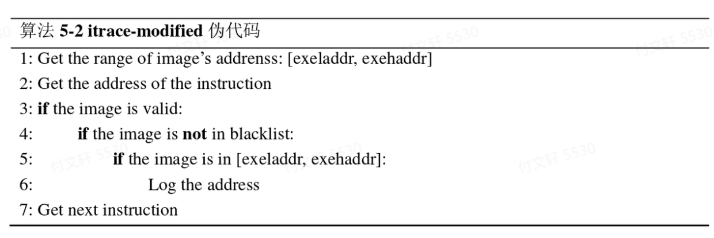

# 基于人工智能的漏洞挖掘笔记

原文作者：夏之阳；上海交通大学硕士学位论文

时间：2019

几个常用的数据库**NVD，Exploit-Database，Bugtraq，OSVDB，SARD，CVE，CWE，CVSS** 

SCAP是国际上广泛使用的一套信息安全评估标准体系

## 研究现状

### 模糊测试

目前最常用的是黑盒测试方法，原理就是构造大量的特殊构造或者随机输入，监视运行过程中的异常，从而发现漏洞（这个模式只是半自动）。

近年来模糊测试的目标都是**提高测试过程中的覆盖率** ，使得能够进行更完整的检测。目前比较成熟的基于覆盖率的模糊测试工具有American Fuzzy Lop(AFL，对边进行哈希编码，计算边覆盖率)、LibFuzzer（通过Clang计算基本快覆盖率）、honggfuzz（通过Clang计算基本快覆盖率）、VUzzer（通过二进制插桩工具Pin跟踪基本块覆盖率）、CollAFL（优化AFL中的hash碰撞问题）等。谷歌则将AFL、LibFuzzer和honggfuzz三个工具结合在一起，推出了开源测试工具OSSFuzz。

另一个研究方向是**定向模糊测试** ，但这种方式不是黑盒，需要对代码结构有一定了解，因此是灰盒测试。AFLGo是一种定向模糊测试工具。*作者提出：未来开源将定向模糊测试和文本的工作相结合* 

### 补丁对比

> 利用已知漏洞的代码进行比较，发现漏洞 主要是使用的一个时间差：补丁刚发布，下游产品可能不会及时打补丁。攻击者通过对比补丁前后代码的区别来找到漏洞位置，进一步分析、利用。

该技术历经多次改进，大体可以分为三个阶段：

1. 基于文本比对 比较常用的算法是最长公共子序列算法

1. 基于图结构比对 建立抽象结构图，将程序转换成有向图，从而转化成图同构问题。Flake等人提出基于控制流图结构比对方法，侧重于可执行文件的结构化信息及其变化，并用启发式算法比对控制流图，判定软件的改动位置；Jang等人在此基础上加入软件胎记的概念，进一步增强图同构的适应能力。 缺点：会受到编译器优化的影响，每个编译器的优化方案各不相同，可能会产生误报。

1. 基于结构化的比对 重视可执行文件的逻辑结构，如BinDiff提出使用函数指纹进行补丁对比分析。

### 基于源代码的漏洞分析

通常不需要对源码进行编译，而是通过编译原理的方法进行词法分析、语法分析、语义分析，进一步结合控制流信息、数据流信息来构建代码模型，进而分析是否存在漏洞。

基于源码分析的优缺点

- 优点：不需要复杂的编译环境，效率高，且能完整地分析代码程序，解决了动态检测的覆盖率问题。

- 缺点：源码难获得，限制了使用环境；静态分析无法获得准确的程序运行信息，存在较多误报情况（但是可以给后续工作提供导向）。

针对不同语言有不同的代码分析工具，如Flawfinder检测的是C/C++（软件中内置漏洞的特征库，进行特征匹配，但是误报率比较高）；Pixy检测的是PHP（基于敏感流分析检测脆弱点，实现了对于SQL注入、XSS等PHP常见漏洞的检测）。工业界主要使用的是Coverity、Checkmarx等，这些工具依据数据流分析，且支持多种语言检测。

### 基于代码特征

随着人工智能的兴起而出现的一种新颖的分析方式，整体想法就是训练代码 --> 从代码中提取除某些特征 --> 交给模型去训练学习。其中提取特的方式主要源于传统的漏洞挖掘方法：

- Grieco等人将动静态特征和机器学习结合，开发VIDSCOVER工具；为了实现批量化操作，放弃传统的控制流图，直接从汇编代码体特征，用随机森林、逻辑回归和多层感知器等方式分类判断

- Lin等人提出抽象语法树的函数级漏洞检测方案，将抽象语法树的文本和随机森林分类算法结合提高准确率

- Xu等人提出基于神经网络的图嵌入算法来判断二进制代码的相似性，将代码转换成ACFG，并用Structure2vec将ACFG转化成向量，最终有孪生神经网络判断相似性

- Li等人提出基于深度学习的检测模型VulDeePecker，将代码基于敏感函数切片后形成短小的代码片段，运用双向递归神经网络模型对代码片段进行分类判断*（其中敏感函数/敏感代码的概念是由于漏洞的产生通常和某些高危的函数有关，例如C中的memcpy等，因此这些函数相关的代码需要特别重视）* 

- Bottinger等人提出将模糊测试视为一个马尔科夫过程，用强化学习的方式提高模糊测试效率，通过Q-Learning算法来学习如何选择高回报的变仪策略。

## 作者工作

工作流程：收集样本形成样本库 ---> 切除无关代码、提取特征（有三种方式提特征：基于敏感函数切代码片段、转换成中间代码形式（基于LLVM）提取控制流图、用Pin中改造的itrace模块提取指令序列）---> 用structure2vec、word2vec等方式转换成向量 ---> 用深度学习算法进行学习、判断。

其中静态文本检测有已有研究是针对代码片段运用双向LSTM模型进行训练，提取语义特征进行漏洞判断（作者是借鉴补丁对比技术，提出基于双向LSTM的相似性判断模型）

## 基于源代码的敏感函数检测

### 模型概述

训练阶段：根据敏感函数进行切片 ---> 对切片后的代码片段进行数据清洗，统一格式并进行变量名替换 ---> 分词处理得到单词，并用word2vec进行训练，转化为向量 ---> 将向量送入双向LSTM进行学习、特征提取 ---> 将特征向量送到分类网络，判断是否为漏洞。

检测和训练过程相同

改进版：相似性模型将待测代码和已知含有漏洞的代码进行相似性判断，通过判断待测代码的特征是否和含有漏洞的代码具有相似特征来检测漏洞。由于已知样本是否含有漏洞，将其分为正负样本（有监督的训练）。而检测阶段是将待测样本和模板作为一组输入对，通过双向LSTM模型提取特征后，判断特征向量是否相似。

### 数据预处理

主要包括有：敏感函数分析、代码切片、数据清洗、数据标记等步骤。

#### 敏感函数提取

主要依据人工经验和工具检测，例如针对缓冲区错误漏洞（CWE-119），这类错误通常和操作内存的函数有关，如memcpy、memset、memmove等。

*以上函数列表由商业工具Checkmarx扫描得到，其中\*号表示通配符*

#### 代码切片

程序切片可以直接针对**程序源代码** 或者**编译后的二进制代码** 进行分析。所谓的程序代码无非就是计算机指令按照一定顺序组合序列，这个序列中可以提取出两个信息：**控制流信息** ，**数据流信息**。这两类信息归根结底就是**不同语句执行顺序关系**以及**程序中不同语句对同一变量的定义-引用关系**，再本质的点说就是存在有依赖关系（控制依赖，数据依赖）。

##### 控制依赖

当a与b满足以下两个条件时，称b控制依赖于a

1. 从a到b有一条可执行路径，对于该路径上所有除a,b之外的所有节点，节点b都是其后必经节点。

1. b不是a的后必经节点

由此可以定义控制依赖图Gc = (V,C)，其中V是所有语句的集合，C是控制依赖图边的集合，如果b控制依赖于a，则将a到b的边加入到边集合中。

##### 数据依赖

当a与b满足以下三个条件时，称b控制依赖于a

1. a对变量v进行了定义

1. b引用v

1. a到b有一条可执行路径，该路径上不存在其他语句对v的定义

Gd = (V,D)，其中V是语句集合，D是数据依赖图的边集合，如果存在b基于某变量数据依赖于a，则将a到b的边加入到边集合中。

##### 基于图可达性的程序切片算法

e.g. 

该算法的想法是将切片转化成图的遍历问题，定位到漏洞代码修改前后的语句，假设为n，算法的输入为漏洞代码的程序依赖图以及节点n，输出为切片。伪代码如下：

切片实例：

在源代码中，敏感函数为strcpy，有两个参数buf和str。由于strcpy是向后函数调用，因此对于他的每个参数都将形成后向切片。对于buf，由4,5,9组成，它们属于test函数；对于str，该切片由13,15,18,19,2,9组成，其中str属于main函数。最终两个切片组合在一起形成strcpy的切片。

#### 数据清洗

即统一格式、删除注释、变量名替换等，其中变量名替换的规则为：

1. 自定义变量名替换为VAR1,VAR2等

1. 自定义函数（非系统函数）命名为FUN1,FUN2等

1. 自定义类名替换为CLASS1,CLASS2等

伪代码如下：

#### 数据标记

正样本：包含漏洞的代码，记为1

负样本：不包含漏洞的代码，记为0

### 词向量填充

代码进行分词，形成词典 ---> 代码中的词替换为字典索引编号，形成编号序列（同时需要将长度保持一致，不足的补0，多的截断） ---> 编号片段送入word2vec模型训练形成词向量。

### 深度学习模型设计

#### 双向LSTM直接分类模型

- Embedding层将输入的代码填充成词向量

- 两层双向LSTM提取特征

- Attention层进一步学习全局特征

- 全连接层作为分类器

- 激活函数sigmoid规约到最终输出结果（1是漏洞代码，0不是漏洞代码）

该模型在训练和测试阶段结构相同

#### 双向LSTM的相似性判别模型

两个双向LSTM直接拼接形成，Attention层的输出拼接起来作为全连接层的输入，全连接层作为一个分类器，经过激活函数sigmoid判断最后的输出是0或1，即判断是否相似。

该模型在训练阶段结构不变，输入的数据是标记好的代码组合；测试时，为待测代码和漏洞模板的组合（设置0.1的dropout来防止过拟合，并在每层加入Batch Normalization加速运算）。

需要注意的是：检测时无法通过先验知识对代码进行标注，因此在检测时需要将待测代码与已知漏洞的代码进行匹配。之所以选择多个漏洞模板，是因为即使相同类型的漏洞，也有多种表现形式，如果只使用个别漏洞样本匹配容易产生误报，因此需要一定数量的典型漏洞样本进行对比。

检测方式：从有漏洞的代码样本中找出n个典型的漏洞作为漏洞模板，记为A1，……，An；待检测样本为B；相似性函数为S。如果相似：S(X1,X2)=1，反之为0。最后将n个结果求和，如果结果超过某个阈值则认为大概率是漏洞，反之则大概率不是漏洞。

## 基于中间语言的控制流图检测

基于源代码的方式虽然快，但是没有深入到语义层面，只是停留在文本的表面。中间语言的生成还处于编译阶段，未涉及到动态运行程序，因此还是属于静态检测的范畴。

本文通过LLVM框架生成中间语言LLVM IR ---> 在此基础上生成控制流图 ---> 运用structure2vec将结构图转化成向量 ---> 提取特征后分类。

### 模型概述

- 中间语言的生成基于Clang进行编译即可，指令为`clang -emit-llvm <input_file> -S -o <output_file>`，输出文件的后缀名一般为`.ll` 

- 控制流图的生成需要基于中间语言，指令为`opt -dot-cfg <input_file>`，其中input_file即中间代码`.ll`文件，生成的文件为`.dot`格式。运用xdot工具可以将dot可视化，指令为`xdot <input_file>`

- 图向量转化：利用structure2vec算法进行转化（算法具体内容这里就没有记录了，有兴趣的话可以去阅读原文）。

- 深度学习模型部分
  - 第一部分是基于中间语言的静态文本特征提取。模型主体依旧是两层双向LSTM网络，并连接一个Attention层，层与层之间加入Batch Normalization加速运算，并设置0.1的Dropout防止过拟合。由于中间语言的词汇量比较小，因此词向量填充长度设置为64，双向LSTM的长度设置为64.
  - 第二部分是控制流图特征提取。先用struc2vec将向量中的节点转换成向量，填充向量的长度设置为128；再用structure2vec将节点向量整合成描述整体结构的向量，得到的结构向量长度依旧是128.
  - 将两个128连成256维的特征向量，再送入全连接层进行分类，最后经过sigmoid得到0或1的输出。*（这里有个小问题，为什么是直接连接，为什么不能有其他方式，比如再通过学习进行结合会不会好一点？）* 

## 基于动态插桩的指令序列检测

本文主要还针对C、C++代码的漏洞研究，因此使用GCC工具将所有代码编译成可执行程序，随后用Pin工具提取执行过程中的指令序列。由于Pin工具会把系统库的执行指令也提取出来，所以作者对Pin的itrace模块进行修改，只记录程序地址段中的指令。

### 基于Pin的路径提取

itrace是Pin中的一个插件，可以记录执行指令的EIP，其工作流程伪代码如下：

步骤为：

1. 对于正在执行的指令，得到其地址；

1. 判断根据该地址能否判断image合法，合法转3，不合法转4；

1. 记录该指令的地址，转4；

1. 执行下一条指令，转1；

其中image可以理解为指令所属的地址空间，通过判断image是否合法就即可以判断出指令是否是当前执行的程序的指令。改造后（不记录系统指令）的伪代码如下：

改造以后itrace的工作流程为：

1. 加载时获取image的地址空间；

1. 对正在执行的指令得到其指令地址；

1. 判断根据该地址能否判断image合法，合法转4，不合法转7；

1. 判断image是否在blacklist中，不在转5，在转7；

1. 判断指令的地址范围是否合法，合法转6，不合法转7；

1. 记录下该指令的字节码（用十六进制的形式表示），转7；

1. 获取下一条指令，转1.

### 词向量填充

将实验数据集分为正负样本集，用改造后的itrace插件进行路径提取，得到用十六进制表示的汇编指令序列字节码 ---> 将指令地址以两个十六位进制数为单位进行分割，每个可执行文件提取的地址可以转化成由n组两位十六进制数组成的列表。由于分割后每一组对应一个十进制数（0~255），因此一共只有256个“词”，为了进一步加速，使用word2vec填充每个“两位十六进制”到64维。

### 深度学习模型

这一部分由于是对Pin提取到的汇编指令的字节码进行检测，该序列是顺序执行的，只有前后关系而没有反向的关系，所以只使用单向LSTM即可。设置0.1的Dropout防止过拟合，优化方法使用Adam，损失函数使用binary_crossentropy。

## 实验结果与讨论

### 基于源代码

#### 直接分类模型

经过20个Epoch的训练之后，准确率达到89.6%，召回率为82.0%，误报率高达18.9%。监测模型整体更偏向于将样本判定为正样本（即模型更愿意将样本当成漏洞样本）。

#### 相似性检测模型

由于这种检测方式是需要和模板进行匹配，所以单看准确率说服力是不够的，还需要看模板选择。

从图中可以看出，模板数量在40以后逐渐趋于平稳，在80-100基本稳定，这个区间都是比较合理的。

当模板数量确定之后，再讨论阈值的选择。

当阈值设置过低时容易产生很多误报，而当阈值设置过高时会导致很多漏报。综合上述曲线图，阈值选择为40-50是比较合适的选择。

### 基于中间语言的控制流图检测

### 基于动态插桩

- 准确率：95.8%

- 召回率：96.1%

- 误报率：1.8%

### Attention层加入的效果

从实验结果中可以看出，前三种加入了Attention之后都有一定的提升，但是对于指令序列来说没有正向帮助。

### 实验结果讨论

从实验结果来看，动态>动态，指令序列>源代码，符合先验知识。

动态检测更加贴近实际执行情况，能更加准确地把握执行时的特征，在各个方面表现都更加优秀。但是动态检测的问题在于其效率较低，比较耗时，且检测时需要一定的运行环境进行支撑。

中间代码由于形式简洁、混淆信息较少，其准确率较高，但是召回率却是最低的（从整体来看，中间代码的形式更加倾向于认为代码无漏洞）；源代码的误报率最高，但是同时召回率也高，整体来看更加倾向于认为代码包含漏洞。运用相似性之后能有效降低误报率，但是模板选择上还没有定论，有很大改进空间（如本文为随机选择，如果能加入人工的方式或者其他经验选择应当会更适合）。