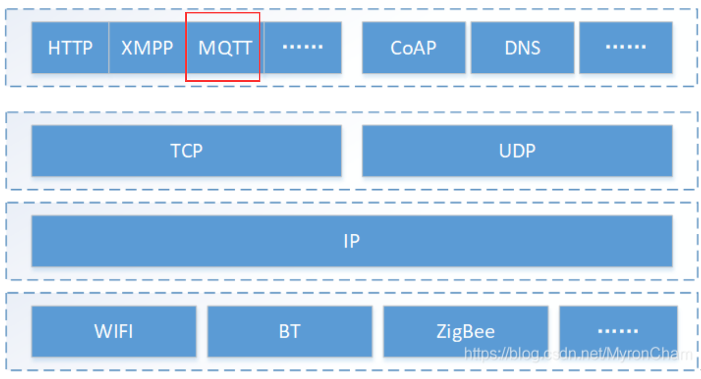
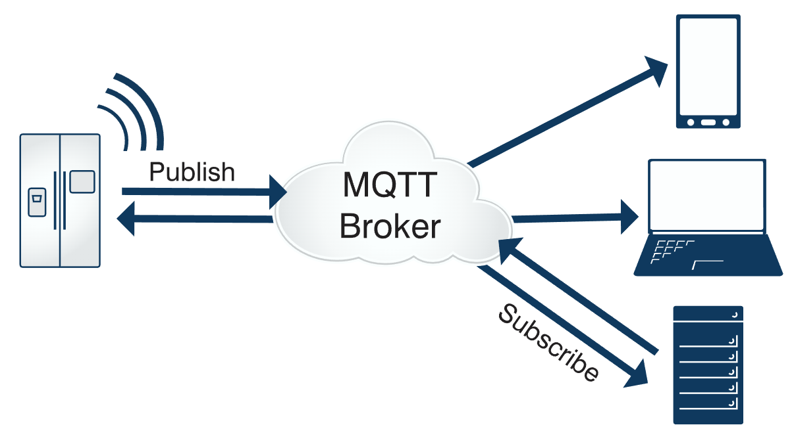
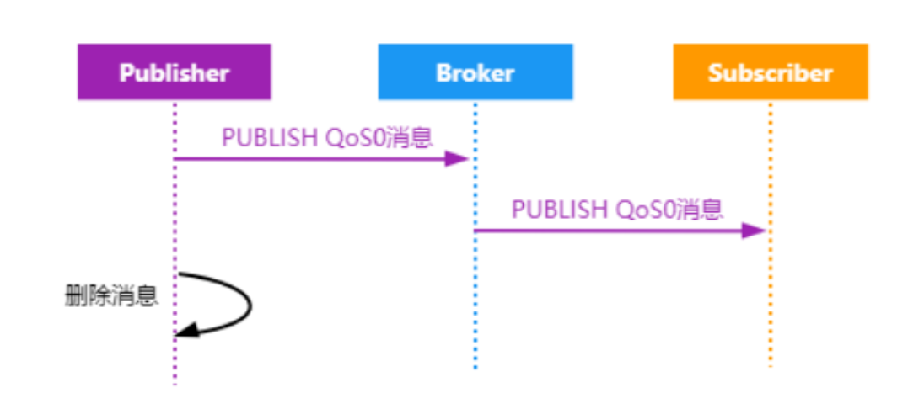
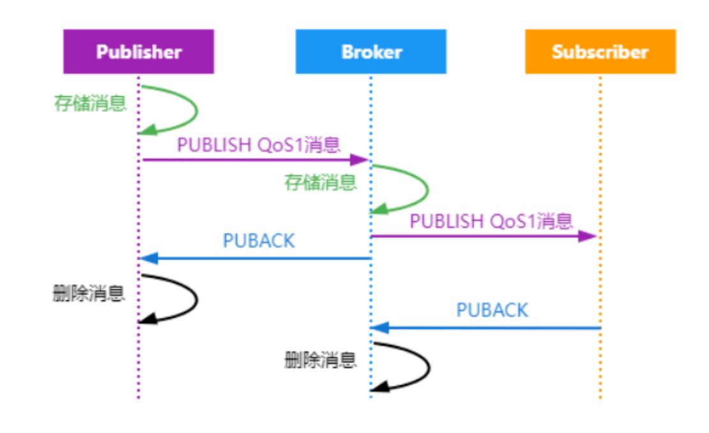
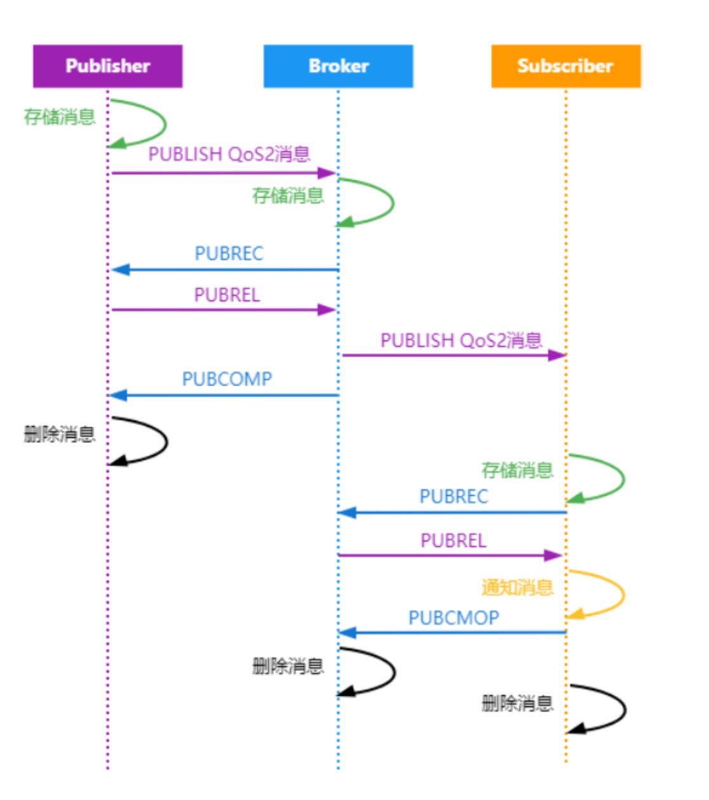
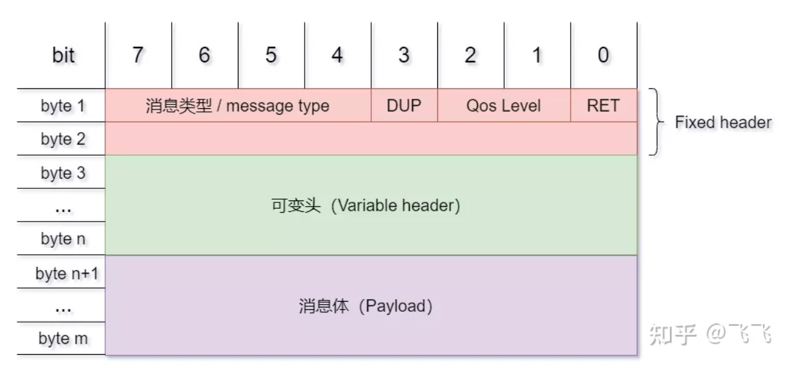
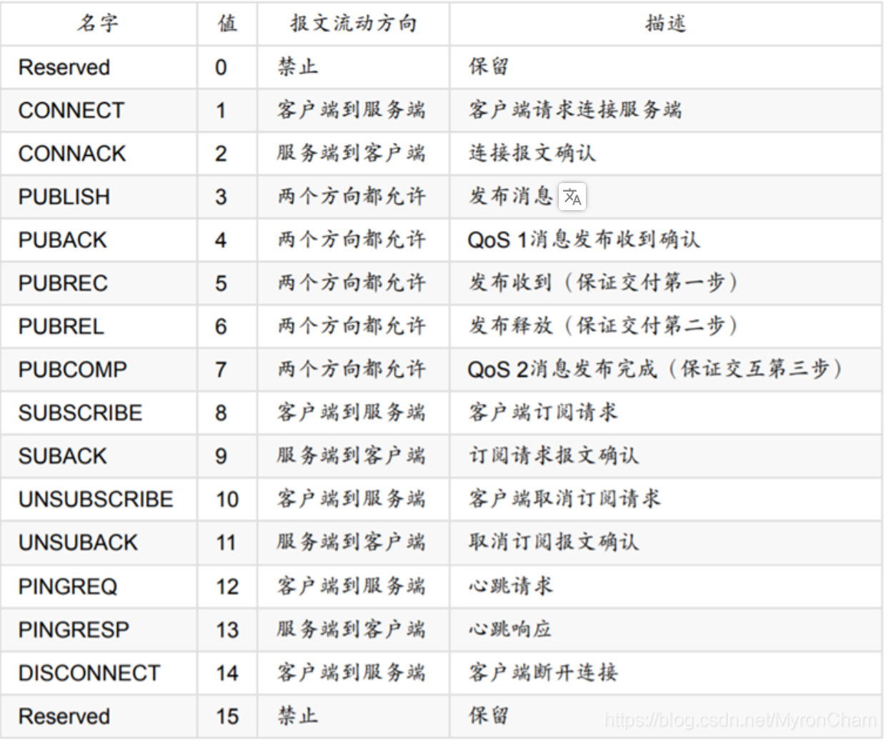

# MQTT协议

在看论文时看到了MQTT协议，大致了解一下相应内容。

## 概述

MQTT(Message Queuing Telemetry Transport)于1999年由IBM发布，其通讯模式为“发布——订阅”，可以以极少的代码和有限的带宽为连接远程设备提供实时可靠的消息服务，是一种“轻量级”的通讯协议。由于其低开销、低带宽占用的特点，使得其在物联网设备、小型设备、移动应用等方面应用非常广泛。

## 协议所处位置

MQTT协议构建于TCP/IP层之上，位于应用层。

## 通讯模式

正如前面所说，MQTT的工作模式为“发布——订阅”，类似于公众号的形式，消息的发送方将内容发送到某个特定的“主题”，只有有权访问这个主题的接收方才能收到相应的消息，其他用户无法接收。即可以实现一对多的消息发布（多个接收方订阅同一主题）

## 协议原理

### 相关术语

在MQTT协议中，参与者有三种身份：

* 发布者（Publisher）
* 代理（Broker）
* 订阅者（Subscriber）

其中发布者和订阅者身份可以同时担任，为客户端；代理为服务器，负责将双方的消息进行转发。

MQTT中传输的每条消息可以分为两部分：

* Topic：用于指明消息所属主题
  * 一个主题可以有多个级别，用`/`分割，如`device/lock`
* Payload：消息中具体的内容

**QoS（消息传递的服务质量水平）**

MQTT是建立在TCP/IP之上的，本身就有一定程度的质量保证，但是在无线网中的干扰和中断非常频繁，MQTT中设置了QoS字段来确保服务水平。其共分为三个等级：

1. QoS 0：保障消息到达终点**最多不超过1次**。消息可能到达1次或根本不会到达，消息质量完全依赖于TCP/IP的质量。会发生丢失，不可靠。

   

2. QoS 1：保证消息**至少会有一次**传送给订阅者。

   

   利用该机制可以保证离线设备在上限之后也能收到相应信息。

3. QoS 2：保证消息最终**只会有一次**到达终点，该机制是MQTT中传输最慢但是最可靠的形式，适用于消息很重要但是不会重复出现的场景。

   

### 主要报文内容说明

* CONNECT：连接服务端。该报文出现在客户端与服务器**首次建立链接**时，会话持续期间仅允许发送一次。报文中主要包括：
  * 清理会话：决定是否恢复原会话，还是创建新的会话；
  * 遗嘱标志：客户端断开连接，是否通知订阅该客户端发送消息的其他客户端；
  * username 和 password：建立连接验证时使用；
  * 保持连接：该连接是否为长连接及心跳时间；
  * 应用消息内容：连接时具体的消息内容；
* CONNACK：确认连接请求。客户端请求连接后，服务端响应的报文，主要包括：
  * 当前会话类型：告知客户端当前的会话是否为恢复的会话；
  * 连接返回码：连接建立状态值，如用户名、密码校验不通过；
  * 应用消息内容：应答的具体内容；
* PUBLISH：发布消息。指从客户端向服务端或者服务端向客户端传输一个应用消息，报文主要包含：
  * 重发标志：标识是否为重发的消息；
  * 服务质量等级：QoS 0，QoS 1，QoS 2
  * 主题名：存在于报文的可变头部，且必须在第1位，该消息发布至哪个Topic中；
  * 应用消息内容：应用的具体消息；
* PUBACK：发布确认。是对**QoS 1等级**的PUBLISH报文的响应。
* PUBREC – 发布收到
* PUBREL – 发布释放
* PUBCOMP – 发布完成，用于对QoS 2时使用。
* SUBSCRIBE - 订阅主题
* SUBACK – 订阅确认
* UNSUBSCRIBE –取消订阅
* UNSUBACK – 取消订阅确认，用于客户端订阅消息时使用，一个客户端可以订阅多个主题（topic），当客户端订阅该主题后，服务器会推送消息至订阅者和取消订阅时使用。
* PINGREQ – 心跳请求
* PINGRESP – 心跳响应。用于保持长链接心跳使用。

### 报文数据包结构

* 固定头：必须存在，用于描述报文信息。里面有指出什么类型的报文和报文服务的等级。

  其中消息类型具体为：

  

  * **第一字节**剩余的4位包含了发送重复数(DUP) （1字节） 、服务质量 (QoS) （2字节）、保留标志(RETAIN)（1字节），从官方文档给予的说明来看，标志位主要用于发布消息时使用，用以说明这个消息的重发次数、服务质量及其服务端是否存储该消息。

  * **第二字节**起表示报文的剩余长度。最大4个字节，每字节可以编码至127，并含有一位继续位，如继续位非0，则下一字节依然为剩余长度。由此，理论上一个控制报文最长可以到256MB。

* 可变头：不一定存在，根据固定头部指定的报文类型而定。

* 消息体：应用消息， 根据固定头部指定的报文类型而定。（仅做简单了解，这里就不细讲不同类型是什么样了）

## 协议优缺点

### 优点

- 基于“发布——订阅”模式，程序耦合性低。
- 对网络容忍度高，具有会话恢复和客户端异常中断通知机制。
- 低开销、低带宽占用。
- 支持多语言，如java、c等。

### 缺点

- MQTT中的安全认证相对简单，其设想的环境是没有敌手的，安全性较低。
- 第三方代理大多收费。

## 参考链接

* [MQTT协议（1）介绍](https://blog.csdn.net/MyronCham/article/details/117729564)
* [MQTT协议，终于有人讲清楚了](https://zhuanlan.zhihu.com/p/421109780)
* [MQTT 入门介绍](https://www.runoob.com/w3cnote/mqtt-intro.html)
* [MQTT 协议基本介绍](https://www.jianshu.com/p/ecde412d2eeb)
* [带你了解MQTT协议](https://www.51cto.com/article/719632.html)