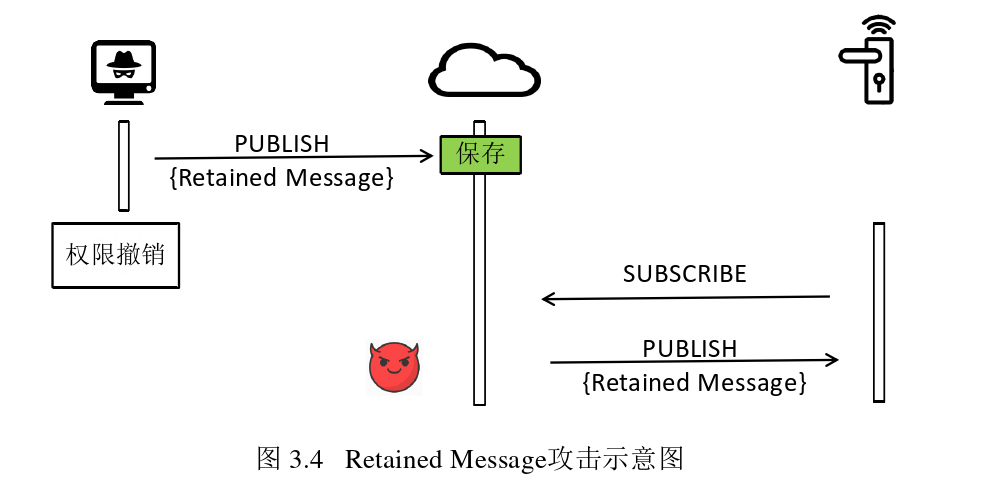

# 物联网平台关键组件安全研究

> 本篇文章还没有看完，中途转向逆向

作者：贾岩

时间：2020年12月


## 文章贡献

1. 对消费物联网生态系统进行了总结与梳理。
2. 发现物联网平台在应用通用通信协议时的新安全问题，并提出了相应设计准则。
3. 发现物联网云间权限委派时的新安全问题，并实现了基于模型检测的半自动化漏洞检测工具。
4. 发现支持多管理通道的物联网设备的新安全问题，设计并实现了能够快速部署的临时解决方案。


## 缩略语对照表


## 第一章：绪论

```
物联网平台┬工业物联网（工业界应用）
		└消费物联网（消费者使用）┬联动规则平台(Trigger-action Platform)：让物联网设备根据预设规则自动化执行
				 			 └智能语音助手(Intelligent Virtual Assistant)：通常以智能音箱为载体，通过对话来控制智能家居设备
```

### 本文主要工作


本文工作重点关注物联网平台中尚未被广泛研究的关键组件，试图在实践中探索其中尚未被发现的安全问题。

本文所采取的工作的核心方法为实证研究(empirical study)，即通过观察和实验的经验事实来尝试揭示其中存在的安全问题。

### 结构安排


* 第三章关注关联完成后试用阶段用户、设备与云通信时由消息传输协议给访问控制功能带来的安全风险；介绍设备使用过程中物联网云平台部署MQTT协议时出现的新安全问题；
* 第四章关注物联网云与云间授权过程和用户授权过程的访问控制安全风险；
* 第五章关注设备厂商生产配置物联网设备时使用多设备管理通道引入的访问控制安全风险。

### 文章贡献

1. 对消费物联网生态系统进行了梳理和总结；
2. 发现物联网平台在应用通用协议时的新安全问题，并提出响应设计准则；
3. 发现了多个物联网云间权限委派时的新安全问题，设计并实现了针对该类问题基于模型检测的半自动化检测工具VerioT；
4. 发现了支持多管理通道的物联网设备的新安全问题，设计并实现了能够快速部署的临时解决方案CGuard。


## 第二章：消费物联网生态系统


* 用户：物联网设备直接使用者，通常是消费者。常见的用户有设备主人（所有者）和受人授权的临时用户；设备主人一般具有最高权限，并能随时撤销被授权人的权限。
* 厂商：设备厂商使用自己搭建的物联网平台，或使用其他第三方物联网平台提供的平台服务来构建解决方案，使设备接入物联网。
* 平台提供商：提供的服务包括云服务、接入云的协议方案、移动App开发模板、方便接入云的SDK等。


### 常见消费物联网技术架构


基于云的架构中，用户能远程控制物理网设备，通常云会接收用户使用控制台发来的命令，并在安全验证之后将指令发送到对应的物联网设备，物联网设备通常会配置云的域名或证书，**直接信任云端发送来的指令并执行，不再执行额外的安全检查。**

由于互联网不是每时每刻都很可靠，因此没有互联网参与的基于网关架构和用户控制台与设备直连通信架构也得到广泛支持。此模式的通信内容仅存在于本地网络中，提供了更好的隐私性，且在这种架构中，网关、设备本身承担起了相关的安全验证功能。


### 设备生命周期


1. 预配阶段：厂商在物联网平台云端对设备进行注册和设置，包括型号、权限、包含的功能等；同时，厂商将物联网平台提供的SDK集成进生产的设备中，进行相应的配置，如配置证书、云端节点、设备身份等。此外，用户还需要注册相应账号，一般还需要下载对应的App进行控制。
2. 关联阶段：一般情况下，用户在使用设备之前需要设备与自己的账户进行关联，具体可分为如下两步
   1. 对设备进行完网络配置使设备接入Internet；
   2. 设备、移动App和云三者进行交互，建立用户与设备的访问控制关系（也称绑定）；
   3. 使用阶段：用户通过控制台操控和查看自己的设备。有时用户还可以临时分享设备的访问权给其他用户，并随时取消分配的权限。甚至用户还可以将设备的权限分享至其他平台服务提供商。
   4. 在物理网设备的所有权需要转让或者设备主人放弃使用该设备时，用户需要进行解绑操作。


### 物理网平台简介

#### 通用型物联网平台

通用型物联网平台提供面向各种应用的物联网平台服务，包括终端认证、通信协议、云端访问控制、设备状态管理、后续数据分析处理等。由于平台设计为通用目的，因此厂商需要自行配置云端的访问控制策略等更具体的内容。平台提供商提供的设备SDK实现基本的通信功能，通常没有应用层的语义，设备厂商还需要自定义消息内容。该类平台能够被设备厂商定制来适应各种应用场景，如工业、农业等多个领域。

#### 智能家居物联网平台

智能家居是消费物联网中最具代表性的应用场景，物联网平台提供商专门为此应用设计了智能家居物联网平台。智能家居平台提供的服务通常包括了通用型平台的基本内容，但是为智能家居在应用层提供了更具体的标准，并封装了SDK，使得不同设备厂商能够更便捷地将传统家用电器变成智能家居设备。

通常，厂商接入此类平台需要经过与平台提供商洽谈并通过认证。通过认证之后厂商可以在平台中配置自己的设备，使用平台提供的SDK开发自己的设备并接入到平台的生态系统。

注意：平台提供商通常为用户提供统一的App，用户使用该App即可管控接入此生态系统中的任何厂商的设备。当然平台也支持厂商自行开发兼容的App。

#### 服务型物联网平台

上述两种类型的平台通常包含对设备和用户的认证与访问控制等核心功能，直接参与管理设备。此外，有些物联网平台只提供辅助的控制、自动化等服务，本文称其为服务型物联网平台，包括智能语音助手和联动规则平台。该类物联网平台专门针对消费物联网中智能家居领域特有的用户需求设计。

* 智能语音助手使得用户可以通过语音对智能家居设备进行控制。
* 联动规则平台允许用户设置自动化规则来控制不同厂商的物联网设备。

语音助手服务或联动规则平台的云- -般通过直接管理物联网设备的云控制设备，而非直接与设备通信，因此，该类平台无需给厂商设备提供SDK，仅提供了服务器之间的授权机制和其他业务API供厂商使用。用户需要在使用阶段将设备的权限通过OAuth等协议授权给语音助手服务云或联动规则平台。


## 第三章：物联网云平台消息传输协议安全风险分析

物联网云平台通常基于已有的通信协议来构建，如HTTP、AMQP、MQTT等，但是MQTT最初在设计时没有考虑到存在敌手的情况，仅提供了简单的认证机制，所有的保护机制都需要物联网云平台提供商自己开发。经研究发现，物联网平台对MQTT协议定制的安全措施普遍存在安全隐患，使得攻击者能够利用设计中的漏洞开展如下攻击：

1. 非法远程控制目标设备；
2. 窃取用户隐私信息，例如作息规律、位置、同居者等；
3. 大规模拒绝服务；
4. 伪造设备状态。

经评估，这些攻击将带来非常严重的后果，如通过收集平台上所有设备产生的时间信息，进而获取用户的个人可识别信息(Personally identifiable information, PII)。


### 相关工作

报告[56]发现公共网络中的MQTT服务器缺乏基础的认证和授权机制，敌手能随意地连接并订阅任何主题；

报告[57]也同样发现大量没有保护的MQTT服务器，经过对采集到的流量数据进行分析，还发现MQTT协议客户端与服务器软件库中的实现问题。


### 背景


云作为中心负责管理设备和App通信，云中部署有Message broker，用来转发指令、设备装状态。厂商只需要使用云提供的SDK进行简单配置，即可以实现开发、“入云”。整个系统中，云担任着保护用户与设备交互安全的核心功能，例如对设备和App（用户）进行认证与权限检查。


​        MQTT协议是一种低功耗、低带宽占用的即时通讯协议，在物联网中应用较广。其通讯方式为“发布——订阅”模式，位于OSI中的应用层，位于TCP/IP或者其他可靠的连接之上，如WebSocket。在这种模式中，发布者按照某种类型发布信息，而非直接发给接收方，接收方则根据需求选择接收（订阅）某类消息。

某个示例：


建立传输层连接 --> MQTT客户端（物联网设备和App）发送CONNECT至消息代理来建立一个MQTT会话（类似于HTTP中的cookie），MQTT会话被CONNECT消息中的ClientId字段唯一标识。ClientId仅在第一个CONNECT消息中携带，建立会话以后物联网设备通过发送SUBSCRIBE给消息代理来订阅其“关联主题“。整个MQTT的通信过程依赖于四个重要实体：身份（ClientId）、消息、主题、会话。因此需要对这四个进行保护。


### 物联网云平台的安全措施

#### 认证机制

MQTT可以工作与WebSocket和TLS之上，提供了认证上的方便；同时不同云平台会有不同的认证措施，或提供其他服务。

* Web认证机制。

  利用MQTT处于应用层的特点，使用Web技术中的认证机制在客户端开启MQTT会话之前就进行认证。如AWS IoT会在WebSocket建立连接时利用HTTP的cookie等信息进行认证。

* 客户端证书。

  在物联网设备出厂时内置一个受信证书，在建立TLS连接时使用TLS客户端认证模式来对客户端进行认证（验证证书）

* MQTT认证。

  利用MQTT协议在开始连接时CONNECT连接中的username和password机制进行认证。

#### 授权机制

由于MQTT是“发布——订阅“模式工作，因此要限制物联网设备只能够被授权用户访问，就需要限制客户端所能访问的”主题“，即限制其访问能力（如果某个客户端的能力没能够被限制，则会出现越权访问）。

不同的平台会提供不同粒度的能力来定制相应安全策略，有的云平台提供商提供了灵活的策略配置功能，允许厂商完全自定义每个终端访问哪些个具体的主题，如AWS IoT；有的平台提供安全策略模板，设备厂商只能基于特定预设模板进行配置，如IBM Waston IoT；还有的提供商对厂商屏蔽了具体细节，自动根据设备身份进行主题分配。


### 威胁模型

本章所有攻击假设敌手能够像普通用户一样注册设备厂商和物联网平台提供商的账号，并且**能逆向分析自己的设备和App终端软件，获得终端与云之间的通信流程**。但是，敌手不能获取其他用户(受害者)拥有的App和设备与云之间的通信内容，不能进行网络层的数据篡改和中间人攻击。受害者(设备主人)没有安装受攻击者控制的恶意移动App，目标设备的固件没有受到敌手篡改，云服务器向所有用户提供平等可信的服务。

有一些攻击场景中，敌手可以合法获取设备的使用权（如宾馆、保姆等），这些情况下用户希望能够安全的授予和回收临时权限，同时获得临时授权的敌手不能在物理上对设备进行破坏。


### 云平台MQTT安全措施实践分析

#### MQTT消息授权漏洞

本节中将详细讨论Will Message（遗嘱信息）和Retained Message（保留信息）带来的设备非法访问问题。

1. **未收授权的Will Message**

   为了处理之前因故障产生的异常，MQTT协议特意设置了Will Message消息类型来进行处理。针对此类信息，一个客户端在发送CONNECT开始连接时可以向消息代理注册一个特殊的Will Message，该消息和PUBLISH一样可以指定要发表的Topic并携带任意内容。当Broker发现一个客户端异常断开连接（断开连接的时候没有收到DISCONNECT报文），Broker会向订阅该主题的客户端发送之前定制的Will Message。

   原本这个机制可以告诉管理员哪个设备出现了故障，但当设备所有权从恶意用户转移到其他用户时，或者是用户的临时权限需要撤销时，这个异常处理的特性会带来隐患：敌手 	在有权时注册一个携带控制指令的Will Message，在丧失控制权以后且设备被其他合法用户使用时会触发该消息发送至设备。具体来说，即使敌手对该设备的权限已经被撤销，即消息代理已经根据更新的安全策略拒绝转发他发送的常规PUBLISH消息至该设备的关联主题，但只要敌手控制客户端异常地断开连接，敌手注册的Will Message仍然会被消息代理正常发送。通过控制客户端断开的时机，在上面的例子中，敌手便可以随心所欲地打开智能门锁。另外，尽管一个MQTT客户端只能触发一次Will Message，但是只要敌手同时保持多个MQTT客户端并注册多条Will Message,他便能够利用此方法在未来继续随心所欲地控制设备多
   次。
   攻击实例：

   

2. **未授权的Retained Message**

   MQTT是一个实时通讯协议，如果broker发送PUBLISH消息时客户端不在线，订阅者将无法及时收到消息。为解决这个问题，MQTT协议特别设置了一个Retainedd Message：客户端可以在发送普通PUBLISH消息时设置retained标志位，broker在收到此消息后会将最新一条Retained Message保存在对应的主题上，并将该消息发送给任何新订阅此主题的客户端。通过这个特性，管理员可以在每次订阅时都获得最新状态，而不用一直保持在线。

   攻击实例：

   

#### MQTT会话管理漏洞

MQTT的通信是建立在会话之上，当一个客户端权限发生变更时（如访问设备的权限被撤销），其权限变更应当作用于客户端已建立的会话之上，特别是与安全密切相关的订阅会话和连接会话。然而研究发现实际上物联网平台的实现并没有满足这个安全期望。

1. **订阅会话管理漏洞**

   MQTT协议标准出于安全考虑明确建议，消息代理应当对客户端的行为(action)进行授权检查[45]。根据标准中的建议，物联网云平台在实现安全策略时均对客户的主动行为进行了管理。例如，当一个物联网设备被重置时，云会撤销其前用户的所有权限，当前用户的客户端再在会话中主动向消息代理发出SUBSCRIBE订阅设备的关联主题或向设备主题发送PUBLISH消息时，均会被消息代理拒绝。但是，MQTT协议标准并没有任何建议或提示涉及客户端的会话该如何安全地管理。因此，尽管会话直接影响了MQTT系统的安全性，但是多数物联网平台并没有将会话管理纳入安全策略中，给该平台下的设备与用户带来了极大的安全与隐私风险：当客户端建立连接并成功订阅一个主题后，即使该客户端在权限被撤销后不能发送SUBSCRIBE消息订阅该主题，消息代理仍然会一直维持其订阅会话。换言之，某设备的前用户(敌手)可以通过在丢失权限后保持订阅会话继续接收设备向关联主题上发送的消息，无论该设备是否已经被新的用户(受害者)所绑定。根据设备种类的不同，攻击者可能获得到受害者设备上的各种隐私信息，例如生活习惯、健康状况数据等等。

2. **会话生命周期管理漏洞**

    当一个设备被重置或者新用户绑定时，前用户MQTT客户端的权限会被撤销，从而失去相关权限；但从另一个方面，设备仍然能继续保佑自己的权限，可以访问其关联主题。由此产生的问题是：敌手在有权限时获取设备的认证凭证（已有工作证明通过流量分析和逆向工程很容易获取），然后编写MQTT客户端以设备的身份接入broker来获取新用户的相关信息。为应对此威胁，部分平台选择动态更新设备的身份凭证。

   但是实际上由于会话管理存在缺陷，敌手在以设备的身份接入broker、订阅相关主题后，新用户绑定设备，设备凭证会更新，但是保持的MQTT会话仍然有效：“设备”角色的权限不变，因此敌手能利用此客户端向设备关联主题发送虚假设备状态欺骗用户、

   攻击实例：

   

#### MQTT身份管理漏洞

如第3.3节背景所述，物联网云平台使用平台设计的身份来对MQTT客户端进行认证，例如AWS IoT中允许使用TL S认证客户端证书;同时，每一个客户端在协议中被ClientId所标识。于是，一个客户端便同时拥有两个层次的身份标识:平台层身份和协议层身份。一个用户可能拥有多个控制端设备，例如智能手机与平板电脑，每个设备同时都有自己的ClientId，而每个设备还可能会被多个用户所共享。这两层身份复杂的关系是否得到了妥善的管理，也密切关系着MQTT通信的安全性。

1. ClientId劫持攻击

   ClientId在协议中标识着客户端的身份与会话，MQTT协议规定当一个新连接客户端与已连接客户端具有相同的ClientId时，消息代理会断开具有相同ClientId的已连接客户端。在敌手环境中，MQTT协议中这种敏感的状态转移(检测到冲突Clientld时断开一个客户端)应当得到恰当的保护。然而，本研究工作发现主流物联网平台对客户端ClientId的认证并不完善，并且没有把ClientId当做一个令牌保持机密性。敌手能够由此利用其合法的平台层身份通过认证而用其他客户端的ClientId来建立MQTT会话，使目标设备断开连接。通过PoC攻击实验，本工作在许多主流物联网平台_上证实了该问题，受影响的厂商包括AWS、IBM、百度等。

   在某些特殊情况下，敌手还能够劫持目标客户端的订阅会话。为减少通信开销，CONNECT消 息中设置有一个CleanSession标志位，当该标志位为0时，MQTT消 息代理会在该客户端断开连接后继续保存其会话，包括已订阅的主题、未完成传送的消息等内容[45];当该客户端使用相同ClientId再次连接消息代理时，便可恢复之前的会话。当客户端的ClientId暴露给敌手后，敌手便可以利用此机制来恢复受害者的订阅会话，越权接收发送给目标客户端的消息。正是由于平台提供商没有认识到MQTT中ClientId这种敏感实体的重要性，缺少对平台层身份和协议层身份进行关联控制的安全策略，导致恶意用户能以目标客户端的ClientId恢复其会话并窃取消息。

2. 获得ClinetId

   上述攻击是建立在敌手能获得客户端的ClientId基础上，通过研究相关设备厂商和物联网平台的开发文档以及MQTT协议标准，发现ClientId并没有被作为秘密来保护，敌手能够通过以下两种方式获得ClientId：

   * **猜解。**ClientId通常具有一个固定的形式，当两客户端使用相同ClientId登录时，先登录的会被断开；同时MQTT客户端一般都会有一个连接异常时自动重连。综上两点会出现竞争现象。由此敌手可以通过猜的方式登录客户端，如果出现有周期性掉线重连，则表示当前ClientId确实有人在使用。
   * **设备共享。**一旦设备被用户合法访问过一次(例如部署于酒店、租赁公寓中的物联网设备)，用户很容易通过查看其MAC地址、序列号或网络嗅探等方法获得设备的永久ClientId。注意，该类方法并不需要对设备进行拆解破坏。对于敌手而言，他由此能够随时地远程开展攻击使目标设备断开与消息代理的连接，造成拒绝服务攻击或窃取发送给设备的消息。


#### MQTT主题授权漏洞

在MQTT中明确限制权限的就是主题，对主题应当需要明确保护，但是实际中出于效率开发等因素，敌手仍能非法访问其他主题。

1. 安全保护不应当走“捷径”

   如前所述，应用MQTT协议至物联网场景中时，物联网平台需要自行添加协议中缺失的安全措施，特别是管理哪些客户端能在哪些主题进行发布和订阅操作。在实践中，一个物联网平台往往要管理来自上百个设备厂商的数百万个设备和用户，客户端的权限会随着用户的操作而动态变更，给如何实现高效的访问控制带来了挑战。本研究发现有物联网厂商在实现主题访问控制时采取了便捷的方案，却不经意引入了严重的安全问题。例如，服务数十家设备厂商的苏宁物联网平台[86]将设备关联的MQTT主题设计为随机字符串，主题访问控制的安全性也依赖于主题的机密性,只有获得设备主题名称的用户才能够订阅对应的设备消息。

   链接分享给要分享的用户，任何知道此链接的用户便可访问该文件。然而，在消费物联网场景中，设备关联主题的机密性却难以得到保证。如3.3节威胁模型所述,在宾馆甚至私人住宅中，敌手非常容易地能够临时获得设备的合法使用权，进而通过分析自己移动App的流量轻易获得设备的关联主题。同时，厂商倾向于将设备的唯一.标识如序列号、MAC地址等作为主题的一-部分，而正如上节所述，这些唯一标识符并非随机源，易于被暴力猜解。因此，由于“设备关联主题是秘密”这样错误的安全假设，敌手能够在设备主人不知情的情况下订阅设备关联主题，越权获得设备发送的信息。敌手窃取设备泄露的信息后，除能直接获得设备状态外，还能够推断出生活规律、同居关系等隐私信息。

2. MQTT主题描述语法带来的安全问题

   一个设备可能会订阅多个主题，其中有些可能存在有关联，如用/deviceID/cmd来接收用户发送的控制指令，用/deviceID/temperature来上报设备采集的温度信息。为了简化语法，MQTT设置了通配符，其中`#`表示任意层数（类似正则表达式里的`*`）；`+`表示只匹配一层（类似正则表达式的`.`）。但这种灵活的语法带来了安全隐患：不仅互联网上开放的消息代理对订阅通配符操作未加保护，本应当严格控制的物联网平台也存在处理不当的情况。如阿尔法物联网平台没有限制使用通配符，用户可以直接使用`#`来订阅所有的信息，包括个人信息等敏感内容，导致越权访问。


### 防御方案

1. 管理协议中的身份与会话

   在应用一个通用的消息传输协议至复杂的存在敌手的物联网系统中时，一个关键的原则是:**协议层的身份(例如ClientId)应该同平台层身份一样被认证，并且当该身份作为安全令牌(例如会话令牌)使用时，其机密性应当得到保护。**

   根据前文攻击案例的分析，我们为如何管理协议中的会话提出了如下原则:**当主体(例如用户)的权限更新时，对所有协议透明的状态(如连接会话)和协议中的状态(如订阅状态)均应当进行相应地更新。**

2. 面向信息的访问控制模型

   在物联网系统中，使用通信协议的目的在于传输消息，因此构建安全措施关键也在于保护消息传输协议中携带的消息:**系统应该控制主体发送或接收消息的权限,并且同时考虑主体接收消息时的安全要求。**本章研究发现，该原则的前者通常被业界所熟知并能正确地实施，但是后者却没有在MQTT协议设计考虑中，特别是在设备分享与权限撤销的场景中对消息接收者的安全要求。为填补这项空白，本文提出了**针对物联网通信的基于UCON[93]的加强访问控制模型一面向消息的访问控制模型(Message-Oriented Usage Control Model，MOUCON)。** MOUCON的 核心.思想非常简单，类似Linux操作系统将文件作为资源检查用户对文件的读、写权限，MOUCON模型将消息作为资源(客体)，根据主体的属性来进行权限检查。具体定义可以看贾老师的原文。


## 一些准备后续查阅的文献

* 文献25：分析智能家居平台Samsung SmartThings并发现权限粒度过粗的访问控制设计问题
* 文献26-28
* 文献31：研究国内的JoyLink的安全和隐私问题
* 文献32：基于云的设备与用户绑定关系建立过程……
* 文献33：研究了物联网设备、移动App和云之间的交互流程，并重点关注了三者状态机相关的安全问题
* 文献34：配网过程


* 文献[25,26,29,30,33,37,62,63]对物联网平台系统开展了广泛的研究