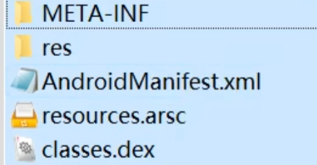

# Android逆向学习笔记1

> 课程来源：bilibli，视频链接：[Android逆向学习（自学专用版）](https://www.bilibili.com/video/BV19G4y1v7EG/?spm_id_from=333.337.search-card.all.click&vd_source=1685dbb19ce1624124f7b004f1afa849)


## 第一阶段：APK反编译基础及静态分析

### APK包体基本结构

* **META-INF**：为APK的签名文件，是APK正盗版的**唯一标识**。
* **AndroidManifest.xml**：配置清单文件，标识着一个APK有多少个界面等
* **classes.dex**：APK的代码文件，由java等编译
* **resources.arsc**：资源文件（通常汉化会用到这个文件），其他还有assets、res文件夹

一个APK至少含有的文件：




### 反编译

* 最基本环境：Java环境

* 反编译工具：AndroidKiller（需要配置Java的安装路径）

  在反编译之后`classes.dex`会变成smali文件夹，`resources.arsc`会进入到res文件夹下

* 测试环境：雷电模拟器

==问题==：AndroidKiller中的软件已经很久没有更新过了，需要自己手动更新内部使用到的插件


### Smali语法

该语法是安卓反编译以后生成的一个文件，为`.dex`文件反编译以后生成， 后缀为`.smali`

#### 数据类型

```
B --- byte
C --- char
D --- double
F --- float
I --- int
J --- long
S --- short
V --- void
Z --- boolean
[XXX --- array	如[I表示整数类型数组；[F表示float型数组
Lxxx/yyy; --- object	如Ljava/lang/String;表示String类型
```

#### 方法定义

```
Func-Name(Para-Type1Para-Type2Para-Type3...)Return-Type
参数和参数之间没有任何的间隔
如：
Hello()V，表示void Hello()
Hello(III)Z，表示boolean Hello(int, int, int)
Hello(Z[I[ILjava/lang/String;J)Ljava/lang/String;，表示String Hello(boolean, int[], int[], string, long)
```

* 方法中有的时候会有`.local 1`字样，这个`1`表示该方法会使用1个寄存器
  * smali语法在逻辑运算的时候，使用的是寄存器，这个`.local`后面的数字只能大于等于寄存器数量
* p0则通常表示this
* 通常v2用来保存函数调用的返回值

#### 关键词

```
.field private isFlag:z --- 定义变量
.method --- 方法
.parameter --- 方法参数
.prologue --- 方法开始
.line 123 --- 此方法位于第123行
invoke-super --- 调用父函数
const/high16 v0, 0x7f03 --- 把0x7f03赋值给v0
invoke-direct --- 调用函数
return-void --- 函数返回void
.end method --- 函数结束
new-instance --- 创建实例
iput-object --- 对象赋值
iget-object --- 调用对象
invoke-static --- 调用静态函数
.locals --- 本地寄存器
```

#### 条件跳转

``` --- 
if-eq vA, vB, :cond_** --- 如果vA==vB则跳转到:cond_**
if-ne vA, vB, :cond_**
if-lt vA, vB, :cond_** --- 如果vA<vB则跳转
if-ge vA, vB, :cond_**
……(和汇编的是一样的)
```


### 安卓常见的破解工具

* 环境设备
  * 电脑：Java、Python、Eclipse等环境
  * 手机：ROOT
  * USB数据线
* PC工具：Java、Python、Eclipse、AndroidSDK、Apktool、dex2Jar、JD-GUI（这两个比较老了，可以用**Jadx**，也是反编译的工具，但是不能反编译到smali，只能到java层次，适合用来阅读逻辑）、AndroidKiller、Fidder/BuipSuit、Ida Pro、SqliteBrowser、010Editor、JEB等
* 终端工具：R.E.Explorer、inject、界面劫持工具、mt管理器（之前另一个教程里有用到）、**Xposed Installer框架**（用来执行插件的）
