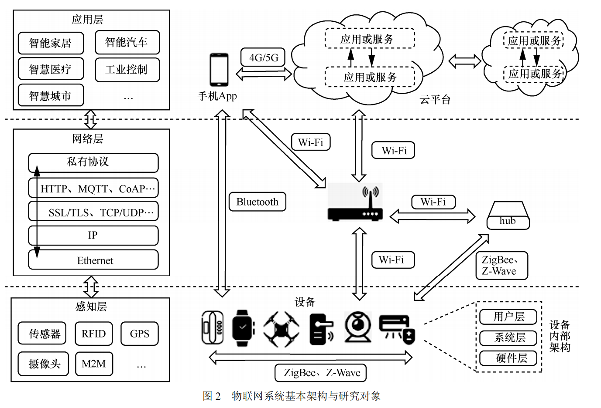
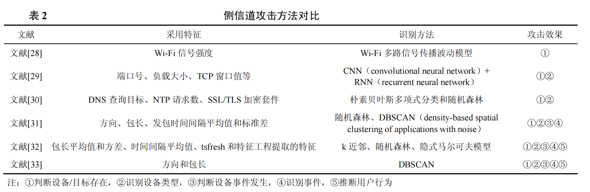
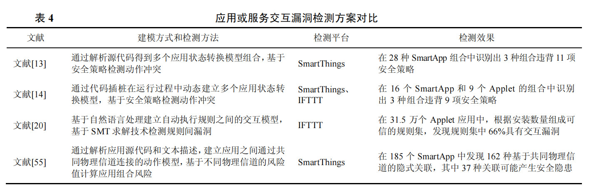
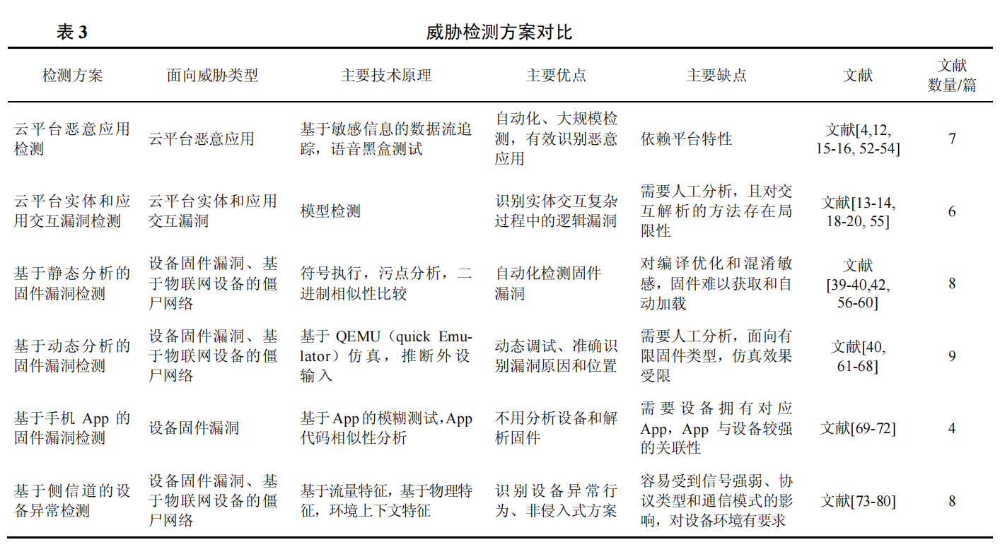
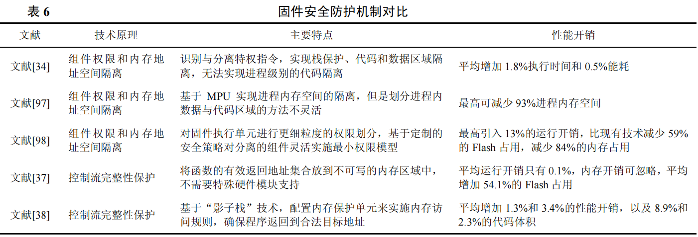
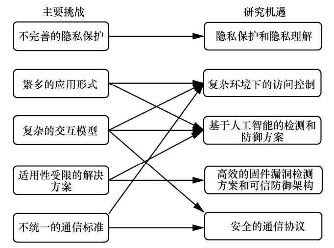

# 物联网安全研究综述：威胁、检测与防御笔记

**作者**：杨毅宇，周威，赵尚儒，刘聪，张宇辉，王鹤，王文杰，张玉清

**时间**：2021年8月

**摘要**：基于近 5 年网安国际会议（ACM CCS、USENIX Security、NDSS、IEEE S&P）中发表的物联网安全文献，以及其他部分高水平研究工作，从威胁、检测、防御的视角对物联网安全研究工作进行了系统的整理和分析。

首先，介绍了物联网系统的基本架构。然后，将当前研究中提出的主要威胁分为 8 种类型，并分析了威胁的成因和危害。

之后，介绍了针对这些威胁所提出的 6 种威胁检测和 5 种防御方案，并对比了它们的技术原理和优缺点。

最后，提出了当前研究依然面临的主要挑战，并指出了未来研究发展的方向

**本文贡献**

1. 系统总结近 5 年物联网安全研究中发现的主要安全威胁，展示这些威胁产生的成因和危害；
2. 深入分析对抗这些安全威胁的主要检测和防御方案，展示这些方案的技术类型和效果
3. 基于威胁、检测和防御 3 个方面的分析来揭示物联网未来发展过程中将面临的主要安全挑战，并指出物联网安全研究下一步的方向。

## 背景介绍

物联网系统一般架构主要分为感知层、网络层、应用层3个部分。

* 感知层。即各类物联网设备，设备通过传感器实时收集信息并发送给应用层，或接收应用层指令并执行相应动作。

  设备的内部架构可以分为硬件层、系统层、用户层。

  * 硬件层包括支持设备功能的各种硬件模组（如网络模组、传感器模组等）、处理器、外围电路等；
  * 系统层装载了固件程序，其中包括操作系统和应用程序，负责设备功能的实现；
  * 用户层主要向用户提供展示数据和接收输入的操作接口。

* 网络层。负责设备之间，以及设备、云平台、手机APP这三类实体之间的通信。设备连接路由器有 2 种形式：一是直接通过 Wi-Fi 连接；二是通过 ZigBee、Z-Wave 等协议与网关设备（如hub）连接后，再经网关通过 Wi-Fi 与路由器通信。

  实体之间通信分为 3 种类型：

  1. 设备与 App通信，设备既可以通过蓝牙直接连接手机（如可穿戴设备、车载系统网络），也可以通过局域网 Wi-Fi与手机通信（如智能家居网络）；
  2. 设备与云平台通信，设备依靠路由器转发请求和接收响应，而路由器与云平台的通信主要由传统 TCP/IP 网络架构实现；
  3. 手机与云平台通信：手机 App 可以通过4G/5G 网络或局域网 Wi-Fi 连接云平台。

* 应用层。主要是指云平台和手机 App。云平台主要由厂商在云端部署的各类应用服务组成，负责管理设备和用户，对设备收集的数据进行处理，或向设备发送远程控制命令。根据云平台提供的功能，可以将其分为设备接入平台、服务联动平台、语音助手平台 3 种。

  * 设备接入平台提供了实际的设备接入和管理功能，如 Samsung SmartThings、Google Home、Philips Hue、小米米家等；
  * 服务联动平台并没有连接真实的设备，而是将其他平台的功能连接起来，提供“条件−动作”自动执行规则服务，如 IFTTT 平台等；
  * 语音助手平台通过智能音箱向用户提供语音控制服务，用户发出的语音命令经语音平台处理后可以与其他控制设备的功能或服务连接到一起，如 Amazon Alexa 等

## 研究现状

### 安全威胁

#### 1.云平台访问控制缺陷

访问控制是云平台正常运转的重要前提，物联网云平台连接了大量与人类紧密联系的设备，如果身份验证或权限管理出现漏洞，云平台将转变成为攻击者的强大武器。现有研究显示，云平台的访问控制问题突出，作者节根据授权类型将权限管理的威胁分为平台内和平台间 2 种：

* 部分平台对内部应用或服务的权限管理设计存在漏洞，应用或服务可以获得其申请范围之外的权限，导致攻击者可以利用这种缺陷对他人的设备轻易发起信息监听或越权控制。
* 云平台之间进行相互授权的过程中也存在设计漏洞。由于目前缺乏统一的平台间授权标准，即使厂商在自身范围内做好了安全审核，在权限交接时可能会因为平台之间不对称的授权要求而暴露新的漏洞。多家全球知名的云平台之间的授权过程中都发现了安全漏洞，这些安全漏洞导致攻击者可以通过代理平台绕过设备自身平台的保护机制，对设备发起非法访问。

#### 2.云平台恶意应用

云平台提供了面向设备的各类应用，用户通过应用可以实现丰富的控制功能。但是，目前云平台对应用的安全审查不够完善，导致恶意应用混杂其中。

部分平台虽然对用户隐藏底层的运行机制，但会开放一系列基础设计功能（如API 或编程框架）给用户，用户可以自己编写和发布应用。这类平台包括 SmartThings、IFTTT、Alexa 等，它们虽然提供了更加丰富和灵活的应用生态，但是为攻击者提供了实现恶意应用的机会。

#### 3.云平台实体和应用交互漏洞

云平台、手机 App、设备三类实体之间的交互是物联网云平台区别于传统云服务的重要特性，然而复杂的交互过程也带来了安全挑战。作者将交互漏洞分为实体间交互和应用间交互 2 种类型。

* 在用户访问设备的过程中，设备可能经历注册、绑定、使用、解绑、重置等阶段，在各个阶段中，云平台、手机 App、设备这三类实体需要进行信息交互和状态转换，并且各实体的交互和转换次序必须遵照既定模型进行，任一实体对交互模型的违背都会破坏模型的完整性。Zhou等和Chen 等分别对多家全球知名厂商平台的实体交互过程进行检测后发现，厂商对功能的实现并未严格遵守通信模型的规定，例如，用户解除云平台中的设备绑定关系后，设备不会回退到初始状态，而是依然与云平台保持连接，所以攻击者可以在此时对该设备发起绑定请求实现远程劫持。

* 云平台应用或服务的交互情形有 2 种：

  * 一是多个应用控制相同的设备，此时设备是应用的“交点”；

  * 二是多个应用的触发条件或执行动作重合，此时条件或动作是应用的“交点”。当多个应用在同一场景下被使用时，它们在“交点”上可能产生不可预期的执行冲突，而这种冲突会改变应用或服务的执行结果。

#### 4.通信协议漏洞

物联网系统通信融合了传统的 TCP/IP 协议，以及在物联网系统中常见的底层协议和私有协议，针对传统协议的威胁会被引入物联网，物联网系统协议在设计和实现过程中的缺陷也会产生新的安全漏洞。本节主要关注与物联网系统密切相关的 2 种协议：物联网常见协议和私有协议。

* 首先是**物联网常用协议**，如MQTT、CoAP、ZigBee、低功耗蓝牙等。这类协议虽然不是专门为物联网系统定制设计的，但是由于其适配于低功耗设备和低带宽需求的特性而受到众多物联网系统的青睐，因此在物联网系统中有较高的使用率，但是其本身并非为存在对抗性的应用场景所设计，因此缺乏内建的安全机制，厂商在应用和实现这些协议时容易忽略对安全属性的考虑。
* 其次是**物联网私有协议**。这类协议是指厂商定制设计的协议类型，通常只适用于其平台下设备的通信，且一般不对外开放实现细节。但是，攻击者通过逆向工程仍可以获取通信细节，如果厂商对私有协议的设计存在缺陷，也可能被攻击者利用后发起攻击。

#### 5.通信流量侧信道信息泄露

物联网系统中规模庞大和种类丰富的网络流量为侧信道攻击的实施提供了可行性条件，同时*物联网系统的通信过程具有区别于其他系统的内在特性*，例如，设备只被分配简单的任务和操作，只能发起有限的服务请求，并采用固定的协议和传输模式进行通信，所以物联网的通信流量具有明显的可识别特征。虽然有各类加密机制应用在流量信息保护中，但是仍然不能防止攻击者通过侧信道特征获得设备和用户相关的敏感信息。

#### 6.设备固件漏洞

固件是运行在设备中的二进制程序，负责管理设备中的硬件外设以及实现设备的应用功能。固件不同于传统的个人计算机或手机程序拥有成熟的漏洞检测和系统保护技术，大部分固件所运行的实时操作系统中缺乏基本的安全保护措施，如 DEP（data execution prevention）、ASLR（address space layout randomization）等。同时，当前缺乏对固件程序进行调试和检测的有效工具，导致大量携带漏洞的固件存在于实际产品中，攻击者利用这些漏洞可以对设备进行拒绝服务、非法操作和劫持等攻击。本节根据固件漏洞产生的原因将其分为内存漏洞和逻辑漏洞 2 类。

* 固件内存漏洞一般由编码或设计错误引起，会导致内存非法访问、控制流劫持等攻击，如堆栈缓冲区溢出。物联网设备固件主要由底层语言（如 C语言）开发，在开发过程中会不可避免地引入编码缺陷。在硬件层面，设备的 CPU 异构性、外设多样性等特点，使对固件程序开展规模化和自动化的漏洞检测十分困难。在软件层面，设备操作系统呈现碎片化，同时由于有限的硬件资源导致缺乏必要的动态防御措施，如 CFI（control flow integrity）等，导致攻击者更加容易利用内存漏洞。多项研究指出，代码注入、控制流劫持、跨二进制模块的调用是固件内存漏洞的主要成因。

* 固件逻辑漏洞指的是固件在认证、授权、应用功能等方面的设计或实现缺陷。与内存漏洞不同，这种漏洞不一定会引发系统崩溃，攻击者利用逻辑设计缺陷，构造特定的输入就可以使程序的正常功能发生偏移。例如，认证绕过漏洞是典型的固件逻辑漏洞类型，攻击者可以通过这种漏洞绕过系统对特权指令的权限检查；在智能网络打印机固件程序中的功能设计缺陷在实际办公场景中会导致任务篡改、机密窃取等后果

#### 7.基于语音信道的攻击

语音助手设备（如智能音箱）在物联网系统中处于控制中心的地位，用户可以通过语音助手设备来控制其他设备，所以对语音设备的攻击将会威胁受其控制的所有设备。部分攻击技术可以在语音信道中藏匿人类无法察觉但设备可以识别的语音信号；隐藏的语音信号在传输过程中面临传播距离和噪声影响的挑战，但这种困难被证明可以克服。

#### 8.基于物联网设备的僵尸网络

物联网系统中的设备数量众多且规模庞大，其一旦被病毒、木马等恶意软件攻击，就可以组建威力巨大的僵尸网络。被病毒劫持的设备除了无法正常使用之外，组成的僵尸网络还可被攻击者当作其他恶意行为的“跳板”，为后续的大规模分布式拒绝服务攻击、恶意邮件分发等攻击做好准备。

#### 小结

1. **云平台威胁影响严重，但是当前研究针对的云平台类型有限。**物联网云平台在近几年中获得了巨大发展，与之相关的安全研究也不断增多，但是从近 5 年的研究来看，当前研究比较依赖于平台的“开放”特性，大多数研究都围绕 SmartThings、IFTTT 等可获取应用内部逻辑的云平台，而当前更多的云平台并不对外开放内部逻辑。在开放平台中已发现的威胁可能在封闭平台中同样存在，因此对封闭平台的类似威胁研究有待探索。
2. **云平台更注重系统机密性的保护，而轻视了系统的完整性和可用性。**当前大多云平台通过加密机制对外隐藏应用和通信协议的实现作为主要的安全机制，而对其他的安全因素疏于维护，如身份和权限检查、交互模型维护等。上述的多项研究表明，在物联网系统这种存在对抗性交互的环境中，敌手有能力破解加密保护，因此云平台在授权管理、协议应用、实体交互等过程中如果存在安全漏洞，将会被敌手轻易利用，云平台一旦受到威胁，其连接的各类设备将会被攻击者全部攻破。
3. **交互逻辑漏洞是物联网系统中新出现的威胁类型。**物联网系统的一个显著特点是其中功能实现过程涉及用户、云平台、设备三类实体的交互，同时云平台面向用户提供日益丰富的自动控制服务，各类服务在同一个应用场景下也会存在交互。这些交互在实现之初难以准确判定其中是否存在设计缺陷，甚至导致安全隐患。随着物联网系统应用功能不断提升，交互类型不断复杂化，交互过程中的逻辑漏洞是值得深入研究的方向。
4. **设备固件漏洞仍然是设备遭受威胁的主要因素。**由于物联网设备的数量庞大，固件漏洞被利用后可以快速传播，造成更大规模的威胁。随着设备硬件性能不断提升，固件包含的功能愈加丰富，内存漏洞的影响仍然是设备面临的主要安全威胁。但是与内存漏洞相比，逻辑漏洞更难发现，而且攻击者利用逻辑漏洞可以实现更加隐秘却更具危害的威胁，因此如何进一步提升逻辑漏洞检测能力是值得后续研究的方向。
5. **针对语音设备的攻击是物联网系统特有的威胁类型。**基于语音信道的控制方式极大地提升了用户访问设备的效率，然而语音信道也引入了新的攻击，一方面是基于语音平台的恶意应用，另一方面是利用语音信号的敏感性实施的隐藏语音信号攻击，由于语音助手设备在应用场景中的核心地位，基于语音控制的功能越来越丰富，针对这类威胁的研究仍然是研究人员关注的重点。

### 安全威胁检测

#### 1.云平台恶意应用检测

检测云平台应用的主要思想是提供一种独立于平台审核机制的方法，判断发布在市场中的应用是否会出现有威胁的运行状态，或者出现功能声明之外的运行结果，从而判定该应用是否具有“恶意”性质。

* 首先，对于 SmartThings 和 IFTTT 平台来说，其中恶意应用或服务引发的典型后果之一是隐私信息泄露，而且这 2 种平台都可以获得应用代码或API 权限，因此对这 2 种平台可以采用基于数据流分析的检测方案，即追踪敏感数据在应用中的传递过程来识别应用是否将携带敏感信息的数据在未经用户授权的情况下发送给外部不可信的目标。
* 其次，对于语音平台，由于无法获取 Skill 功能的实现细节，因此当前研究主要采用黑盒测试方案，即通过构造不同形式的 Skill 语音命令输入，来检查执行结果是否产生偏离正常功能的行为。这种方案面临的首要挑战是如何自动构造语音命令输入。

#### 2.云平台实体和应用交互漏洞检测

当前研究中对交互漏洞的检测大多基于模型检测的方法，主要思想是先对实体或应用的交互过程建模，然后将正常模型和实际运行状态进行对比，检测其中出现的异常。

* 首先是对实体交互漏洞的检测，采用的模型主要是有限状态机，主要通过逆向分析实体的交互过程得到各实体状态的正常转换流程，及其组合而成的三元组状态集合，由此构成了实体的正常交互模型。由于攻击将导致实体出现异常状态转换，或出现异常的三元组集合，因此可根据标准交互模型与实体的实时状态进行对比来检测是否出现异常交互。
* 其次是对应用或服务交互漏洞的检测，由于云平台应用具有不同的实现方式，所以建立的模型也有不同的特点，表4中对部分方案的建模方式和检测效果等进行了对比。

#### 3.基于静态分析的固件漏洞检测

固件静态分析是指不运行固件程序，通过符号执行、污点分析等技术分析二进制文件的代码结构或逻辑关系，检测其中存在的内存漏洞或逻辑漏洞。

1. **符号执行**是固件分析中常用的技术，核心思想是将程序输入变成符号，程序执行结束后可以得到与每条执行路径对应的符号表达式和约束条件，对约束条件进行求解即可得到满足路径需求的输入值。例如，Subramanyan 等采用了一种专门的形式来描述固件中关于机密性和完整性的信息流属性，然后通过符号执行检查固件中的执行路径是否违背了属性的安全约定。
2. **污点分析**的主要思想是在程序中建立数据依赖关系图，通过污点传播算法追踪从敏感数据源到数据聚集点的路径，并检测路径中是否存在安全问题。Karonte基于二进制文件之间交互通常通过一组有限的进程间通信模式集合进行的思想，通过追踪进程间通信的数据传播过程实现了跨文件的污点分析。
3. **基于二进制相似性检测**的思想是提取已知漏洞在二进制文件中的特征，然后在新的二进制文件中进行匹配查找以定位漏洞。例如，Feng 等借鉴了计算机视觉技术对图像处理的思路，将提取到的程序控制流图转换为数字特征向量，从而大大降低了特征维度，提高了匹配算法的效率。

#### 4.基于动态分析的固件漏洞检测

固件动态分析通过获取程序运行的实时状态可以更加准确地发现漏洞，当前研究大多通过将固件程序加载到 QEMU 等仿真软件中，在脱离硬件的情况下模拟固件的功能运行，再结合模糊测试等技术检测漏洞。这种方法对基于 Linux 内核且具有完整操作系统功能的固件类型进行仿真运行的成功率较高。例如，FIRMADYNE和 FIRM-AFL可以对大部分基于 Linux 内核的固件进行全系统仿真运行。

但是对于其他基于实时操作系统的固件，或没有操作系统的“裸机”固件（即应用程序直接与硬件交互而不需要中间的操作系统）来说，这种方案难以应用。主要原因是：**这种固件没有统一的文件格式导致难以加载，部分固件被加密导致难以提取核心代码，各种硬件组件和外设的输入输出信息难以获取。**

基于以上挑战，部分研究实现了固件部分仿真主要思想是从固件中分离出与检测目标相关的代码执行路径，只对这部分路径进行仿真执行。部分研究克服了设备硬件与固件的耦合性和底层架构的差异性等困难，实现了固件全仿真。

#### 5.基于手机 App 的固件漏洞检测

部分物联网厂商向用户提供了手机 App 作为设备控制终端，App 中包含了与设备通信和功能相关的逻辑和数据。利用这种 App 与设备之间的关联性，部分研究人员在不分析设备和固件的前提下，通过手机 App 来检测固件中的漏洞。

由于现阶段实现物联网设备全系统仿真较困难并且难以直接从设备端定位数据输入，IoTFuzzer和 DIANE转换思路，**将 App 看作设备的输入接口**，将发向设备的**请求参数看作可变异的种子数据**，首先在 App 中自动定位参数的数据源或处理函数；然后对参数值进行变异，通过 App 的原始业务逻辑将变异数据发向设备；最后动态观察真实设备的崩溃信息，以快速检测固件中的内存漏洞。

#### 6.基于侧信道的设备异常检测

受到攻击的设备除了内部功能受到影响之外，其外在的各类侧信道特征也会表现出异常，因此可以利用此特点进行设备的异常检测。

1. 设备与网络交互过程中产生的流量可以反映设备内部的行为，所以可以通过提取流量特征来检测设备的状态。一方面，可以提取流量中未加密的头部信息识别异常设备；另一方面，可以提取加密流量的统计特征，如数据包长度、时间戳等。
2. 其次，设备工作过程中表现出的外在物理特征，如电量、电压、速度、重力、方向等，也可以反映设备的运行状态，部分研究基于物理特征实现设备异常检测。
3. 此外，有部分研究基于邻近的设备或传感器对于活动发生时的物理环境感知应具有上下文一致性这一特点，将邻近设备的状态和动作数据作为特征进行恶意行为识别

#### 小结

### 威胁防御

本文对防御的定义是在威胁出现前就实施阻止措施，直接避免危害产生。

#### 1.细粒度的云平台访问控制

物联网云平台访问控制问题产生的原因主要是云平台实现功能时未能遵循最小权限原则，因此当前研究利用云平台的特性设计了细粒度的访问控制机制。

#### 2.安全的通信协议

为了保障物联网系统通信安全，在物联网常用协议中需要增加稳健的安全机制，然而协议的制定和改进是多方参与且长期演进的过程，因此更重要的是协议应用方必须在业务逻辑中对通信实体的身份和权限实施严格检查。

此外，也有部分研究基于物联网系统特性设计了安全的通信协议，例如，Alshahrani 等提出了一种基于 ZigBee 通信的设备间进行互相认证和密钥交换的模型，可以增强 ZigBee 协议在对抗性环境中应用时的稳健性。

还有部分研究面向设备近距离通信设计了新型的安全配对协议，可以克服传统配对协议存在密钥信息易被窃取、需要人工参与等问题。

#### 3.流量特征隐藏

为了应对形式多样的通信流量侧信道分析，部分研究关注如何隐藏流量特征。流量特征推理主要是提取流量中的头部特征和统计特征，所以对应的防御方案是消除这两种特征与设备和活动的对应关系。

* **头部特征**：主要目标是在不影响流量转发和不改变负载数据的基础上进行头部信息的再次封装，令攻击者无法获得有意义的头部信息。如通过DNS加密技术阻止对网络请求目标的分析。
* **统计特征**：主要目的是在不破坏正常功能的前提下，改变流量的整体特征。例如，在正常通信过程中注入欺骗流量妨碍窃听者对真实设备和活动的识别；或采用流量塑形技术，通过增加发送时延或注入无关流量来降低或提高单位时间内的通信速率，改变流量传输曲线的形状，以混淆攻击者对行为的提取。

#### 4.基于可信计算的固件安全防护机制

物联网设备内在的软硬件资源受限是导致固件漏洞的主要原因之一，因此部分研究关注如何基于有限条件构建可信的固件运行环境。

首先，考虑将传统安全机制应用于固件程序，增强固件本身的防护性能。一方面，对固件程序组件权限和内存地址空间实行分离机制。针对物联网设备的实时操作系统或“裸机”系统中没有内存或数据隔离的缺点，部分研究将固件划分为不同组件以实施最小权限隔离，如 EPOXY、MINION、ACES（automatic compartments for embedded system）等。另一方面，对固件程序实施控制流完整性保护，确保函数返回地址完整性，以应对控制流劫持攻击，如 μRA、Silhouette等。表 6 对几种固件安全防护机制的特点和性能进行了对比。

其次，远程证明是对远程设备执行状态的可信性进行认证的关键技术，其主要思想是**可信的远程校验方通过获取本地证明方的状态信息，来检查证明方当前是否处于可信状态**。在物联网系统中，远程认证的主要目标是设备需要提供高时效且细粒度的可认证信息。

#### 5.语音攻击防御

针对隐藏在语音信道的各种媒介中，且用户无法察觉的恶意语音攻击样本，部分研究提出了对应的防御方案，本节分析了这些方案的原理和不足：

1. 在语音设备的交互过程中增加基于安全提示和语音确认的交互模式，用户需要对敏感操作进行主动确认来提高安全性，但是这种方法会带来额外的可用性开销，且确认操作容易被用户忽略。
2. 通过添加专用硬件模块对具有特殊信号特征的语音信号（如高频超声波）进行过滤，或者物理隔断语音设备与桌面等硬件媒介的直接接触，但是前者需要特殊硬件支持，后者为语音设备的可用性增加了负担。
3. 通过增加噪声干扰或降低输入音频的采样频率，影响语音识别系统对恶意命令的识别率，但是这种方案也会影响正常语音的识别率。
4. 通过机器学习算法实现声纹识别区分人类和机器生成的语音，但是这将使语音识别系统产生额外运行开销。
5. 由于人工生成的语音命令缺少了人类在现场说话引起的无线信号干扰，因此可以利用这个特征来区分隐藏语音命令。

#### 小结

以下对现有的威胁防御研究特点和不足进行总结：

1. **云平台访问控制的适用面有限。**相较于传统的云服务，在物联网云平台中，用户访问设备的过程具有更加复杂的关系，例如，多个用户可以对同一个设备进行共享或交互，因此需要精准且高效的访问控制机制。当前研究提出的新型访问控制方案虽然解决了已知的授权管理问题，但目前只能面向有限云平台。值得一提的是，Shezan 等基于迁移学习思想提出了一种可在不同平台之间进行权限知识迁移的权限管理模型，在建立新平台的权限模型时，可以直接采用来自其他平台的权限管理规则。
2. **保障通信协议安全仍面临困难。**一方面，在物联网系统这种存在对抗性的环境中建立安全且适配的通信协议是一个需要多方参与且长期演进的过程，此过程中更重要的是协议应用方应根据应用场景在业务逻辑中增加协议当前不具备的安全机制，以保障通信安全。另一方面，当前提出的设备安全配对协议均建立在*“物理邻近即安全”*的假设之上，而物联网中复杂的设备应用环境是对这个假设的最大挑战，由于邻近的设备也可能是伪装的恶意设备，因此对设备的认证是配对协议需要重点考虑的问题。 
3. **固件的安全防护机制需要进一步提升。**设备固件受限于物联网设备有限资源的特性而无法直接应用传统的软件安全保护机制，因此现有研究通过一些硬件辅助方案（如 MPU 或者最新的 ARMv8 TrustZone）来实现特殊的系统防御，如数据执行保护、控制流完整性保护等措施。但一方面这些硬件组件在现有设备上不一定存在，另一方面在现有的程序中配置和使用这些方案也需要投入过高的人工成本，此外，可能引入过多的功耗和时延，而物联网设备往往对功耗和时延有着更高的要求，因此这些方案的性能和适用面也需要进一步提升。
4. **面向语音攻击的防御措施不够完善。**现有的语音攻击防御方案虽然在实际研究中被证明有效，但是不难看出各方案在实现时都面临可用性和设备性能的额外开销。**综合来看，目前对于藏匿在语音信道中的恶意命令没有完善的防御方法，这也使面向语音攻击的防御成为后续研究的热点。**

## 挑战与机遇

### 主要挑战

#### 1.不完善的隐私保护

物联网设备与人类生活密切相关，通过设备感知的信息可以推断出人的生活习惯、行为特征等，而当前在物联网系统中存在的各类攻击可能导致设备收集的信息被窃取。从表 1 可以看出，当前物联网系统中的大部分威胁都会导致隐私泄露的危害。

此外，导致隐私保护不够完善的另一个重要因素是隐私信息理解问题，即用户使用设备前对设备的隐私收集和使用方式不能充分了解，或者现行的隐私信息保护法案不能完全满足真实的使用需求。

#### 2.繁多的应用形式

云平台提供的应用或服务不仅数量庞大而且种类繁多，然而当前的云平台安全审核机制难以满足安全需求。现有研究充分证明，厂商在发展新用和维护其安全性之间存在不平衡，依靠静态分析应用的方式难以发现其中的动态特性导致的问题，而动态分析应用安全的方案匮乏，人工审核方式有一定效果，但是耗时耗力且容易出现疏漏。随着物联网应用层生态的不断发展，在发布大量应用的同时，需要高效、准确、自动化的应用安全审核机制。

#### 3.复杂的交互模型

物联网系统功能提升的同时，系统内的交互形式也不断增多，交互过程日益复杂，不仅有应用之间的交互、设备之间的交互，更有跨平台的交互，所以对平台或设备安全性的保护不能只限于单个实体，还要考虑交互过程可能引入的风险，典型的问题是即使实体单独运行过程中的安全性得到保障，然而在与其他实体的交互过程中原有的保护机制很可能被打破。当前检测和防御方案大多通过交互行为建模来检测其中的威胁，但是由于交互模式的差异，各类模型方案只能应用于特定平台或场景，彼此之间难以复用。

#### 4.适用性受限的解决方案

当前研究提出的威胁检测和防御方案大多针对特定的应用类型和场景，或者特定的设备结构和系统。在云平台中，恶意应用和交互逻辑漏洞检测的大部分方案基于特定平台的开发特性建立分析框架；在设备固件分析中，固件运行依赖的底层架构和底层硬件多种多样，所以只能针对特定类型的固件进行仿真。这些特点使当前研究得到的分析方案只能应用在特定的领域中，组件之间无法移植或组合，在出现新的问题时难以达到预期的效果。

#### 5.不统一的通信标准

物联网系统的通信具有网络类型多且结构差异大的特点，由于通信过程缺乏统一的协议或授权标准，各类网络的安全约束参差不齐。同时，物联网设备有限的资源和对实时性的要求令其更适配计算量低且逻辑简单的轻量级通信协议，而当前被广泛使用的各种轻量级协议一般缺乏内建的安全机制，设备厂商应用协议时容易忽略对安全机制的实现，导致引入安全威胁。

### 未来研究机遇

#### 1.隐私保护和隐私理解

在物联网发展的过程中，隐私安全问题一直是研究关注的重点。一方面是物联网应用场景中隐私信息泄露的检测和保护措施；另一方面是对隐私理解问题的研究，如调研用户对隐私政策的使用和理解现状，或当前物联网生态中的各参与方对隐私保护措施的合理性，以推动物联网系统中隐私保护机制的发展

#### 2.复杂环境下的访问控制

物联网系统的应用环境复杂，身份认证和授权管理缺陷导致的安全漏洞体现在多个方面，当前研究提出的访问控制增强方案存在不足。因此，设计既满足物联网系统的安全需求，又能够适应物联网的低能耗和高实时性要求，同时还具有扩展性的访问控制机制是物联网未来进一步发展的实际需要。

#### 3.基于人工智能的检测和防御方案

人工智能技术可以对设备收集的信息进行深度学习和理解，在一定程度上可以弥补现有的检测和防御技术在自动化方面的不足。例如，结合深度学习与模糊测试自动进行恶意应用检测[4]或漏洞挖掘，借鉴迁移学习思想融合不同平台的检测知识。随着物联网应用类型不断丰富，以及交互场景越来越复杂，利用人工智能技术提升威胁检测和防御方案的效果是值得继续深入研究的方向。

#### 4.高效的固件漏洞检测方案和可信防御架构

由于设备固件中普遍存在安全漏洞，需要更加有效的方法进行检测以避免威胁在使用过程中进一步扩大。例如，在固件动态分析方面，如何实现更全面的模拟，以及与其他工具结合检测固件漏洞，仍需要更深入的研究。另外，由于设备自身硬件和软件条件的受限，大多数传统安全机制不能直接应用，如何克服这种限制在固件中实施更可信的防御架构也是需要研究的问题。

#### 5.安全的通信协议

通信协议是物联网传输层的核心。一方面由于当前厂商在应用缺乏内建安全机制的轻量级协议时容易忽略对安全因素的考虑，因此需要高效自动的协议安全分析方案；另一方面可利用物联网区别于其他系统的特性，如三类实体交互、设备邻近等，结合应用场景设计专属物联网的安全通信协议。
