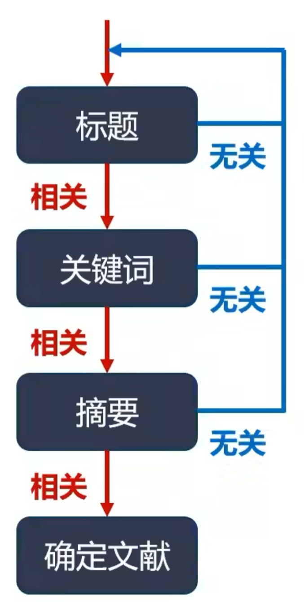

# 如何做好文献阅读及笔记整理

> 感觉自己文献做笔记的时候有些问题，想学习一下他们整理的方式，原视频已赋[超链接](https://www.bilibili.com/medialist/play/watchlater/BV17W4y167SM)

## 为什么要做文献阅读

1. **了解课题背景知识**

   适用阶段：对于课题一无所知，亟待探索的阶段

   阅读建议：硕博学位论文，领域大牛文献综述（建议先看学位论文，然后再看大牛的，有助于针对性的补充课题的背景知识）

2. **把握课题研究方向**

   适用阶段：对于课题已经有一定的了解，需要深化认知的阶段，需要进一步细化研究方向，更聚焦要研究的点

   阅读建议：行业最新论文，**领域大牛的文献综述**（一般会在发展和展望中提出领域的不足以及未来研究方向）

3. **学习课题设计思路**

   适用阶段：对于课题开始实践，设计试验阶段

   阅读建议：不仅仅局限于本领域最新研究论文，也要多看看其他领域的前沿论文

4. 提升逻辑写作能力

   适用阶段：所有

   阅读建议：顶刊！！！

## 如何做好文献阅读

### 如何筛选所需阅读文章

> 缩小搜索范围，切忌盲目下载一堆论文，不做任何筛选

筛选内容：标题、关键词、摘要

推荐工具：

1. [Stork文献鸟](Storkapp.me)

   通过输入研究方向的关键词，设定提醒时间，文献鸟会定时将符合关键词的文献发送邮件

2. [Connected Papers](Connectedpapers.com)

   通过输入文献名称或者DOI，可以获得与文献相关的论文知识图谱，追踪文献的引用和被引用关系

   使用时需要注意：

   * 论文发表时间越新，颜色越深
   * 论文引用度越高，圆圈越大
   * 论文之间联系越强，连线越黑

   该工具还进行了相应的总结：

   * Prior Works

     列举了最常被引用的论文，通常是开山之作

   * Derivative Works

     列举了该领域新的综述或者相关研究工作

### 如何阅读文章

了解论文整体框架结构，如研究型论文通常分为如下5个部分：

* 摘要：概括本论文所有覆盖内容，是论文简化版
* 前言：研究背景简介，现有研究不足，本论文创新点
* 材料与方法：试验材料，试验步骤，分析方法
* 结果与讨论：试验现象与机理，他人研究对比，不足及未来展望
* 结论：凝练总结本论文主要试验现象和相关机理

### 针对不同目标有选择性的阅读文献

1. **了解课题背景知识**

   精度：摘要-结论-前言

   略读：结果与讨论-材料与方法

2. **把握课题研究方向**

   精度：摘要-结论-前言

   选择性阅读：结果与讨论（不足及展望）

   略读：材料与方法

3. **学习课题设计思路**

   精度：摘要-结果与讨论-材料与方法

   选择性阅读：前言（论文创新点与可行性分析）-结论

4. **提升逻辑写作能力**

   精度：摘要-前言

   选择性阅读：结果与讨论（小标题及每段开头结尾）-结论

   略读：材料与方法

## 如何做好笔记整理

