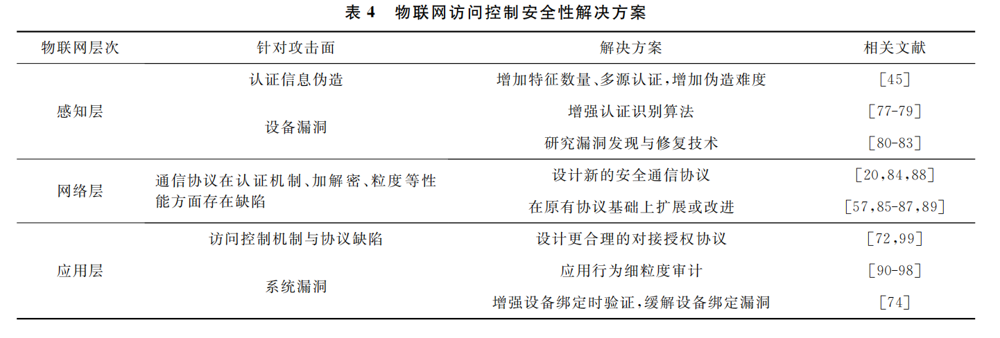

# 物联网访问控制安全性综述笔记

**作者：**刘奇旭，靳 泽，陈灿华，高新博，郑宁军，方仪伟，冯 云

**单位：**中国信息工程研究所，中国科学院大学网络空间安全学院

**时间：**2022年

**摘要：**近年来物联网安全事件频发，物联网访问控制作为重要的安全机制发挥着举足轻重的作用．但物联网与互联网存在诸多差异，无法直接应用互联网访问控制．现有的物联网访问控制方案并未重视其中的安全性问题，物联网访问控制一旦被打破，将造成隐私数据泄露、权限滥用等严重后果，亟需对物联网访问控制的安全性问题与解决方案进行综合研究．根据物联网架构复杂、设备多样且存储与计算性能较低的特性，梳理了物联网访问控制中的保护面和信任关系，形成信任链，并论述了信任链中的风险传递规律．围绕保护面和信任链，从感知层、网络层、应用层分别综述了现有的访问控制攻击面，分析了存在的安全风险．针对安全风险提出了应有的访问控制安全性要求，包括机制完善、应对攻击面、多级认证与授权、结合具体场景，基于这４个要求总结了现有的安全性解决方案和针对性的访问控制框架．最后讨论了物联网访问控制设计中所面临的挑战，指出了深入研究物联网云平台访问控制、物联网云对接标准化、引入零信任理念３个未来的研究方向．

**贡献：**

1. 分析了物联网３个层次间的数据流向与信任关系，提出了物联网访问控制信任链模型，围绕３个层次并结合信任链带来的风险传递，调研并总结了现有物联网访问控制的安全威胁研究，在物联网不同层次结构中分析了其安全问题和暴露出的攻击面；
2. 调研并总结了不同层次结构中针对不同的访问控制安全问题和攻击方法的解决方案以及应有的安全性设计要求；
3. 基于现有的研究基础，分析了物联网访问控制安全性研究的挑战与机遇，并给出了未来的研究方向．

## 研究背景

### 物联网基础知识

设备、网络协议、云平台和应用APP之间的相互作用构成了物联网的体系大厦，学术界通常将物联网系统的体系架构分为感知层、网络层、应用层３个层次：

1. 感知层对应的是物联网各类设备，其上搭载了红外感应、射频识别等多种类型的传感器，主要负责识别和采集物理世界的数据；
2. 网络层对应的是各类通信协议，负责在感知层和应用层之间传递数据；
3. 应用层对应的云平台和应用APP中的各类接口和服务，也是用户与物联网的接口，负责数据处理、计算以及智能决策．

​		下面本文将针对４个简单的使用场景，对物联网数据流进行描述．值得注意的是，以下叙述的场景仅仅是相对流行的方案，现实中同样的使用场景可能出现完全不同的解决方案．

1. **远程控制设备。**当用户远程使用 Ａｐｐ控制物联网设备时，Ａｐｐ端将会与云平台建立通信，并将控制指令发送给云平台，云平台接收到控制指令，将会把用户的控制指令翻译为设备能够理解的控制信息，并发送给设备．
2. **远程监控设备**。设备和云平台之间首先建立通信．设备将数据发送给云，云端会将这部分数据暂存．当用户打开Ａｐｐ并查看设备状态时，云端将暂存的最新设备上报数据发送给用户
3. **本地控制设备。**本地控制设备一般依赖于近场通信协议或局域网通信．但对于以云通信为主的设备，需要设备先在云平台上进行注册．也就是说，本地控制设备在远程控制设备条件存在的情况下，通常是远程控制设备的一种简化．
4. **自动化编程控制设备。**自动化编程控制设备是指在云平台上编写程序，通过触发器触发程序执行（例如当温度达到２８摄氏度时打开空调），这种情况下需要用户将自己的程序上传到云平台

### 访问控制基础知识

​		访问控制是一种通过对资源的访问、获取和操作进行身份验证和授权管理，使资源能够在合法范围内被使用或受限使用的技术，是维护网络安全、数据安全的重要措施。访问控制是主体根据策略对客体进行不同权限访问的过程，主要包括五大要素：主体、客体、认证、授权以及策略：

1. **主体．**主体是能够访问客体的实体，包括人、进程或者设备等具有能够访问客体属性的实体，主体可以在系统中执行操作、在客体之间传递信息或者修改系统状态
2. **客体．**客体是系统中需要被保护的实体的集合，包括文件、记录、数据块等静态实体，也包括进程等可执行指令的实体
3. **认证．**认证是指访问控制客体对主体进行身份确认的过程，从而确保主体具有其所请求的权限
4. **授权．**授权是指授予某个主体对某资源的访问权限的过程，强调的是某个主体可以对某资源进行哪些操作（读、写、执行等）．
5. **策略．**策略是指主体对客体访问的规则集合，规定了主体对客体可以实施读、写和执行等操作的行为，以及客体对主体的条件约束．策略体现的是一种授权行为，授予主体对客体何种类型的访问权限，这种权限应该被限制在规则集合中

​		经过多年的演进，访问控制技术已经产生了很多类型的访问控制模型，包括自主访问控制（disscretionary access control, DAC）、强制访问控制模型（mandatory access control, MAC）、基于角色的访问控制（role-based access control, RBAC）、基于属性的访问控制（attributed based access control, ABAC）、基于使用控制的访问控制（usage control, UCON）、基于权能的访问控制（capability-based access control, CapBAC）等：

1. **自主访问控制．**自主访问控制的核心思想是自主授权，主体可以完全控制客体，并可以自己决定是否将对客体的访问权限或部分访问权限授予其他主体．这种访问控制方式权限管理分散，而且需要手动对权限进行管理，在面对庞大且复杂的物联网时，难以适应物联网的动态自发性、可操作性等特性；
2. **强制访问控制．**强制访问控制的核心思想是系统强制主体服从访问控制策略，系统为主体和客体分配不同的安全标识，主体和客体不能够自行改变自身的安全标识，只能由系统或管理员强制分配，根据安全标识决定主体对客体的访问许可，本质是利用非循环单项信息流保证数据的机密性和完整性；
3. **基于角色的访问控制．**基于角色的访问控制的核心思想是将访问权限与角色相关联，通过将权限分配给角色，再让用户成为适当的角色，从而使得用户得到这些角色的权限，根据用户的角色决定用户对资源的访问权限．这种访问控制方式在涉及大量角色的物联网环境中会存在角色爆炸问题，同时也难以满足物联网中细粒度、多层次的访问控制需求；
4. **基于属性的访问控制．**基于属性的访问控制的核心思想是根据主体的属性授予访问权限，主体和客体都是通过与特征相关的属性进行识别，当用户发起访问请求时，根据他的属性授予相应的访问权限．这种访问控制方式由于其属性在访问过程中不可以改变，无法满足物联网中节点属性动态改变的需求，同时随着设备数量的增加，会增加策略管理的工作量和复杂性；
5. **基于使用控制的访问控制**．基于使用控制的访问控制的核心思想是属性可变和持续检查，当主体发起访问请求时，授权元素检查主体和客体的安全属性以决定是否允许访问，这种检查持续伴随着整个访问过程，在访问过程中，一旦主体或者客体的安全属性发生改变，授权将相应地改变，撤销授权或支持继续访问；
6. **基于权能的访问控制．**基于权能的访问控制的核心思想是根据权能（密钥、令牌等）授予用户相对应的访问权限，一种权能拥有对某些资源的访问权限，系统仅允许权能拥有者对这些资源的访问，拒绝其他访问．此外，主体可以将其全部或部分访问权限通过委托机制授予其他主体，同时支持主体撤销其所授予的权能，这使得 CapBAC具有分布式、细粒度等优点。

### 物联网访问控制

物联网访问控制即物联网场景下的访问控制技术，用于保障设备、用户、云端之间资源请求与权限授予过程的安全合规．相较于互联网访问控制，其区别主要在于４点：

1. **计算与存储能力不同．**物联网中存在大量的各类轻量级感知层设备，通常设备容量低，不支持复杂的运算、数据存储，难以参照互联网设备建立较强的安全边界，也因此成为攻击者的重点目标。
2. **体系架构不同．**由于设备的性能较低，物联网中的运算、决策主要依靠云平台来实施、对接并下发，无法复用互联网中心化的访问控制架构．同时物联网架构导致数据的传输和交互更加频繁，扩大了风险暴露面。
3. **通信协议不同．**在互联网中，有线通信协议更加普及，而物联网中由于大量设备的存在，无线信协议更加常用，因此无线通信协议的安全性更加重要．物联网设备的异构性也提高了对通信协议的要求．在协议模型方面，互联网中“请求/响应”模型的通信协议更加普及，而物联网由于大量设备存在并且通信存在大量不稳定因素，引入了很多“发布/订阅”模型的通信协议；
4. **业务场景不同．**互联网访问控制的业务场景主要是控制数据资源的访问，而物联网的业务场更加多样化、与物理世界更加密切相关，包含家居、医疗、工业控制等，不同场景中的设备性能、具体架构、安全需求都有所区别，需要具体问题具体分析．

用户 Ａｐｐ、云平台、设备之间通过各自独立的访问控制模型形成一个相互的信任关系，产生访问控制信任链，而对于访问控制信任链，存在３个攻击面：

1. 攻击者可以直接绕过物联网设备对用户的认证，从而直接控制设备；
2. 攻击者通过中间人攻击等手段劫持物联网设备与云平台的连接，从而注入或窃取数据；
3. 攻击者绕过云平台对用户的认证，从而通过云平台间接地控制物联网设备．

因此，在物联网场景下，信任链中的一环出现访问控制失效，恶意的控制流和数据流就会沿着信任链传递，造成难以预估的危害．

本文在前面介绍了[4种控制设备的场景](#4种访问场景)，这些场景在信任链中可能存在3种风险传递模式：

1. **设备端风险传递**

   利用设备对云平台或用户的访问控制漏洞，可以近距离接触设备并对云平台进行控制或导致数据泄露．通过访问控制信任链，设备端的安全问题可能传递到云平台和用户端，造成更严重的安全问题．需要注意的是，设备对云平台也需要进行访问控制，设备需要首先确认云平台的身份，也需要确认来自云平台消息的完整性，防止诸如 ＤＮＳ污染等问题．设备端产生的风险，一方面直接作用于设备；另一方面，借助云平台的信任，设备端风险可以传递到用户侧，例如远程监控设备，设备端的数据如果受到篡改，用户会通过云平台接收到假的设备状态而导致严重后果，如虚假的火灾警报．

2. **云平台风险传递**

   云平台作为数据的传输中转站，一旦出现安全风险，可能对大量的设备和用户造成影响．攻击者可以利用远场通信协议的安全漏洞或云平台处理逻辑的安全问题，对连接在云平台上的设备进行控制或监听或对连接在云平台上的用户 Ａｐｐ进行欺骗．由于访问控制信任链中，设备和用户 Ａｐｐ对云平台的信任，这种攻击的隐蔽性强，受害者很难发现．从数据链的角度分析，云平台应用发起的控制指令，仍然是由云平台发起的，数据的传递基于设备端对云平台的信任链，一旦云平台应用出现安全问题，可以造成难以估量的后果．因此，云平台应用程序的复杂安全威胁也是目前研究的重点之一．

   值得注意的是，即使是本地控制设备场景，在当今智能家居等行业的发展背景下，云平台也会在设备绑定、客户端鉴权等方面扮演非常重要的角色．即使用户 Ａｐｐ和设备在同一个局域网下，云平台也有可能在绑定设备的过程中扮演必不可少的角色．

3. **客户端风险传递**

   客户端安全风险主要是用户移动端 Ａｐｐ的安全问题．由于移动端 Ａｐｐ的安全问题很难通过信任链将恶意数据传递到其他物联网实体，因此目前对物联网移动端 Ａｐｐ的研究相对较少．

## 物联网访问控制现有研究

### 物联网访问控制原则

Ouaddah等人结合物联网的特性总结了物联网访问控制应该遵循的８个原则：

1. **协同性**．物联网环境下可能存在多个不可信的个人或者组织进行协同，访问控制系统必须允许各个主体制定自己的政策，且能与其他组织的政策兼容合作．
2. **自适应策略**．由于各个主体的动作是动态、不可预测的，必须允许访问控制的策略可以针对上下文进行动态调整更新来适应不同的需求
3. **细粒度**．因为物联网系统中的各种设备会受到各种环境因素的影响而被触发，访问控制也应该同样考虑到这些环境因素，将环境信息引入到系统中进行更细粒度的决策（例如，根据当前的时间、位置、目标设备等信息决定是否允许操作）
4. **易用性**．访问控制应该易于管理和修改，以方便缺少相关技术的普通用户使用．
5. **分布式自治系统**．每个实体的访问控制策略的实施和管理应由其自己的规则来控制，以适应物联网环境下分布式安装的智能设备．
6. **异构性**．由于物联网设备之间存在各种物理上的差异，在进行管理时应存在一个统一的虚拟接口，来方便控制管理存在不同特性的设备．
7. **轻量性**．访问控制系统应保证轻量来节省各种物联网设备本就不富裕的计算能力和能源消耗
8. **可扩展性**．访问控制系统应可以随时扩展，以应对当前越来越多的物联网设备、应用和用户

### 现有研究

当前物联网访问控制相关研究主要集中在访问控制架构、机制流程、模型３个方面：

1. 在**架构**方面，由于物联网场景通常由多种类型的设备组合连接而成，访问控制不再是传统互联网中的少量几个系统之间的互相授权，而是大量设备之间的权限管理，因此互联网场景下常用的中心化访问控制架构难以适用。此外，这些设备一般互为异构且计算能力弱，难以处理加解密、智能策略生成等复杂算法，更无法将传统互联网中的访问控制系统直接进行移植，需要探索适用于物联网场景的访问控制系统，重点满足轻量性、异构性等原则．而随着物联网架构的进一步演进，现有研究出于将计算负载分散化和增加容灾能力的目的，主要探索去中心化、分布式架构的设计．区块链是如今非常流行的去中心化技术，众多研究提出了将**区块链、智能合约**等技术引入到系统中，利用区块链技术的分布式、可验证等特性来实现可扩展、分布式、可协作的访问控制。**雾计算**和**边缘计算**是通过将计算需求迁移到其他设备来提高计算性能和架构扩展性的技术，也已经有研究提出将雾计算和边缘计算运用到物联网访问控制的架构设计中．
2. 在**机制流程**方面，当前研究主要针对访问控制系统中的各种交互协议与数据格式，由于物联网设备的特殊性，通常无法采用有线连接，而是使用移动网络、蓝牙、ZigBee等无线方式与服务器连接．无线连接与有线连接相比存在延迟高、带宽小、抗干扰能力弱等特点，无法直接使用互联网中复杂的交互协议与框架，当前研究主要是将轻量级的协议与框架引入物联网访问控制系统当中。在**交互协议**方面，研究人员围绕 ＭＱＴＴ，ＣｏＡＰ等物联网通信协议进行访问控制相关设计 ．在**数据格式**方面，研究人员倾向于结合JSON（javascript object notation），XACML（extensible access control markup language），SAML（security assertion markup language）等数据格式灵活、简单的优点，提出了物联网授权框架，使得资源受限的物联网设备也能进行细粒度和灵活的访问控制 ．这些研究能够降低物联网访问控制流程中的流量、内存、性能损耗，且同时能保证访问控制系统的正常运行．
3. 在**模型**方面，当前研究主要是将互联网中已有的 RBAC，ABAC，UCON，CapBAC 等访问控制模型进行移植．进行移植的原因之一是这些传统模型已经在互联网的悠久历史中证明了其可靠性和实用性，只需要针对物联网环境下的分布式等特性进行少量修改就可以直接使用。另一原因是直接移植模型可以使得现有的互联网系统可以方便地与物联网设备进行对接交互，让原有的互联网用户可以无缝地接入物联网中来实现 WoT（Web of things），从而减少企业开发程序上的人力成本

​		从现有相关研究来看，当前物联网访问控制研究更注重功能性，主要针对物联网环境下由于架构不同和资源受限带来的计算能力低、带宽小等问题，需对互联网下访问控制所用的方法进行修改后移植到物联网场景中．具体来说，在访问控制架构上，从中心化的架构逐渐转向分布式架构，借助区块链等先进的分布式技术进行设计；在机制流程上，则围绕适用于物联网的通信协议和轻量级数据格式进行研究；在模型上，主要研究将成熟的互联网访问控制模型向物联网移植并适配．

​		但现有研究并未重视物联网环境下访问控制系统的安全性．一方面，当前的物联网由于设备类型多样、业务需求多样，其体系结构非常复杂且处在持续的演进中．另一方面，物联网中的设备通常与用户物理相邻，它可以是身边的摄像头、烟雾报警器，也以是工控系统中的水闸电闸，这些设备能够以多种形式影响到用户本身，所以，直接使用从互联网移植现有访问控制技术的系统架构、机制流程、权限模型而不对安全性进行额外的验证和适配是不充分的，可能引发安全上的隐患与风险，导致敏感数据泄露，危害到工业生产安全、人身安全甚至是国家安全

### 物联网访问控制安全性

物联网访问控制是保护用户数据、保障设备合法操作指令的安全技术，而要使访问控制真正生效，则需要保障访问控制自身的安全性，包括主体、客体、机制策略、身份认证、权限授予等方面的安全．由于物联网体系架构的复杂性和业务场景的多样性，物联网难以建立传统的安全边界，其访问控制系统难以实现端到端的设计．为实现安全的访问控制，需要围绕物联网数据链、信任链和业务场景，研究从哪些层面入手保障访问控制安全性，即物联网访问控制保护面．

1. **设备安全**

   设备上搭载的传感器所采集的指纹、声纹是物联网进行用户身份认证的重要数据来源，关系到用户的身份信息是否独立、安全，若该类数据被伪造或窃取，将产生身份冒用风险，导致访问控制失效；

2. **流量安全**

   物联网在感知层、网络层、应用层之间的数据传输依赖网络流量，对于访问控制场景，则需要在３个层次之间进行身份认证信息、授权指令等的传输．因此，流量的安全性至关重要，需要在该层面防范数据窃取、中间人攻击等风险，增强网络协议的安全性对于流量安全的保障

3. **应用安全**

   根据物联网的数据链与访问控制信任链，应用是用户与设备、设备与云平台的接口，向上传递身份认证信息，向下传达授权决策与操作指令，因此需要在应用 Ａｐｐ层面保障安全．

4. **云安全**

   云平台承担着复杂的数据计算、处理与存储任务，在更多的访问控制场景中负责授权策略管理，并且，物联网中既存在云平台与设备、应用的交互，也存在云平台与云平台之间的交互，因此，云安全是保障安全的物联网访问控制生效的重要着力点

5. **接口安全**

   物联网多个层次之间以及各个层次内部的数据流转都依赖接口，不安全的接口存在信息泄露、篡改的风险．

## 物联网访问控制攻击面

### 感知层攻击面

感知层是物联网架构中最基础的层次，负责向上层提供数据支持，是一个具有物理设备的实体，感知层分为传感器和设备软硬件２个层次：

* 传感器负责收集外界信息，设备软硬件负责驱动传感器工作，并与上层建立连接；
* 感知层的访问控制模型主要有２方面：
  * 一方面 设 备 传 感 器 作 为 主 体，采 集 外 界 信息；
  * 另一方面设备作为客体，与多种主体（如 Ａｐｐ和云）进行交互．

在现有的针对感知层的研究中，主要考虑传感器数据的可靠性以及感知层软硬件的设计与实现

#### 感知层传感器安全问题

​		对于感知层传感器而言，有研究表明现有的安全方案和访问控制系统无法为传感器提供足够的安全防护，产生了漏洞：伪造传感器所收集的数据，使得传感器无法获取相应的外部信息．在现有的研究中存在很多伪造传感器数据的攻击案例，这种攻击可能导致应用层基于错误的传感器数据产生错误的判断，由于应用层的访问控制模型无法涉及到感知层的细节，应用层的访问控制模型会被完全欺骗。传感器获取的客体数据大多来自于真实的物理世界，导致传感器的访问控制几乎无法使用现有的技术，只能在一定程度上针对每一种数据来源的真实性进行判断。

#### 感知层设备安全问题

感知层设备作为访问控制的客体，被多种主体访问．感知层设备主要分为软件和硬件２个层面，软件涉及操作系统和上层的应用程序 ．感知层设备的访问控制的失效可能发生在非法的控制端或恶意用户获取了设备的信息或对设备进行了修改。

* 在感知层设备的软件层面，访问控制攻击面主要包括：弱口令、访问控制失效的通信接口、缺乏认证的更新机制
* 在感知层设备硬件层面，针对设备客体访问控制的攻击面包括了针对硬件的侧信道攻击和调试接口暴露．

​		当设备的软硬件的访问控制模型被打破时，其危害可能被信任链传递到其他层次．例如，云平台的访问控制模型会无条件接受设备传递的数据，因为云平台已经没有任何办法验证设备是否已经被攻击者控制，进而也会被应用层的访问控制模型认可，影响应用层逻辑．但针对感知层设备的攻击需要攻击者接触设备，利用条件较苛刻．

### 网络层攻击面

​		网络层是位于物联网架构中间的层次，主要支撑感知层和应用层之间，以及位于感知层的设备之间和位于应用层的云平台与应用 Ａｐｐ之间的通信，是由不同的通信协议组成的一个层次，网络层的访问控制威胁也主要分布在各种不同的通信协议中．按照设备的近场性，可以将网络层分为近场通信层和远场通信层．

* 近场通信层主要涉及设备配对、设备间近距离通信、设备和 Ａｐｐ之间近距离通信等；
* 远场通信主要涉及设备和云服务器之间、云服务器和Ａｐｐ之间的通信等．

​		网络层向上对接云平台和应用层的访问控制模型，向下对接感知层设备的访问控制模型．

#### 网络层近场通信安全威胁

​		IoT近场通信协议主要有 BLE（bluetooth low energy），ZigBee，Z-Wagve，6LoWPAN等．近场通信协议的设计问题和漏洞能够破坏客体设备的访问控制模型，也包括用户设备（手机），主要漏洞是设备未授权访问、用户隐私泄露、设备劫持等；近场通信协议的安全问题能够绕过设备的访问控制模型，进而通过信任链传递到云或其他主体，并且这些安全问题的避免难度较大，目前主流研究集中在对协议的漏洞进行研究，并改进协议，进行安全加固．

​		近场通信协议的安全问题主要打破设备的访问控制模型，进而通过信任链影响到云端访问控制模型、应用层访问控制模型，由于通信协议的漏洞相对较难避免，因此具有很强的隐蔽性。但利用近场通信协议需要攻击者在较近的物理距离内发起攻击，影响面相对较小。

*注意：这一块有很多的具体攻击实例文章，可以看原文的参考文献*

#### 网络层远场通信安全威胁

​		网络层远场通信主要聚焦于各种物联网流行的通信协议上，目前使用较为广泛的协议包括 ＭＱＴＴ（Message Queuing Telemetry Transport），ＣｏＡＰ（Constrained Application Protocol），ＡＭＱＰ（Advanced Message Queuing Protocol），ＨＴＴＰ（Hyper Text Transfer Protocol），ＸＭＰＰ（Extensible Messaging and Presence Protocol），ＤＤＳ（Data Distribution Service for Real-time Systems）．远场通信协议的安全疏忽能够打破云平台或云端数据的访问控制体系，远场通信协议对于访问控制模型的挑战，成为了目前学术界的关注重点之一．

​		网络层远场通信协议大多在设计之初就缺乏对适用物联网的安全性设计，对于保密性，通常都是由TLS协议或DTLS协议保证。对于协议本身的安全问题与协议适用物联网时协议对接云平台和云端数据的访问控制模型时存在的安全问题，目前的研究较少。

​		由于云平台和协议特性之间的安全鸿沟，云平台很难利用现有的访问控制技术去限制物联网协议，攻击者可以利用协议的特性，打破云平台的访问控制模型，进而欺骗云平台去修改云端设备元数据，并成功控制受害者设备，窃取用户敏感信息。**Ｗａｎｇ等人提出了 ＭＰＩｎｓｐｅｃｔｏｒ框架，实现了自动化分析远场通信消息传递协议的安全性**（这个论文需要去关注一下，在原文的参考文献67），在９个广泛使用的物联网平台上对 ＭＱＴＴ，ＣｏＡＰ，ＡＭＱＰ 协议进行分析，并且使用 ＭＰＩｎｓｐｅｃｔｏｒ框架评估这些协议的安全性，发现了针对物联网远场通信协议的１１种类型的攻击方式，其中包括客户端身份劫持攻击、恶意主题订阅、未经授权的消息响应等．这些攻击方式可以在协议的层面突破云平台甚至云端数据的访问控制模型，并通过信任链将危害传递到大量物联网设备．

​		远场通信协议主要通过打破云平台的访问控制模型或应用层的访问控制模型来修改云端数据，并通过信任链将危害传递到设备和用户 Ａｐｐ，远场通信协议因为可以修改云端数据，其安全问题具有影响面大、破坏性大的特点，在极端情况下，一个攻击者甚至可以利用远场通信协议和访问控制模型之间的安全鸿沟，对整个云上连接的设备进行低成本的大规模攻击

### 应用层攻击面

​		在当前的IoT架构中，应用层一般是物联网顶层设计的逻辑，如在智能家居场景下的用户、家庭等概念均运行在应用层之上．物联网应用层是一个抽象层，应用层之上一般只是数据和访问控制逻辑．正因如此，一旦应用层访问控制出现问题，运行在其他层次的安全手段（如网络层的安全防护）难以发现．另外，由于云平台需要存储几乎所有的应用层数据，一旦云平台的应用层访问控制逻辑出现问题，借助信任链，可能导致大量IoT设备沦陷

而现有的IoT云平台根据其功能可以分为２类：

1. 第１类是IoT设备厂商自身的云平台。

   例如小米米家、涂鸦智能等，一般可以与本厂商的IoT设备进行连接，通过网页/手机 App控制IoT设备，并提供接口可以与其他云平台或者 Trigger Action平台进行对接，部分平台例如 SmartThings，甚至允许用户上传自己的程序在云平台上，允许用户自己编程控制IoT设备．云应用大大拓展了物联网的使用范围，但也使得应用层访问控制变得极为复杂，大大增加了安全的不确定性

2. 第２类是自动化流程平台．

   例如IFTTT，Zapier等，除了可以与第１类的厂商云平台进行对接，还可以与推特、Dropbox等非IoT厂商的云平台对接．以此提供除了IoT设备之外的触发和应用能力，例如通过发送短信操控IoT设备，或者由IoT设备触发短信的发送．而少部分IoT设备，例如门锁、牙刷、医疗设备、摄像头等，可能厂商并没有建设云平台，者这个设备本身并不具备连接互联网的能力，实际上是直接通过局域网或者 BLE连接用户手机 App，并以此被用户所控制．

​		对于直接受到IoT平台操控的设备，攻击威胁主要来自*云平台的访问控制失效*；而受 App近场通信直接操控的IoT设备，攻击威胁主要来自*手机App本身和设备端不完善的访问控制的联合作用*.

#### 云平台中的云应用产生的漏洞

​		当前的云平台一般都会允许用户创建一些简单的规则或者应用，以方便用户满足自己的一些特殊需求．其中一些平台，例如IFTTT与 SmartThings，还允许用户发布自己的云应用并共享给其他人使用．而大量创建的应用不可能做到每个都被人工计过，导致其中会存在难以对云平台应用程序访问控制的基本问题，从平台的接口盗取用户隐私数据，甚至控制用户的IoT 设备．

​		除了恶意应用，还有不少应用本身并不是恶意的．单一应用不会产生安全风险，但是多个应用之间的物理或者非物理上的意外组合或交互，导致在应用层构建了一条逻辑上的、云平台未曾预料到的数据链和信任链，引发访问控制漏洞．

#### 云平台与云平台对接时产生的漏洞

​		目前，云平台的互相连接非常常见，尤其是在消费级物联网云平台，这便于消费者将多个厂商的物联网设备或者非物联网服务进行联动和管理.目前厂商的主要做法是使用 OAuth（open authorization）协议来进行平台之间的授权和鉴权，但OAuth本身为一个集中式的权限管理协议，这种集中式的服务会使得攻击者在攻陷一个系统后就可以利用系统中保存的令牌同时获得当前系统中所有用户的物联网设备权限．另外，由于 OAuth协议中缺少对被授权主体的验证，在云平台与云平台对接授权后，设备主人通过云平台将设备共享给其他用户（例如：授予短期住宿的客人开门权限），如果云平台的实现不当，不慎将 OAuth令牌泄露给用户，会导致用户意外获得这个门锁的完全控制权，即使主人在平台上撤回权限也无法真正回收权限.

​		此外，由于目前各个平台的对接标准不统一，各个平台都存在特有的格式和要求，导致对接时的信息可能会被另一方错误使用，导致访问控制漏洞

#### IoT设备绑定存在漏洞

​		设备绑定漏洞主要存在于智能家居领域．当云平台设备进行绑定时，需要用户手机 App、云平台、IoT 设备三方共同协作完成，最后才能将IoT 设备绑定到用户手机 App的账号中．而如果在云平台中进行设备绑定的状态模型出现问题，则可能导致设备 被 敌 手 重 绑 定、解 绑 定 等

​		Zhou与Chen等人展示了多种状态模型漏洞的利用方法，他们发现目前云平台绑定ＩｏＴ 设备时用到的均为类似设备ＩＤ、设备网卡地址、设备型号等公开或者容易被嗅探出来的信息，使得攻击者在获得这些信息后可以伪造出一个“幻影“设备，将真正的设备绑定到攻击者的帐号下，或者将“幻影”设备绑定在原有帐号下伪造各种数据，这种攻击方式本质上利用的是云平台对设备接入的访问控制逻辑错误，利用物联网数据链，使有害信息传递到用户 Ａｐｐ

#### App与设备端应用层漏洞

​		与手机 Ａｐｐ有关的访问控制漏洞，主要发生在本文１．１节中提到的本地控制设备，或控制一些不支持云平台的ＩｏＴ 设备上．在这种情况下，ＩｏＴ 设备受到手机 Ａｐｐ的直接操作，由于 Ａｐｐ与ＩｏＴ 之间的交互通常使用局域网、蓝牙等本地通信方式，使得攻击者如果在本地或者已经取得手机部分权限的情况下，可以利用物联网设备访问控制模型的安全问题进行攻击

## 物联网访问控制安全性解决方案

​		已经有相关工作提出了物联网访问控制框架的特性与原则，但并未针对安全性问题进行细致的研究探索．为了实现安全的物联网访问控制，需要结合物联网的特性，满足４点要求：

1. **机制完善**

   物联网结构与数据流转复杂，因此，需要更加细致、完善的访问控制机制与流程

2. **应对攻击面**

   安全的访问控制除了在机制上要完善，还应该在具体的技术建设层面解决脆弱点与攻击面带来的安全风险．

3. **多级认证与授权**

   由于物联网的数据流转在多个层次之间进行流转，存在信任链条的传递，在每一个环节都可能存在不同类型的风险，因此，安全的物联网访问控制应该向着多级认证、逐级授权的细粒度方向演进

4. **结合具体场景**

   物联网与人类社会的生产生活息息相关，其业务场景包括了智能家居、智慧医疗、工业控制、车网等，不同场景的数据敏感程度与被控风险程度有所不同，在具体建立访问控制时需要结合具体场景进行设计规划．

### 感知层访问控制安全性解决方案

感知层主要包含设备及设备上搭载的传感器．在访问控制场景中，一方面作为主体，负责收集数据作为身份认证信息；另一方面负责执行云端通过认证与授权后下发的指令．

#### 传感器层面

​		其主要的访问控制安全威胁在于收集到的有关身份认证的信息（如指纹、声纹等）可能被篡改、被伪造，因此，很多研究工作从信息防伪造的角度着手，强化传感器层面的访问控制安全．

​		在传感器层面，大多数的访问控制解决方案需要针对特定传感器的特定攻击方法来实施，比如较为常见的指纹和声纹伪造２种场景．针对指纹传感器欺骗检测的方法一般分为２类：基于硬件的检测和基于软件的检测．

* 对于硬件检测，可以通过增加传感器设备来收集生命特征，比如温度、血压、导电率等，这种硬件检测方法准确度较高但增加了设备的成本，且无法应用于旧设备中．
* 软件检测通过增强对图像的识别来区分真实指纹和伪造的指纹 ．目前基于机器学习的软件图像检测方法较为流行

#### 设备层面

​		设备感知层的访问控制模型较简单，攻击面与传统的嵌入式设备攻击面大致相同，主要的薄弱点为设备软硬件漏洞，因此设备层面的安全防御主要是漏洞的发现和修复以及可信计算加固，防止潜在的漏洞利用等．除了使用自动模糊测试的手段及时发现漏洞外，还可以通过可信执行环境、控制流保护、数据执行保护等手段防御漏洞攻击．在物联网设备中提供可信执行环境可以隔离可信应用和普通应用，在一定程度上缓解了远程漏洞攻击影响，保证了可信应用的安全，同时也可以避免具有物理权限的攻击者提取敏感信息

### 网络层访问控制安全性解决方案

网络层在物联网中主要负责数据的传输，为了更安全地访问控制，需要保障数据传输过程中的安全，通过完善加密算法、传输协议等避免访问控制场景中的身份认证信息、授权信息被窃取或篡改．

#### 网络层近场通信

通常有两种解决方案：

1. **设计全新的安全通信协议**，使其不仅适用物联网的低功耗、低成本的需求特性，并且尽可能保障通信的安全，安全的设计贴合物联网的复杂架构．
2. **在原有协议的基础上进行扩展或者改进**，利用扩展部分保障原有通信协议的安全或者改进原有协议以便消除威胁

#### 网络层远场通信

网络层远场通信的安全威胁解决方案与近场通信的解决方案类似，通常有２种方案：

1. 设计新的适用于物联网远场通信并有安全通信保障的新协议；
2. 在原有协议基础上进行扩展或改进

### 应用层访问控制安全性解决方案

​		应用层包含云平台和用户App，其中存在云平台与用户的交互、云平台与设备的交互、云平台与云平台之间的交互等，在各种类型的交互中都存在着访问控制过程．而应用层在物联网架构中作为具备高性能运算与存储的层次，需要建立更完善的访问控制模型、更安全的认证与授权机制．

#### 基于云平台上云应用行为的访问控制

​		目前，云平台中云应用所广泛运用的访问控制系统均基于权限，多项研究已经证明基于权限的访问控制系统因其控制粒度不足，无法控制应用获得权限后的使用方式，使其仍不能阻止云应用的恶意行为．当前的学者为了解决这个问题，主要通过不同方式收集当前应用的行为，直接**对应用行为进行安全审计**，从而构建拥有更加细致的控制粒度的访问控制系统，这让应用即使拥有权限也无法做出恶意的行为。目前的研究方有3种，分别通过**静态分析、动态插桩和监听流量**来收集应用行为

1. **静态分析**。直接对应用的代码进行行为分析，判断应用是否存在恶意的行为
2. **动态插桩**。通过在已有的代码中手动或者自动的方式插入用于审计的代码，从而直接限制数据的流向或者在运行时收集上下文信息并分析出当前应用的行为。
3. **监听流量**。这个方面最具有代表性的解决方案是 Homonit，其通过解析捕捉到 ZigBee或者Z-wave等无线协议的流量，然后将这些流量中的特征进行分析从而得出应用是否存在不当行为．这种方式相对来说限制较小，不需要应用的源代码也可以对应用的行为进行检测，但是也最容易受到干扰导致误报．

#### 统一且去中心化的云平台对接授权协议

​		在当前的云平台与云平台对接中，主要沿用了互联网中的OAuth协议，其作为一个集中式的权限管理协议，容易导致系统被攻陷后凭据被攻击者获取从而使得其破坏访问控制，因此授权协议应该是去中心化的。

#### 云平台设备绑定

​		目前发现的设备绑定时漏洞的成因主要来自于在更改绑定状态模型时没有验证绑定状态转换的合法性和认证时使用静态设备身份认证信息．为此，应研究动态生成的设备绑定信息和经过验证的绑定状态模型。IoT设备的设备ID等信息应在注册时由云平台通过算法生成后下发，而不是在出厂时硬编码进芯片中，并且生成算法中应包含用户ID、随机数等难以被攻击者猜测、枚举出的信息．同时，为了防止攻击者进行恶意的绑定状态转换，云平台在对定状态进行转换时，应验证状态转换请求的发送用户的绑定状态、目标绑定的设备状态和请求消息中的认证信息，避免状态的非法转换

## 挑战和机遇

### 面临的困难和挑战

1. **规模巨大且环境复杂**。物联网设备种类规模巨大在当前环境下，物联网已经广泛渗透到各行各业中，在智能家居、智慧城市、工业4.0等各种场景中，都可以看到大量物联网设备的影子．规模如此巨大的物联网设备对访问控制系统的性能和架构提出了巨大的挑战．除了规模巨大，物联网设备由于在不同场景下的广泛运用，其种类也同样繁多，这些设备往往都针对特定场景进行了特殊的设计，导致不同设备之间存在巨大差异，包括计算能力、处理器架构、操作系统等多个方面，这使得访问控制系统不仅需要覆盖到所有场景下不同的设备类型，还要协调拥有不同特性的设备遵守其控制．为解决这些问题，需要研究让访问控制系统在拥有强大性能的同时还拥有良好的安全性和兼容性的方法．
2. **物联网安全架构复杂**。物联网设备由于其天生的“万物互联”特性，一般采用分布式部署，物联网设备之间会直接进行通信而不依赖额外的中心服务器进行中转．但同时由于物联网设备需要提供给用户使用，一般仍然会存在一个中心的服务用于对用户提供接入、下发用户的命令或者接受来自设备的信息．这种复杂的中心化与去中心化混合的架构对访问控制系统提出了巨大的挑战，系统需要同时满足设备、用户、云端服务三者之间的访问控制，使得安全架构非常复杂，难以保证安全性．然而，当前的访问控制系统通常只着力于两者之间的访问控制，例如用户和设备之间的访问控制，而忽略云端，目前需要一种新的访问控制系统能够同时满足三者之间的安全访问控制，但同时保证系统能够适应物联网的特殊环境而不会变得过于复杂；
3. **解决方案以点为主缺乏统一**。目前现有的物联网系统为了保证安全性，一般都会存在 访 问 控 制 系 统，但 由 于 缺 少 类 似 互 联 网Ｗｅｂ中的 ＯＡｕｔｈ，ＸＡＣＭＬ等统一的访问控制框架和协议，使得各个物联网系统均为“点”，需要通过自己编写实现的系统进行访问控制．这些系统往往缺少相关安全性测试，无法保证用户和设备的安全，且这些系统也无法互相对接，让“点”无法连成“线”和“面”，导致各个系统之间无法在保证安全的情况下方便地共享数据，与“万物互联”的理念相违背．因此，需要研究人员和当前广大的物联网设备公司进行合作，开发出一套统一而具有通用性的访问控制系统．

## 未来研究方向

1. **深入研究物联网云平台访问控制**。

   云平台作为物联网的数据中心和控制中心，其中接入了大量的设备并存储了大量的数据，一旦访问控制失效，将造成严重危害．然而，目前云平台的访问控制问题是物联网访问控制问题中的重灾区包括云平台内部访问控制问题、云平台间的访问控制问题，以及云平台与设备、手机 Ａｐｐ等交互时的访问控制问题．由于云平台内部的复杂性、云平台应用和设备的多样性、不同云平台厂商间的封闭性，以及云和设备、协议之间的安全鸿沟，目前难以找到统一适用的访问控制模型解决云平台的访问控制问题．深入研究物联网云平台访问控制，是未来亟需研究的方向之一．

2. **研究物联网云对接标准化**。

   当前物联网云平台厂商各自都有自己的对接标准和访问控制机制，这些对接标准和访问控制机制能够很好地适配本厂商生产的设备，然而面对其他厂商生产的设备接入，或者本厂商生产的设备接入其他云平台时，就会引发访问控制失效问题．由于物联网具有分布式、灵活、动态接入的特性，很多厂商不仅允许与本厂商的ＩｏＴ 设备进行连接，还允许与其他厂商的云平台进行连接，甚至允许与自建云平台进行连接，这些连接过程由于不同的厂商有不同的标准规范，对连接后的平台和设备的访问控制安全性造成了极大的冲击．为延续物联网分布式、灵活、动态接入的特性，并使得对接入后的平台和设备的安全性得到保证，本文认为标准化这些对接过程是非常必要的．

3. **在物联网访问控制中引入零信任理念**。

   在应对物联网场景中的应用安全、网络安全、数据安全方面，仅在传统安全方案的基础上做边界加固和单点增强，难以系统性地缓解各类安全威胁，而零信任是一个新兴的模型，作为一种可以支撑未来发展的安全防护方式正逐渐受到越来越多的关注．零信任模型并非全盘否定，而是秉承网络始终存在内部和外部威胁，所有的设备、用户和流量在验证前不存在固有信任的原则，坚持持续验证、最小权限．因此，访问控制作为物联网场景中数据安全和网络安全防护的重要关口，需要引入零信任模型的理念进行物联网场景的适配和流程架构的设计，从而实现动态、实时、持续、精准、安全的访问控制