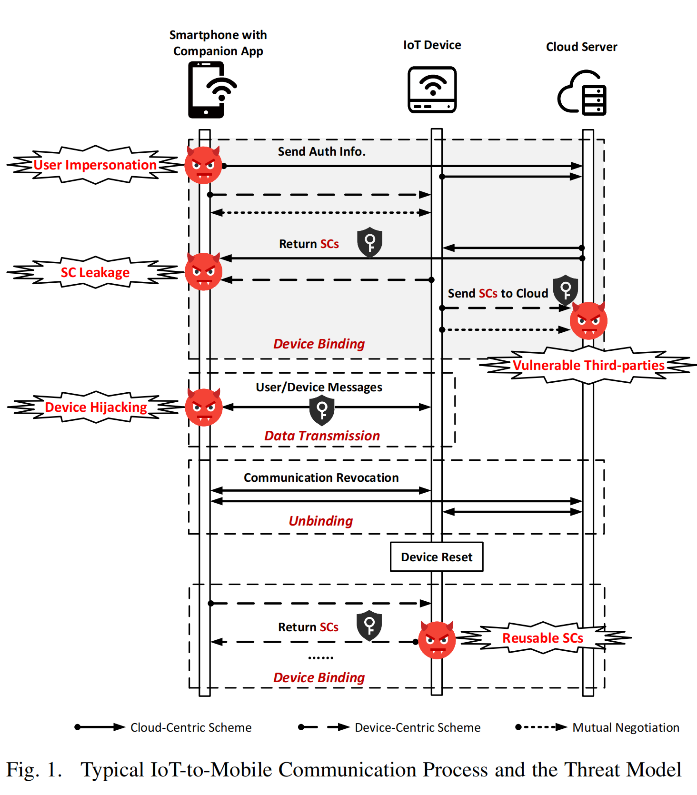
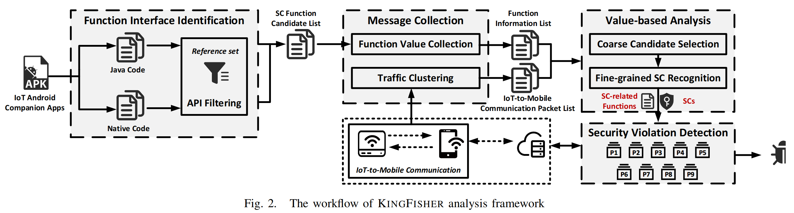
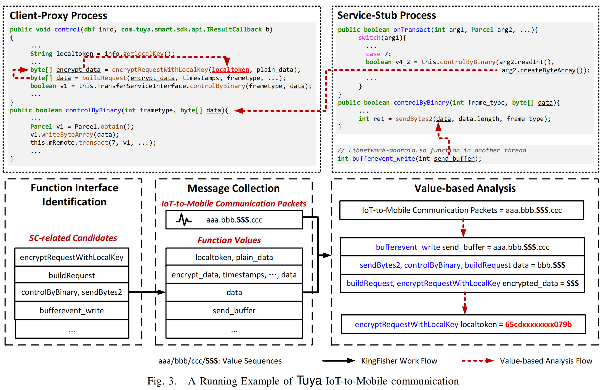

# KINGFISHER: Unveiling Insecurely Used Credentials in IoT-to-Mobile Communications

一篇关于认证机制使用时是否存在脆弱性检测的文章，[原文链接](https://ieeexplore.ieee.org/document/9833606)

## 1. 文章信息

**Author:** YiweiZhang[1], Siqi Ma[2], Juanru Li[1], Dawu Gu[1], Elisa Bertino[3]

**Company**: [1]Shanghai Jiao Tong University, The University of New South Wales[2], Purdue University[3]

**Publisher**: IEEE/IFIP DSN

**Year**: 2022

## 2. Abstract

&emsp;Today users can access and/or control their IoT devices using mobile apps. Such interactions often rely on IoTto-Mobile communication that supports direct data exchanges between IoT devices and smartphones. To guarantee mutual authentication and encrypted data transmission in IoT-to-Mobile communications while keeping lightweight implementation, IoT devices and smartphones often share credentials in advance with the help of a cloud server. Since these credentials impact communication security, in this paper we seek to understand how such sensitive materials are implemented. We design a set of analysis techniques and implement them in KINGFISHER, an analysis framework. KINGFISHER identifies shared credentials, tracks their uses, and examines violations against nine security properties that the implementation of credentials should satisfy. With an evaluation of eight real-world IoT solutions with more than 35 million deployed devices, KINGFISHER revealed that all these solutions involve insecurely used credentials, and are subject to privacy leakage or device hijacking.

## 3. Core Idea

1. 设计出9条原则（分为MUST和SHOULD两个等级）；
2. 实现了KINGFISHER工具，利用此工具检测是否存在漏洞（不符合9条原则中的任意一条都认为是存在脆弱性）。

## 4. Threats Against Shared Credentials

&emsp;在本文中，作者将Shared Credential(SC)分为两种：authentication SC(ASC)和cryptographic SC(CSC)，其中ASC在认证时使用，CSC则对消息进行加密。

* 首先：终端和IoT设备需要进行相互认证。此时云端作为可信第三方，将二者进行绑定，并分发凭证（或者也可以由IoT设备和终端直接交互生成）。
* 其次：在每次数据通信时，二者均需要使用ASC进行认证 ，用CSC对数据进行加密保护。
* 最后：如果终端和IoT设备需要解绑，通常由终端发起，并将解绑的消息发送到云端和设备，以进行解绑。

&emsp;在以上过程中，使用SC时可能会出现一定问题，从而产生威胁。相关威胁模型如下图所示：

攻击模型设置：

1. 攻击者可能在终端上安装恶意软件，该软件可以访问/获取存放的SC；
2. 攻击者可以干涉通信（如WiFi），本文将WiFi设置为不可信的网络。还有更强大的攻击者是可以攻击如蓝牙等本地网络的，但这些攻击方式需要一般无法获得的专有资源。

基于以上攻击模型，可能产生如下攻击方式：

1. 攻击者伪造成合法用户的终端来欺骗IoT设备，或者攻击（不安全的）SC分发机制并获取SC；
2. 此外，攻击者可以冒充云服务器（脆弱的第三方）分发虚假的SCs或获取报告的SCs；
3. 最后，攻击者可以重放攻击：当取消绑定操作后，如果sc没有被撤销(可重用sc)，则会危及设备到终端的通信。

## 5. Nine Security Properties

1. **随机性原则**。SC**必须**防止暴力攻击和猜测攻击。为了实现这一特性，最佳实践是使用由强加密伪随机数生成器(PRNG)构造的部分生成sc。根据RFC6749中OAuth 2.0和IPsec中加密密钥的安全考虑，攻击者猜出生成的sc的概率必须小于等于2^−128^，且应小于等于2^−160^。考虑到可用性和安全性，作者得出结论SC至少应该包含128位的随机数；

2. **安全的分发渠道**。SCs的分发**必须**依赖于一个安全的通道，它实现了强认证，并保证了机密性和完整性。

   * 强认证：需要SC分发方和SC接收方之间进行相互身份验证，以防止MITM (man-in -middle)攻击或潜在的恶意客户端；

   * 机密性：sc不能在透明的情况下分发；
   * 完整性：确保sc在传输过程中不能被修改；

   为了满足以上3点，RFC6749, RFC6750, RFC7519以及NIST密钥管理文档都建议部署Transport Layer Security protocl(TLSv1.2)进行多重认证。

3. **端到端的SC共享**。一个SC**必须**只在被授权的通信方之间共享。参考RFC6749中OAuth 2.0的安全考虑和在RFC6265[17]中的HTTP状态管理机制，此属性要求SC只能在物联网设备、配套应用和可信云服务器之间流通。

4. **ASC和CSC不能一致**。物联网设备到终端的通信**必须**同时实现ASC认证和CSC通信保护，其中SC应仅用于通信方之间的身份验证或仅用于数据加密。具体来说，根据RFC6749和POLP(最小原则)，ASC和CSC都是必要的，物物到移动通信中使用的ASC和CSC应该是不同的特权)，如果两者相同，就会出现问题。

5. **不经意验证（Oblivious Validation）**。来自SC验证的反馈不应泄露任何关于SC正确性的信息。此属性意味着响应**不应**包含任何能够反映SC正确性的信息(请参阅OWASP cheat sheet)。与填充oracle攻击类似，不正确实现的响应消息可以揭示关于目标的有意义的信息，并可用于SC枚举或猜测。因此，当检测到无效SC时，应该返回一个通用响应，而不是包含错误详细信息的消息。

6. **抵抗蛮力破解**。验证**应该**只允许对错误的SCs进行有限的尝试。此属性要求验证步骤为无效的SCs维护一个计数器，这将尝试限制在一个合理的范围内，以防止暴力攻击。OWASP作弊表建议计数器与SC本身相关联，而不是与源IP地址相关联。最佳实施方案是设置来自同一个IP的尝试次数不超过20次。

7. **加密后存储SC**。SC**必须**首先加密，然后存储在非易失性存储介质中，如闪存，以防止攻击者获得SC。过去的研究表明，一旦数据被写入固态硬盘等介质，就不容易安全地擦除它。因此，如果要存储SCs，它们应该以密文形式存储。OWASP密码存储作弊表(cheatsheet)建议使用至少128位密钥和安全模式的AES或ECC与Curve25519或至少2048位密钥的RSA来保护SCs。

8. **短期的SC**。SC**不应该**长期使用。此属性要求通信设置一个SC过期超时，以减少攻击窗口。参考RFC5280和X.509 PKI认证标准，在会话终止后，使用的SCs应该立即被丢弃；OWASP cheatsheet甚至建议，对于长时间的会话，SCs应该被设置为在8小时内过期和更新，以平衡可用性和安全性。

9. **可撤销SC**。SC泄露或过期时**应**主动撤销。此属性要求应该提供一个安全的SC撤销机制。根据OWASP JSON Web Token cheatsheet和NIST密钥管理，在使用或验证SC之前，通信各方应检查SC是否被撤销。如果SC被撤销，它应该验证失败，不能用于以后的通信。

## 6. DETECTING INSECURELY USED SHARED CREDENTIALS

整体工作流程为：

KINGFISHER主要是基于两个分析：

1. 由于物联网厂商通常会定制他们的专有协议来构建物联网到移动的通信，而不披露规范和协议格式。因此，识别与SCs相关的功能和网络流量具有挑战性。本文作者分析app的代码和网络流量，以收集与SCs相关的function和数据包；
2. 基于值的分析，用于检测用于物联网到移动通信的SCs，并标记包含这些SCs的相应函数。其主要挑战是，由于SCs是由物联网设备或物联网云生成的，因此很难跟踪每个SC的数据流。与应用程序生成的凭证不同，SCs通常通过多处理（例如，绑定器IPC机制）和多线程进行处理，这涉及Java代码和本机代码。因此，现有的分析技术[38]、[39]不能精确地跟踪SC的数据流，因为它们不能同时分析用多种语言编写的部分的代码。因此，KINGFISHER使用基于值的比较方式，这是数据流级别的一种代码独立的方法，来检测SCs和处理SCs的功能，而不需要关于编码SCs所遵循的标准/格式的信息。

### 6.1. Function Interface Identifification

&emsp;为了从一个配套的应用程序中获得SC，KINGFISHER可以识别出可能直接/间接依赖于SC的与SC相关的候选数据。由于SC可以通过云创建，也可以在物联网设备和智能手机之间进行本地协商，因此KINGFISHER可以探索动态加载功能，并根据SC的使用情况进一步识别候选者。特别是，KINGFISHER首先通过ClassLoader提取在应用程序执行过程中加载的所有函数。然后进行基于关键字的搜索，以检索与sc相关的候选对象。对于关键字匹配，作者手动构建了一个引用集，其中包含一个通常用于命名与sc相关的函数的函数名列表。关于SCs的使用，它们通常用于用户认证和授权、加密算法和数据保护。因此，作者从前100个物联网应用程序项目中手动探索了与sc相关的功能，以及Github和stack溢出上的样本代码，以提取相关的关键字（如“encrypt”、“build”、“token”）。给定一个参考集，KINGFISHER将动态加载的函数与该集中的所有关键字进行比较。如果任何关键字被包含为函数名的subword，则函数被标记为与sc相关的候选项。KINGFISHER在SC函数候选列表中包含与SC相关的候选项的函数原型（即函数名、参数类型、返回类型）。

### 6.2. Message Collection

KINGFISHER进一步动态收集通过相应的sc相关候选函数的值，并进行网络流量分析。

#### 6.2.1. Function Value Collection

&emsp;为了区分SC，作者构建了一个基于Frida的仪器组件来跟踪SC函数候选列表中每个候选项的函数参数值和返回值。与通常用高级Java代码编写的常见函数不同，通过网络通信进行的SC传输涉及到Java代码和本机代码中的函数，也就是说，与SC相关的候选代码可能存在于Java代码或本机代码中。

&emsp;对于本机代码，KINGFISHER将每个与sc相关的函数的参数和返回变量分类为“指针”变量和“非指针”变量。对于每个指针变量，KINGFISHER都是通过提取所指向的地址来获得变量值，并进一步访问地址的对应内存块，以“00”序列结束，以收集存储在内存块中的值。由于参数变量可能会在函数内进行处理，因此它们的值可能会被修改。KINGFISHER因此记录了每个变量的初始值和最终值。或者，KINGFISHER也可以直接记录非指针变量的运行时值。关于变量值的所有信息都存储在函数信息列表中，与与sc相关的候选对齐。

#### 6.2.2. Traffic Clustering

&emsp;KINGFISHER通过分析网络流量来识别物联网到移动的通信数据包。

1. **数据包捕获**：通过执行tcpdump，KINGFISHER捕获了由智能手机传输的所有网络数据包。然后，它依赖于物联网设备和智能手机的IP地址来区分包是否传输物联网到移动通信，也就是说，如果数据包包含物联网设备和智能手机的IP地址，则被视为IoT-to-Mobile通信的数据包。除了涉及SCs的IoT-to-Mobile的通信数据包外，还有用于其他目的的物联网到移动通信包，如心跳包。
2. **相似度计算**：因此，KINGFISHER将类似的数据包分组到同一组中。给定IoT-to-Mobile的通信数据包，KINGFISHER利用基于流量聚类的序列对齐将类似的网络数据包聚类成一个组。具体来说，KINGFISHER成对比较所有IoT-to-Mobile的通信数据包，并使用消息相似度计算算法：Needleman-Wunsch算法计算每个包对的相似度得分。 
3. **数据包分组**：根据相似度评分，递归选择相似度评分最高的对，对最相似的分组进行合并，并执行UPGMA聚类算法将相似的分组聚类为同一组（作者将不相似度指数设置为0.54，以平衡聚类的准确性和效率）。
4. **SC判断**：由于同一组中的包相似，如果任何一个包被识别为传输SC，则同一组中的所有包将被视为包含SC。因此，KINGFISHER从每一组中随机选择一个数据包，构建一个物联网到移动的通信数据包列表，用于后续的基于值分析。

### 6.3. Value-based Analysis

以上一步的通信数据包为输入，通过比较值识别SC。

#### 6.3.1. Coarse Candidate Selection

&emsp;由于收集了大量的候选包和网络包，KINGFISHER首先过滤掉不相关的候选包。它将存储在函数信息列表中的值（即，参数值和返回值）与IoT-to-Mobile通信数据包列表中的数据包的值进行比较。如果函数值不包括任何数据包值，则KINGFISHER认为此候选项是不相关的。其余的候选函数被标记为initial funtions，它们是直接依赖于所涉及的SC的数据。

&emsp;此外，由于每个初始函数的返回值也可能被其他函数（即间接依赖于SC的数据）所控制，因此KINGFISHER则会跟踪所有这些函数来探索完整的SC数据流。具体来说，它将每个返回值与其他候选项的参数值进行比较，如果它的任何参数值与返回值匹配，则将每个参数值标记为相关函数。KINGFISHER迭代识别相关函数，直到没有找到相关函数。

#### 6.3.2. Fine-grained SC Recognition

&emsp;根据相关功能及其值，KINGFISHER接下来识别所使用的SCs，即ASC和CSC。通过人工观察，作者发现大多数ASCs以JSON格式或基于JSON Web Token格式编码，CSCs通常作为加密函数的参数。KINGFISHER进一步检验了SC值。如果一个值包含一个Base64字符串序列，KINGFISHER将该值视为ASC。否则，当一个值是JSON格式时，KINGFISHER将解析JSON字符串以从特定字段[46]，[47]中提取值，该字段被标记为ASC。或者，如果用作加密函数的加密密钥，则它将值标记为CSC。由于一些加密函数是定制的，因此很难找到其加密密钥的参数。为了解决这一问题，作者手动抽象了加密密钥的共同特征，即： 

1. 密钥长度为16的倍数；
2. 密钥长度不超过64字节(用于加密密钥的通用CSC不超过32字节，考虑到密钥的十六进制值，作者设置最大长度为64字节。)。

然后KINGFISHER分析针对这些特性的定制加密函数的输入/返回值。如果一个值满足这两个特征，KINGFISHER则将该值视为CSC。

&emsp;在标记所有SCs后，KINGFISHER进一步将相应的候选函数标记为sc相关函数。

### 6.4. Security Violation Detection

识别出了待检测的SC以后，只需要和之前提出的9条原则进行比对，看是否违反即可。

1. **Detecting Insecurely Generated SCs**.

   为了检查SC是否安全生成，KINGFISHER检查了SC的长度及其随机性。特别是，KINGFISHER将长度小于16字节的SCs标记为易受攻击的（即违反P1）。关于随机性，KINGFISHER通过重置设备、重新配置网络和重新连接设备以收集SC序列来触发SC生成过程n次。作者在实验中设置`n=10`，以确保设备本身和制造商的远程服务器不会受到任何有害影响的影响，如对服务器的请求爆炸。SC序列是根据重复和一致性进行评估的，其中重复是指子序列的周期性出现，一致性是指使用常数值。如果SC序列中的一个子序列是周期性生成的，KINGFISHER会认为这样的序列违反了P1。此外，一个多次使用常数值的序列（在实验中超过3次）的序列被认为是脆弱的，违反P1.

2. **Detecting Insecurely Distributed SCs.**

   由于SC分发的过程应该始终受到保护，因此KINGFISHER会检查流量，以检测该分发过程是否受到TLSv1.2或多因素认证的保护。如果不是这样，KINGFISHER公司就会将分发程序标记为脆弱的，违反了P2。KINGFISHER然后检查SC是否被披露给任何不受信任的第三方。通过使用Burp Suite，KINGFISHER解析了云和智能手机之间传输的通信包。作者认为以云为中心分发（从云转移到智能手机）SC的数据包中是安全的。相反，如果智能手机在先前没有接收到SC的情况下将其传输到云（即以手机为中心的SC分发），那么就认为SC是脆弱的，违反了P3。

3. **Detecting Insecurely Validated SCs.**

   安全的物联网到移动通信应该包括用于身份验证的SC和用于加密的SC。因此，不包括任何SC或为多种目的使用同一SC的通信是不安全的，违反了P4。为了检测这种违规行为，KINGFISHER首先检查ASC和CSC是否从物联网到移动的通信中被识别出来。缺少其中任何一种都被认为是不安全的。当ASC和CSC都被识别出来时，KINGFISHER会比较这两个值。如果两个值都相同，则SC是不安全的。

   为了检查验证错误消息是否会泄漏信息，KINGFISHER会修改SC值和其他数据字段（例如，设备标识信息），以验证错误响应。首先，KINGFISHER生成一个伪随机字符，并将该字符附加到SC值的末尾以修改其长度，或者替换SC的最后一个字符以仅修改其值。然后，利用检测组件将参数值挂钩并替换为不正确的参数值，从而触发物联网到移动设备之间的通信。在收到来自物联网设备的响应后，KINGFISHER会监控设备的响应。如果两个不正确值的响应不同，则违反P5认为物联网到移动通信是不安全的。

   为了进一步研究针对DDoS和暴力攻击的保护方案，并避免向云服务器发送过多的请求，KINGFISHER将生成20个伪随机字符，通过在原始值的末尾附加它们来创建20个错误的值。如果所有的响应消息都是相同的，则认为SC实现违反了P6。

4. **Detecting Insecurely Protected SCs.**

   KINGFISHER通过将SC与存储在应用程序本地内部存储（即“/data/data/xxx”）和外部存储（即“/sdcard/xxx”）中的文件进行比较来执行字符串匹配。如果有任何匹配项，则会识别出一个漏洞（即，违反了P7）。

5. **Detecting Insecurely Revoked SCs**.

   作者假设一个安全的SC只能保持8小时不变。因此，KINGFISHER在8小时后重用SC。如果它可以成功地建立物联网到移动的通信，那么SC的实现就被认为违反了P8。在SC撤销后，需要禁用以前的SC。当SC被撤销或分发一个新的SC时，KINGFISHER会通过使用以前的SC发送一条消息。如果设备正确地响应了该消息，则违反了SC撤销安全属性（P9）。

## 7. Example

本文作者以Tuya为例演示KINGFISHER的工作流程。

本样例中Tuya程序工作流程：

Client

1. 使用localtoken对本地的plain_data加密（通过函数`encryptRequestWithLocalKey`），生成encrypt_data
2. 对刚刚生成的encrypt_data进行包装（通过`buildRequest`），生成要传输的数据包data
3. 通过`controlByBinary`函数与Service进行交互（具体为其内部的`transact`函数）

Service

4. Service通过`onTransact`和Client进行交互，接收到的数据同时由Java代码和本机代码来处理
5. 然后通过另一个县城中的`buffevent_write`函数转发到绑定的设备

KINGFISHER工作流程：

1. 首先识别出可能与SCs相关的功能（如图中左下角的函数）
2. 然后，它会记录包括函数参数在内的运行时的值，包括函数的参数（如localtoken, data, send_buffer）和返回值(encrypted_data)；同时，从网络流量中收集与秒相关的数据包。
3. 有了这些消息，KINGFISHER将最终执行基于值的比较，以跟踪SC数据流，并检查是否存在属性违规。

## 8. Attack

1. **Device Hijacking**：由于SCs由物联网设备和配套应用程序共享，易受攻击的SCs不仅会导致设备数据注入，还会导致设备劫持。也就是说，如果攻击者获得了SCs，攻击者将能够构建设备控制命令和消息，其中包括SCs（用于身份验证或加密）。与数据注入攻击一样，如果攻击者获得了BroadLinksc，则可以使用它们来构建与设备消息具有相同协议的用户消息。因此，攻击者可以模拟合法的同伴应用程序来发送假命令来控制该设备。
2. **Data Injection**：当攻击者获得物联网到移动通信中使用的ASC时，攻击者可以伪造设备状态消息。因此，来自“设备”的数据不能被信任。以BroadLink为例，由于它所使用的ASC和CSC相等，攻击者也可以在获得CSC后获得ASC。此外，BroadLink物联网到移动的通信协议可以通过反向配套应用程序来恢复。因此，攻击者能够使用ASC构建合法的消息。由于IoT-toMobile的通信安全仅由SCs来保证，因此，如果用户使用相同的SCs，则无法区分伪造的消息和实际的设备消息。当设备所有者配置操作触发器规则时，这将更加危险，这些规则具有级联效应，从而导致自动执行其他操作。
3. **Privacy Leakage**：如果CSC不安全地使用（例如，CSC是由重复的子序列生成的，如BroadLink的情况），攻击者必须尝试的可能CSC数量减少，因此攻击者可以快速找到正确的CSC。因此，攻击者可以解密所有物联网到移动设备的通信。

