# Discovering IoT Physical Channel Vulnerabilities

一篇检测物理通道(Physical Channel)交互是否会产生非预期行为的文章，[原文链接](https://arxiv.org/abs/2102.01812)

组会演示[PDF](../pdfs/IoTSEER.pdf)

## 1. Imformation

**Author:** Muslum Ozgur Ozmen[1], Xuansong Li[2], Andrew Chu[3], Z. Berkay Celik[1], Bardh Hoxha[4], Xiangyu Zhang[1]

**Company**: [1]Purdue University, [2]School of Computer Science and Engineering, Nanjing University of Science and Technology, [3]University of Chicago, [4]Toyota Research Institute North America

**Publisher**: ACM CCS	

**Year**: 2022

## 2. Abstract

&emsp;Smart homes contain diverse sensors and actuators controlled by IoT apps that provide custom automation. Prior works showed that an adversary could exploit physical interaction vulnerabilities among apps and put the users and environment at risk, e.g., to break into a house, an adversary turns on the heater to trigger an app that opens windows when the temperature exceeds a thresh old. Currently, the safe behavior of physical interactions relies on either app code analysis or dynamic analysis of device states with manually derived policies by developers. However, existing works fail to achieve sufficient breadth and fidelity to translate the app code into their physical behavior or provide incomplete security policies, causing poor accuracy and false alarms.

&emsp;In this paper, we introduce a new approach, IoTSeer, which ef ficiently combines app code analysis and dynamic analysis with new security policies to discover physical interaction vulnerabili ties. IoTSeer works by first translating sensor events and actuator commands of each app into a physical execution model (PEM) and unifying PEMs to express composite physical execution of apps (CPEM). CPEM allows us to deploy IoTSeer in different smart homes by defining its execution parameters with minimal data collection. IoTSeer supports new security policies with intended/unintended physical channel labels. It then efficiently checks them on the CPEM via falsification, which addresses the undecidability of verification due to the continuous and discrete behavior of IoT devices.

&emsp;We evaluate IoTSeer in an actual house with 14 actuators, six sensors, and 39 apps. IoTSeer discovers 16 unique policy violations, whereas prior works identify only 2 out of 16 with 18 falsely flagged violations. IoTSeer only requires 30 mins of data collection for each actuator to set the CPEM parameters and is adaptive to newly added, removed, and relocated devices.

## 3. Contributions

* **Translating App Source Code into its Physical Behavior**: We translate the actuation commands and sensor events in the app source code into physical execution models to define their physical behavior.
* **Composition of Interacting Apps**: We introduce a novel composite physical execution model architecture that defines the joint physical behavior of interacting apps.
* **Physical Channel Policy Validation**: We develop new security policies with intended/unintended physical channel labels. We formally validate the policies on CPEM through optimization-guided falsification.
* **Evaluation in an Actual House**: We use IoTSeer in a real house containing 14 actuators and six sensors and expose 16 physical channel policy violations.
* IoTSeer code is available at [github](https://github.com/purseclab/IoTSeer) for public use and validation.

## 4. Design Challenges

1. **Correct Physical Interactions.** 

   以前的方法：使用NLP技术，或者人工判断的方式。如：`heater-on`映射到温度通道。但是这些方法会发现错误的相互作用，或者由于物理通道属性的过度近似和过低近似而无法发现它们，会产生隐患，如：当用户不在家时，他们没有阻止`door-unlock`或错误地批准`window-open`。

2. **Unintended Physical Interactions.**

   之前的工作基于设备的用例定义安全规则，以防止物理交互漏洞。但是这些规则不考虑意外交互，这些交互发生在设备和应用程序的预期使用之外，并在智能家居中意外触发动作。如：

   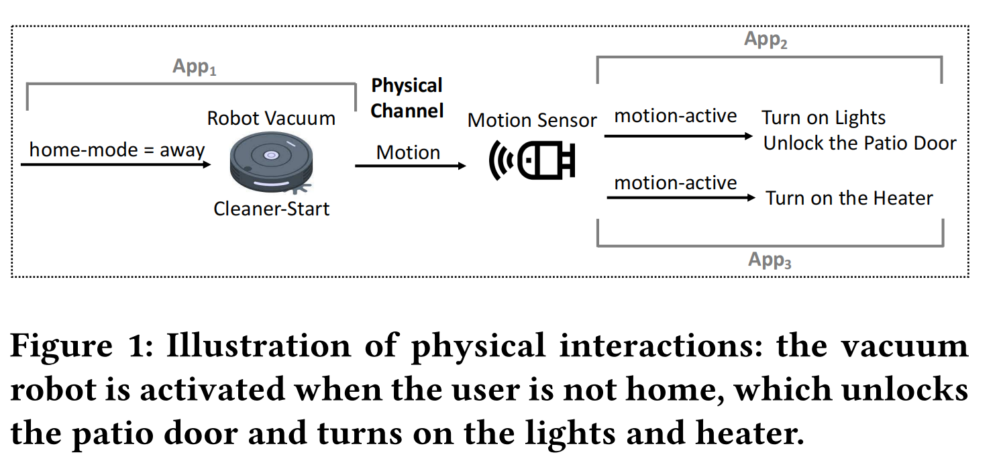

3. **Run-time Dilemmas.** 

   在运行时检查设备状态的动态系统不能推断出一个确切的命令对物理通道的影响。

4. **Device Placement Sensitivity.** 

   先前的工作没有模拟actuator和sensor之间的距离对物理相互作用的影响。直观地说，如果actuator和sensor之间的距离增加，命令对传感器读数的物理影响会单调地减小。

## 5. IoTSEER Design

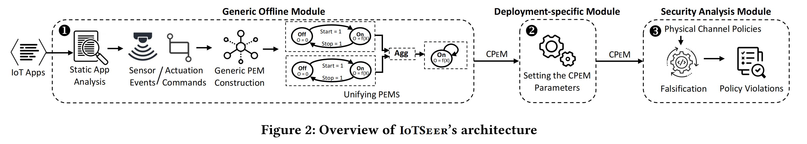

整体思路：为IoT的App进行建模，形成Physical Execution Model(PEM, 是hybrid I/O automation) --> 多个PEM结合，形成Composite Physical Execution Model(CPEM) --> 给CPEM设置相关参数 --> 建立物理通道应当满足的规则 --> 利用设置好参数的CPEM检测，看是否违反相关规则。

### 5.1. Generic Offline Module

1. **Static App Analysis**

   目的：需要应用程序的事件(event)、驱动命令(actuation command)和与每个命令关联的触发条件(trigger condition)。

   挑战：物联网平台是多样化的，每个平台都为自动化提供了不同的编程语言。

   解决方法：利用现有的物联网应用静态分析和解析工具（原文参考文献16,17,61）。这些工具可以模拟应用程序的生命周期，从程序间控制流图( interprocedural control flow graph, ICFG)包括入口点和事件句柄。同时还能提取出：

   1. 设备和事件；
   2. 每个事件会执行的动作(actuation)；
   3. 执行动作的条件；

   例如：从`When the temperature is higher than 80° 𝐹, if the AC is off, then open the window`中IotSEER可以获取到event:`temp > 80`，command:`window-open`，trigger condition:`AC-off`。

2. **Constructing PEMs**

   目的：构建对应的PEM

   解决方法：将应用程序的每个command和sensor event转换为用混合I/O自动机表示的PEM，该过程首先为命令影响的每个物理通道构建单独的PEM，并通过基于物理的建模观察传感器事件。基于物理的建模将控制理论中的通用微分或代数方程集成到PEM中，以建模每个应用程序的物理行为。这种方法被广泛应用于机器人车辆(例如，预测RV的传感器值)和自动驾驶车辆(例如，建模汽车和行人的运动）。

   初始时，IoTSEER会认为每个命令可能会影响所有物理通道，并之后在特定于部署的模块中删除过度近似的通道

   * **PEMs for Actuation Commands**：command PEM定义了命令的离散动态和连续动态。离散行为是执行器用于从应用程序调用命令的状态(例如，开/关)。连续行为是定义其物理行为的代数或微分方程。形式化定义为`Ha = (Q, X, f, ->, U, O)`，其中Q是一组离散的状态（比如开、关）；X是连续的变量（比如温度、音量）；f是flow function，表示连续变量的演化；`->`定义离散转换；U/O表示输入/输出的变量。最终Ha的输出是对应命令产生的影响。

     flow function:作者为每个物理通道定义一个单独的通用流函数。它们是连续物理通道(如温度)的微分方程和瞬时通道(如声音)的代数方程。流函数以两个参数作为输入，器件属性(device property)和到执行器的距离(distance from the actuator)，并输出执行器在该距离上对物理通道的影响。

     **关于流函数的两个参数如何确定，将在后续的步骤介绍**

   * **PEMs for Sensor Events**：作者将事件的PEM定义为混合单状态的I/O自动机(with single state)，Q={on}，并且每经过时间t（传感器对其测量数据采样的频率）就会产生一次自跃迁。

     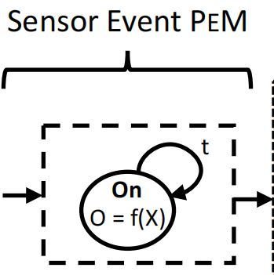

     Sensor Event PEM接受一个灵敏度级别参数，该参数定义物理通道中的最小更改量(threshold)，以改变传感器的读数。阈值函数输出传感器读数，指示物理通道水平是否等于或大于灵敏度水平。如果传感器测量布尔类型的值(例如，是否运动)，PEM输出一个位表示“检测到”或“未检测到”事件；如果传感器进行数值读数(如温度)，则输出数值。

   最终，作者利用以上的方式在IoTSEER中集成了总共24个Command PEM(例如，`heater-on`，`door-unlock`)，它们影响总共6个物理通道，即temperature、humidity、illuminance、sound、motion和smoke，以及6个测量这些通道对应的Sensor Event PEM。

   优点：可以很容易地扩展PEM以定义各种设备的物理行为，因为它们的流函数对于影响相同物理通道的一系列设备是通用的。

3. **Unifying the Physical Behavior of Apps**（Constructing CPEM）

   算法伪代码如下：

   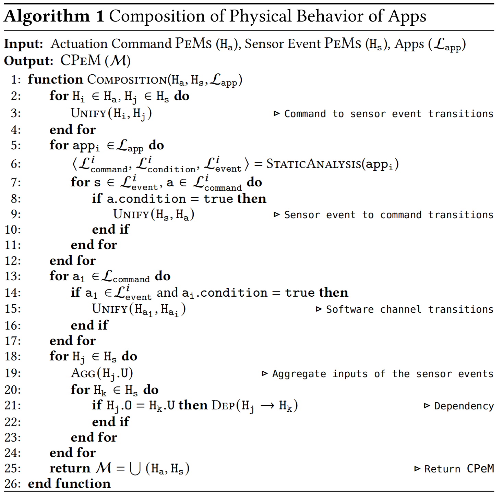

   该算法首先通过匹配Sensor Event和命令的物理通道来识别交互应用程序。

   * 首先，如果传感器测量命令影响的物理通道，则添加从Command EeM (Ha)输出到Sensor Event PEM (Hs)输入的转换(第2-4行)。
   * 其次，软件(software)和物理通道可以触发应用程序的事件处理程序，并在满足应用程序的条件时调用命令。
     * 对于物理通道，作者添加了从Sensor Event PEM (Hs)到Commend PEM (Ha)的转换(第5-12行)。
     * 对于软件通道，如果应用程序在a1发生时调用a2，则添加从Command PEM (Ha1)到另一个Commad PEM (Ha2)的转换(第13-17行)。

   以上的转换操作用`UNIFY()`操作符表示，其中包括的转换方式有：

   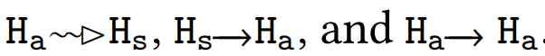

   其中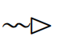是物理通道上的影响，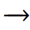是软件通道。

   一个例子：

   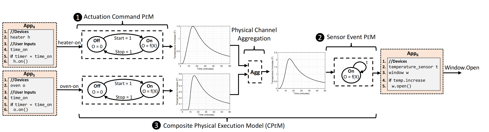

   当App4和App5中的指令启动后，会产生如下转换

   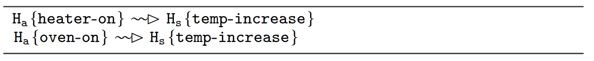

   而温度的升高又会对App6产生影响，即如下转换：

   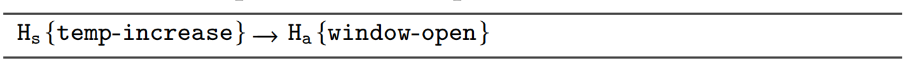

   

   **难点：解决聚合和依赖关系**

   解决方法：传感器可以测量多个命令的累积影响。为此，作者定义了一个聚合运算符(AGG)，它组合了`UNIFY(Ha, Hs)`操作符，以便Sensor Event PEM将Command PEM的聚合输出作为输入(第18-19行)。还是以上面的例子说明，App4和App5的转换可以改写为

   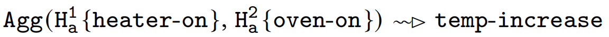
   
   AGG运算符的输出是基于物理通道的单位定义的：
   
   * 对于线性范围的通道（如温度），其输出为Command PEM输出的求和；
   
   * 对于log范围的通道（如音量），其输出将会转换成线性后进行聚合，即
   
     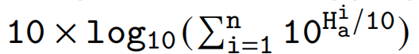
   
   与此同时，物理通道的另一个特性是物理通道(pj)可能取决于另一个通道(pi)（例如，当环境温度升高时，空气-水容量增加，影响湿度传感器的读数）。如果pi的变化影响pj，一个Sensor Event PEM的输出可能会影响另一个Sensor Event PEM的读数。Generic PEM允许作者轻松地识别依赖性，通过迭代获取每个Sensor Event PEM并检查它是否用于另一个Sensor Event的阈值函数(第20-23行)。为了解决这个问题，作者使用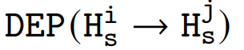表示从温度传感器的PEM输出到湿度传感器PEM的输入转换。

### 5.2. **Deployment-specific Module**

需要设置具体的设备参数，以确保CPEM精确模拟应用程序的物理行为。根据上一节所述，具体的参数有两个：设备的特征值和距离。

1. **Setting the Device Property Parameter**

   作者基于已安装的设备设置设备属性参数有两个方法。

   * 第一种方法是使用已安装设备的数据表。然而，在原型实现中，作者意识到数据表可能是不完整的，或者可能出现差异，比如设备老化。

   * 第二种方法是使用System Identification(SI)，这是一种基于学习的方法，通常由控制工程师使用实验数据轨迹来估计物理过程的参数或模型。

     > 这一部分没看太懂

     该方法的应用流程为：
     
     * IoTSEER单独激活每个执行器并收集传感器测量数据。
     * 接下来，它运行带有设备属性参数的PEM，并获得传感器的trace。
     * 之后计算实际设备和PEM的trace之间的(𝜏，𝜖)-closeness*（这个closeness是保真度度量的一个量，该值决定了两个trace在timing和value之间的差异，其中𝜖也叫作偏差分数）*。
     * 最后对设备属性参数进行二分搜索，以获得使偏差评分最小的最优值。
     
     使用真实的设备轨迹来确定设备属性参数，保证了环境条件的影响(例如，家具)的传感器读数集成到CPEM中。从收集到的实际设备轨迹中，IoTSEER还可以确定一个命令在智能家居中影响的物理通道集。IoTSEER检查一个命令是否不会改变传感器测量值，或者它的影响是否在统计上与环境噪声难以区分。在这种情况下，IoTSEER从CPEM中删除这些命令的PEM（也就是相当于没啥用的PEM，可以删了）。

2. **Setting the Distance Parameter**

   IoTSEER使用接收信号的强度(RSSI)的距离估计技术，这种技术利用距离和RSSI的反比来估计两个设备之间的距离。尽管这种方法可能会在距离参数中产生误差，但作者的评估表明，这种误差对IoTSEER的policy violation识别的影响是很小的。

###  5.3. **Security Analysis Module**

> 以下这部分，尤其是后面优化过后的验证，没有看懂

1. **Identifying Physical Channel Policies**

   本文作者为物理上的影响设置了两个标签：`intended`和`unintended`。IoTSEER会根据应用程序的用例自动生成交互标签，同时它还允许用户根据自己的需要来更改标签。

   为了生成标签，IoTSeer首先检查应用程序的预期用途是否与特定的活动相关。IoTSEER利用了SmartAuth，一种基于nlp的技术，可以从其描述中提取与应用程序相关的活动。如`open the windows when you are cooking`，SmartAuth会检测到app和cooking activity有关，IoTSEER获取该应用程序的活动，并检查安装在智能家居中的任何执行器是否在语义上与该活动相关。为此，IoTSEER使用Word2Vec表示来计算活动和命令之间的语义距离。然后，它为距离低于阈值的命令分配intended（Int）标签，并为其他的分配unintended（UnInt）标签。例如，烹饪活动在语义上与打开烤箱和打开厨具上的命令有关，因此，IoTSEER将Int分配给它们。

   如果一个应用程序的描述没有表明一个活动，或没有一个命令与该活动的语义相关，IoTSEER将根据应用程序的传感器事件分配标签。这些以运动或声音传感器事件为条件的应用程序被用于检测智能家居中用户和入侵者的存在。例如下图中：

   

   App2当检测到运动时打开灯、开门，用于在用户存在时触发。IoTSeer为此类应用程序的所有命令分配了UnInt标签，因为只有对于用户和入侵者来说，这种操作才是intended。

   安装有温度、湿度、烟道和照度通道条件的应用程序，并在物理通道状态达到特定条件时触发。例如，当温度高于一个阈值时，一个打开空调的应用程序会根据环境温度水平来控制空调。IoTSeer为此类应用程序的所有命令分配Int标签，因为它们的预期用途只取决于物理通道的条件，而不管哪些命令会影响它们。

   * **Intent-based Policies**

     作者定义了三个基于意图的策略，如下图所示，它们用于识别创建不希望和不安全的系统状态的意外物理交互。

     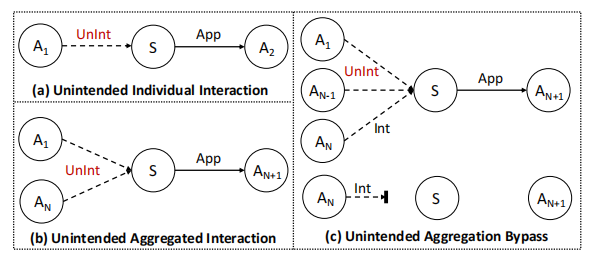

     (a) Actuation commands对物理通道的影响不能非预期地(Unintended)触发一个应用程序的传感器事件并调用其设备操作。

     (b) 多个命令对物理通道的聚合影响不能非预期地(Unintended)触发一个应用程序的传感器事件并调用其设备操作。

     (c) 如果命令的预期影响不会触发应用程序的传感器事件，他和其他的命令的聚合影响也不能非预期地(Untended)触发

     

     

   * **Device-Centric Policies**

     虽然基于意图的策略从非预期的物理交互中检测到不安全状态，但Int标记的物理通道也可能导致不安全状态。例如，加热器对温度传感器的预期影响可能会触发一个应用程序，当温度超过一个阈值时打开窗户。

     为解决上述问题，提出了以设备为中心的策略（也就是在以上策略的基础上增加了时间限制），部分策略样例如下：

     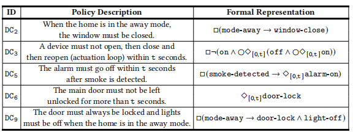

2. **Validating Policies on CPEM**

   在用Metric Temporal Logic (MTL) 表示确定的策略后，IoTSeer执行CPEM（混合I/O自动机），并收集执行器和传感器的trace以验证策略。在每次执行时，CPEM将应用程序的激活时间作为输入，即应用程序调用其命令和命令PEM转换到“on”状态的时间。CPEM模拟命令和传感器事件的统一物理行为，并输出PEM的轨迹。轨迹（v, t）由一个周期时间戳t和一个物理信道值v组成。每个命令PEM的v显示它对通道的影响程度，而每个传感器事件PEM的v显示它的测量值。这些跟踪还包括命令/事件的标签（Int/UnInt）和应用程序id。

   * **Policy Validation Challenges**

     物理通道值和应用程序激活时间是连续的；因此，CPEM的状态空间变得无限大，这使得CPEM上的形式验证方法（如模型检查）无法决定.

     为了解决这个问题，作者首先实现了一种网格测试方法，网格测试确定CPEM是否满足有限的应用程序激活时间集下的策略——应用程序调用驱动命令的时间。如下算法提出了对CPEM进行策略验证的网格测试方法，作者将应用程序的激活时间设置为一个网格（t0：Δt：tend）（第3行）。该算法通过搜索激活时间组合来执行CPEM。然后，它使用鲁棒性度量（第4-6行）验证来自PEM的每个执行跟踪上的策略，其中负的鲁棒性值表示违反了策略。

     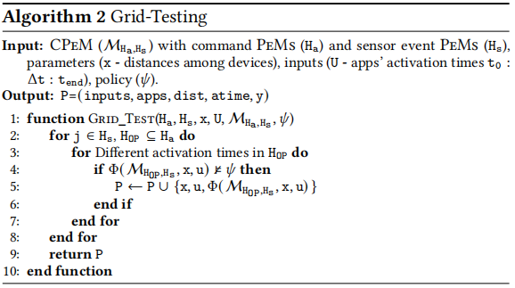

     然而随着交互应用程序数量的增加，网格测试并不能扩大更大的分析，并且可能会由于输入离散化而错过policy voilation。为了解决这些问题，作者扩展了优化指导的证伪(optimization-guided falsification)，并将其与网格测试在识别违规时进行了比较。

   * **Optimization-Guided Falsification.**

     Falsification（伪证？）是一种形式分析技术，它从连续输入集中搜索MTL策略的反例。图6描述了利用伪造来搜索导致CPEM上的策略违反的交互应用程序的方法。

     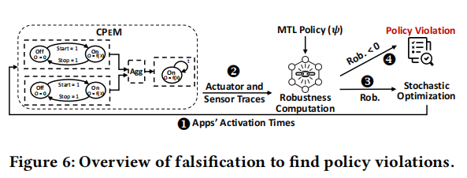

     具体来说：

     1. 使用一种优化算法(Optimization algorithm)，通过采样激活时间来搜索策略违反；
     2. 执行CPEM并记录PEM的执行器和传感器traces；
     3. 从trace中，计算一个鲁棒性值，以量化MTL公式与策略违反有多接近；其中负值表示违反，正值表示满足；
     4. 然后采样器在范围内将另一个输入喂到CPEM（类似fuzz中的mutation）。采样器的目标是最小化鲁棒性值，以寻找策略违反（和fuzz很像）。

     输入生成的终止条件是：（1）发现违反策略或（2）满足用户定义的最大迭代次数。

     以下是一个policy violation的样例结果：

     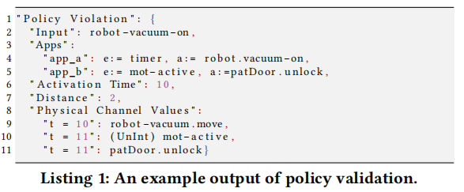

     
