# Evasion Attacks and Defenses on Smart Home Physical Event Verification

一篇防止物理通道逃逸攻击的文章，依旧是Z. Berkay Celik的团队做的，[原文链接](https://www.researchgate.net/publication/364562061_Evasion_Attacks_and_Defenses_on_Smart_Home_Physical_Event_Verification)。

组会演示[PDF](../pdfs/11.16组会_Evasion.pdf)

## 1. Information

**Author**: Muslum Ozgur Ozmen, Ruoyu Song, Habiba Farrukh, and Z. Berkay Celik

**Company**: Purdue University

**Publisher**: NDSS

**Year**: 2023

**Abstract**: In smart homes, when an actuator’s state changes, it sends an event notification to the IoT hub to report this change (e.g., the door is unlocked). Prior works have shown that event notifications are vulnerable to spoofing and masking attacks. In event spoofing, an adversary reports to the IoT hub a fake event notification that did not physically occur. In event masking, an adversary suppresses the notification of an event that physically occurred. These attacks create inconsistencies between physical and cyber states of actuators, enabling an adversary to indirectly gain control over safety-critical devices by triggering IoT apps. To mitigate these attacks, event verification systems (EVS), or broadly IoT anomaly detection systems, leverage physical event fingerprints that describe the relations between events and their influence on sensor readings. However, smart homes have complex physical interactions between events and sensors that characterize the event fingerprints. Our study of the recent EVS, unfortunately, has revealed that they widely ignore such interactions, which enables an adversary to evade these systems and launch successful event spoofing and masking attacks without getting detected. 

&emsp;In this paper, we first explore the evadable physical event fingerprints and show that an adversary can realize them to bypass the EVS given the same threat model. We develop two defenses, EVS software patching and sensor placement, with the interplay of physical modeling and formal analysis, to generate robust physical event fingerprints and demonstrate how they can be integrated into the EVS. We evaluate the effectiveness of our approach in two smart home settings that contain 12 actuators and 16 sensors when two different state-of-the-art EVS are deployed. Our experiments demonstrate that 71% of their physical fingerprints are vulnerable to evasion. By incorporating our approach, they build robust physical event fingerprints, and thus, properly mitigate realistic attack vectors.

## 2. Contributions

* 提出了一种算法，通过分析物理事件指纹(event fingerprints)是否能被其他事件的影响所包含或掩盖，来发现可逃避的fingerprints。
* 针对躲避攻击(Evasion Attack)，作者开发了两种防御方案，即EVS software patching和sensor location patching。Software patching是将新的物理指纹引入EVS的一种自动化方法。Sensor location patching是一种基于设计的安全(security-by-design)方法，与Software patching互补，它生成传感器位置，确保物理指纹对一个事件是唯一的。
* 通过部署在两个智能家庭中的两个独立的EVS评估作者的防御能力，这两个EVS共有12个actuator和16个sensor。作者的评估表明，71%的物理指纹容易受到Evasion Attack，作者的系统可以成功地阻止所有的攻击。
* 作者实验的系统发布在了[github](https://github.com/purseclab/EVS_Evasion)。<u>（目前好像是不能看，404了）</u>

## 3. Background

### 3.1. Event Spoofing and Masking Attacks

智能家居通常会有一个IoT hub作为控制中心，其能掌控着所有的IoT设备。在这里主要考虑两个部分：sensors和actuators。

* sensor: 该器件会周期性的测量物理通道，并输出（记录）下物理通道的数值（这个数值有两种，一个是读数，还有一个是bool型的变量如开/关）；
* actuators: 负责执行命令，从而对物理通道产生影响。

在本文中，event的定义是：通过物联网应用程序触发的执行器状态变化，即用户与执行器的直接物理交互或者配套应用程序和虚拟助手等用户界面。

先前的研究中发现智慧家居对于event spoofing和masking这两种攻击方式是脆弱的：

* Event Spoofing: 攻击者伪造某个event发生，但实际上没有发生；
* Masking: 攻击者掩盖某个event的发生，即event实际上发生了，但是被攻击者掩盖了；

以上两种攻击方式最终会造成<u>物理实际</u>和<u>IoT hub保存状态</u>的不一致。

### 3.2. Event Verification System（EVS）

为了对上述的攻击进行防护，先前有研究提出了EVS系统，该系统利用fingerprint进行保护。根据如何生成fingerprints，系统可以分为两种类型：Rule-based EVS(R-EVS)和ML-based EVS(ML-EVS)。这两个类型的EVS都分为如下图两个阶段：

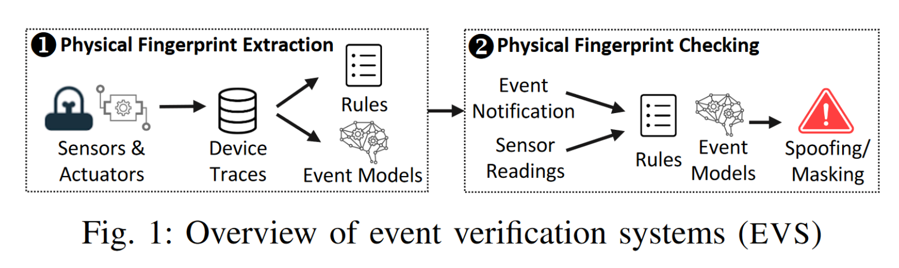

1. **Physical Fingerprint Extraction.**这个阶段EVS需要收集每一个event对应的sensor的读数。

   * R-EVS: 以event(E)及其对sensor读数(S)的影响之间的统计相关性的形式从收集到的trace中提取规则，如`Rule: light-on --- {S1.Illum = High, S2.Illum = High}`。考虑到读数可能会受到环境的影响，直接用读数作为rule中的一部分会很冗杂，R-EVS经常将数值传感器测量映射为二元(如high/low或increase/decrease)，或者映射到几种类别(如high/medium/low)。
   * ML-EVS: 对每个event利用从sensor读数中提取的feature学习出一个模型。比如对于`light-on`这个event，提取光线传感器中的feature(max, mean, sum, stdev)进行学习。同样为了考虑环境噪声的影响，ML-EVS使用smoothing filters和signal processing(如moving averavge)的方式来降低噪声影响。

2. **Physical Fingerprint Checking.**EVS最终是使用刚刚形成的fingerprint进行两种攻击检测，具体如下：

   * R-EVS: 当收到相应的event notification时检查是否符合相应的rule。

     如：为了检查spoofing，当收到了`light-on`消息时，R-EVS会检查光线传感器S1和S2的读数看是否受到攻击（如果读数有偏差，则认为实际上应该没有执行`light-on`，也就是遭到了spoofing）。为了检查masking，R-EVS会定期查看sensor的读数，如果S1、S2读数变成了High，但是没有收到`light-on`的消息，则会认为是masking attack。

   * ML-EVS: 为了检查spoofing，ML-EVS根据学习到的事件模型，从运行时传感器读数预测物理事件是否发生。如果收到通知，但模型预测这个事件没有发生，则认为是spoofing；为了检查masking，他们持续从传感器读数中提取特征。如果事件模型预测发生了一个物理事件，但是没有收到它的通知，则认为是masking。

## 4. Threat Model

### 4.1. EVS Threat Model

在EVS的威胁模型中，他们假设攻击者可以实施的攻击有:event spoofing和event masking。攻击者可以通过(1) 影子设备（即用程序模拟真实设备，使得攻击者能够使用从真实设备偷来的credential远程与IoT hub进行通讯。偷取方式：官网上公开的数据或者是脆弱的IoT APP）和(2) 病毒App（这个APP可以利用物联网编程框架中的设计漏洞，不注入命令对物理设备控制，而是偷偷地执行spoofing或masking）。

之前的工作都认为sensor是可信的，原因有如下两点：

1. 许多传感器定期向集线器发送读数，这就要求攻击者不断地掩盖真实传感器的读数并欺骗注入的值；
2. 已经提出了各种系统来检测传感器攻击。然而如果攻击者能够欺骗所有事件和传感器读数，那么所有攻击都变得微不足道，因为攻击者可以逃避事件验证和传感器欺骗检测系统。

### 4.2. Threat Model of This Work

攻击者的目标是通过欺骗和掩盖事件而不被发现来逃避EVS。为此，作者假设攻击者可以<u>被动地嗅探智能家居通信，而不拦截或注入任何信息</u>。攻击者可以<u>通过现有的物联网网络分析工具，通过未加密或加密的设备通信实时识别事件</u>，这使得攻击者确定实施攻击的时间，最大限度地提高他们躲避EVS的可能性。为了确定要欺骗或掩盖某个事件，攻击者可以<u>预测事件对传感器测量的物理影响，并相应地欺骗或掩盖事件</u>。

## 5. Three Evasions

对于现有的EVS防御措施，有如下三种情况会无法检测。

### 5.1. Fingerprint Encapsulation

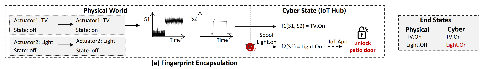

产生攻击的根本原因是一个事件(Ei)对传感器的影响包含了另一个事件(Ej)的影响。从形式上讲，当满足如下条件时R-EVS很容易受到这种攻击:

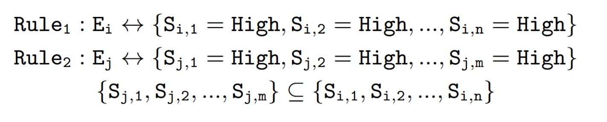

对于ML-EVS，如果Ej的指纹模型预测Ej已经在Ei物理发生时发生，则会发生这种攻击。

### 5.2. Fingerprint Concealment

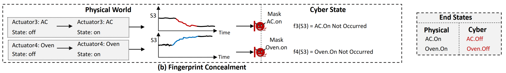

如果R-EVS中有两个规则，其中这两个规则对相同的sensor产生相反的影响。当对手掩盖这些事件的任何通知时，R-EVS无法检测到，因为规则中的预期传感器值没有得到满足。虽然可以布置多个传感器来测量事件，但R-EVS通常不会在其规则得到部分满足时发出警报，以尽量减少误报。

在ML-EVS中，由于两个事件的影响相互抵消，则可能会产生对一个或者两个的事件都预测的是`event-not-occured`，此时就会存在威胁。

### 5.3. Fingerprint Indistinguishability

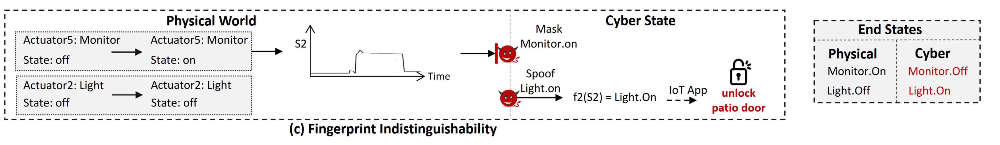

类似于第一种攻击方式，此时二者影响完全相同，此时R-EVS无法区分两个events。

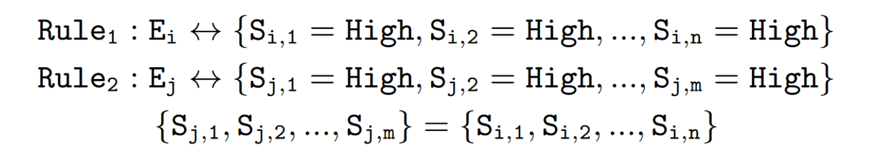

对于ML-EVS也类似。

### 5.4. Aggregated Evasion Attacks.

在具有不同传感器和执行器的复杂智能家居中，多个事件对传感器读数的聚合(联合)影响也可能满足或隐藏事件的指纹，使对手能够进行逃避攻击。

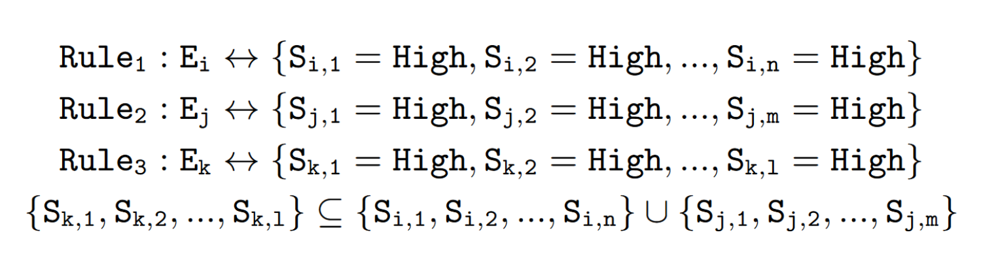

对于ML-EVS也类似。

## 6. Solution: Physical Event Fingerprint Patching

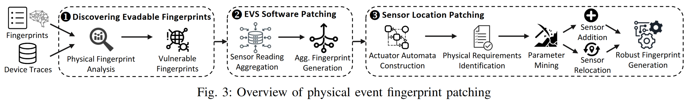

### 6.1. Discovering Evadable Fingerprints

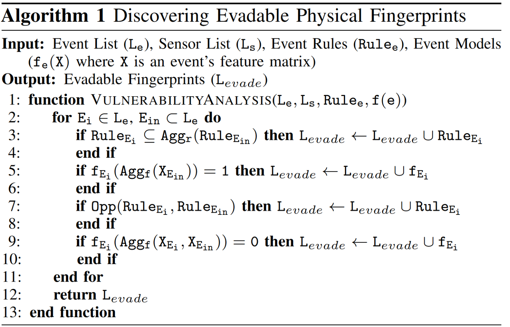

#### Fingerprint Satisfaction Analysis(Evasion1 and Evasion3)

* R-EVS：对于待检测event，检查其他单独或聚合的事件规则是否相同或封装了待检测事件的规则（伪代码3-4行）。为此，作者定义了一个规则聚合函数(Aggr)，它接受单个事件规则作为输入，并输出它们的聚合：如果两个事件影响不同的传感器，Aggr将它们的规则进行聚合；如果两个事件影响同一个传感器的读数，Aggr将它们类别的数值范围相加（我的理解是将范围进行扩大，如[50,100]和[70,120]变成[50,120]。原文是：If two events influence the same sensor’s readings, Aggr sums the numerical ranges of their categories.）
* ML-EVS：对于待检测event，检查从其他单个事件或其聚合事件中提取的特征是否能够使得模型将待检测event评估成`event-occured`。该方式类似R-EVS，只是利用Aggf函数将所有的feature进行聚合。

#### Fingerprint Concealment Analysis(Evasion2)

* R-EVS：如果另一个事件或多个事件的聚合以相反的方式影响传感器的读数，作者将一个事件的规则识别为脆弱的(第7-8行)。作者定义Opp函数，该函数以多个规则作为输入，并输出是否第一个规则与其他规则相反。
* ML-EVS：通过检查被分析事件与其他事件的聚合特征是否评估为事件未发生(第9-10行)来识别脆弱事件。

### 6.2. EVS Software Patching

1. **Sensor Data Aggregation**：将EVS数据收集过程中收集到的传感器读数进行聚合，以确定多个事件发生时的预期传感器读数。利用这些读数来了解聚集的指纹来对抗Evasion。在R-EVS中，需要根据事件的聚合影响调整类别。在ML-EVS中，需要训练数据来学习聚合的事件模型。为了解决这个问题，作者定义了一个传感器读取聚合运算符(Aggs)，它计算事件对传感器的联合影响。

   通常情况下sensor的读数都是线性的，但是有的是log，此时就用如下公式进行聚合

   

   还有的可能是bool型，此时的Aggs计算方式和`or`相同。

2. **Aggregated Fingerprint Generation**：作者利用聚合的传感器读数生成新的fingerprints，这样就能定义多个事件影响下的sensor读数。在此基础上，EVS根据发生的物理事件动态调整其指纹，避免逃逸。

   1. **Generating Aggregated Rules**.(R-EVS)在运行时，对于R-EVS的检查可以通过if语句进行。如Rule `E1 - {S1 = High, S2 = Med}`：

      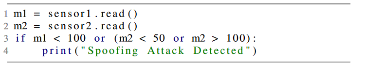

      其中S1的High应当是>100，Med应当是[50, 100]，如果检查的时候发现偏差，就认为遭受到攻击。但是这个如果被其他的Rule包含，就是脆弱的，如`E2 - {S1 = High, S2 = Med, S3 = High}`。将E1和E2聚合以后，S2的聚合成High；S3也只聚合成High；而两个Rule的S1原本都是High，如果直接聚合成High将无法分辨这个High是来自E1还是E2还是两个的聚合作用，因此需要进行求和聚合。如E1的范围是[100, 150]，E2的范围是[100, 200]，那么他们的聚合范围就是[200, 350]，此时定义High的范围是[100, 200]，Agg\_High是>200。

      此时patch之后的E1是：

      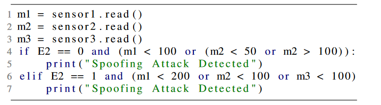

      如果E2没发生，按照之前的检测就行；如果E2发生了，将按照聚合后的进行检测。如果两个事件对传感器的测量有相反的影响，则该传感器将从聚合规则中删除，以防止规避。

   2. **Generating Aggregated Models**.(ML-EVS)这种聚合相对简单一点，如果只有E1，就只用E1的feature；如果E1和E2需要聚合，就将两个的feature都送给model进行学习就行。检查时和R-EVS一样，如果只发生了E1,就用聚合前的；如果E1和E2都发生了，就检查聚合后的。

**Limitations of EVS Software Patching**.

这种补丁方法对于Evasion3和一些特殊的Evasion2（两个或更多的events完全隐藏了互相之间的影响）没有作用。

此外，软件补丁不能用于具有布尔类型属性的传感器(例如，声音检测)或传感器饱和(例如，湿度传感器达到100%)。在这种情况下，来自多个事件的聚合影响与事件的单个影响变得难以区分，其中传感器输出布尔值或最小/最大值。

### 6.3. Sensor Location Patching

为了解决上面的Software Patching无法解决的问题，作者采用一个新的补丁作为解决方式：Location Patching。这种通常能作为唯一标识，可以建立一个健壮的fingerprint。

1. **Actuator Automata Construction**：虽然可以通过物理实验的方式确定位置，但是这种需要的工作量太大，并且不方便试验。因此决定采用自动机的方式，将每个事件映射到它们影响的物理通道，并为每个事件构造一个自动机。

   1. **Mapping Events to Physical Channels.**建立一个二维表格Map[p, e]，其中Map[p, e]表示事件e会对物理通道p产生影响，反之0表示无影响。

   2. **Constructing the Automata**.形式上，自动机表现为`H = (Q, X, f, ->)`，Q是执行器的离散状态(例如，开/关)，X是定义事件对通道的影响(例如，温度变化)的连续变量。流量函数(f)有三个参数:到执行器的距离、最小/最大输出值和描述执行器特性(例如，其光强)的设备属性参数，并随时间计算X。每个物理通道的流函数都是惟一的。对于连续的影响(如温度)，用微分方程来定义;对于瞬时的影响(如声音)，用代数方程来定义。

      参数设置：

      * 首先，我们为距离参数设置不同的值，以测试不同可能的传感器位置。

      * 其次，根据传感器数据表输出的最高和最低测量值设置最小/最大输出参数，以处理传感器饱和，并确保自动机不输出超出这些范围的值。

      * 利用(T, E)-closeness理论（用实际设备的trace的timings和values测量自动机的保真度）设置设备的特征参数。

        利用采集到的EVS指纹生成数据来确定设备的属性参数，这些参数能使得(T, E)-closeness计算得到最大值。特别地，利用在设备特征参数二分搜索的方式执行自动机，并收集代表Event对物理通道影响的自动机trace。之后记录能够使得自动机和真实设备trace偏离最小的参数。

2. **Physical Requirements Identification**:通过观察发现，为了阻止Evasion attack，sensor必须要放到只会受到一个事件影响的位置。这样才能保证从sensor中提取的fingerprint是唯一的。

   基于上述观察，作者将要求形式化：<u>使影响同一传感器读数的事件数量最小化，同时使检测事件影响的传感器数量最大化。</u>作者用linear temporal logic（LTL）表示要求，以推导出防止躲避攻击的传感器位置。

   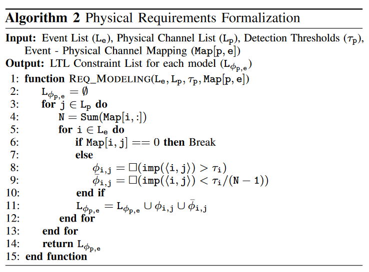

   * **Maximal Influence Formula.**第一个LTL公式（第8行）保证事件e对于物理通道p的影响总是会大于阈值。由于事件对传感器读数的影响取决于距离，因此该公式的满足度取决于传感器和事件之间的距离。阈值定义了一个事件改变传感器读数所需的最小影响。我们根据传感器数据表中定义的灵敏度级别来确定阈值。
   * **Minimal Influence Formula**.第二个LTL公式（第9行）可以得到最小的影响区域。考虑到对于同一个物理通道会有多个事件影响，假设有N-1个事件，那么当每一个事件对通道的影响值 < 阈值/(N-1)时，其求和就一定会小于阈值。

3. **Sensor Location Identification**: 

   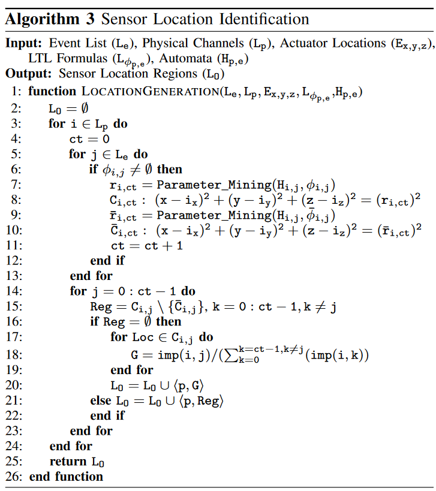

   上述算法的输入是执行器的位置、自动机结构、LTL公式，可以得到sensor应当放置的范围。

   为了得到执行器位置信息，作者使用的是Lumos工具进行定位，该工具使用移动设备传感器和无线信号强度来定位。

   当传感器被放置在已识别的区域时，从其提取的指纹确保事件具有唯一的物理签名。由于我们形式化了物理需求，用LTL确保每个事件的指纹是唯一的，并进行形式化分析(参数挖掘和圆网格搜索)来识别满足LTL公式的传感器放置区域，因此传感器位置补丁形式化地确保在执行器自动机正确的假设下防止规避攻击。

   * **Robustness-guided Parameter Mining**.对于每个物理通道和事件，我们通过参数挖掘[45]计算到满足LTL公式的事件的边界距离。参数挖掘通过确定性或随机搜索得到一个鲁棒性为≈0(即“勉强”满足公式)的参数值。鲁棒性是LTL公式对自动机的满意度，正的鲁棒性值表示LTL公式满足，负值表示不满足。

     简单来说就是找到执行器的影响边界。如下图所示：

     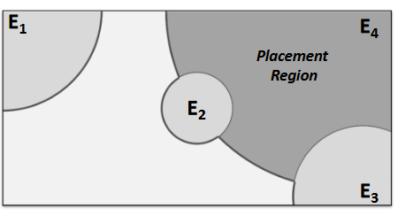

     之后取目标事件的最大影响区域与其他事件的最小影响区域的差值，找到传感器只测量目标事件的影响的放置区域。也就是上图中的阴影部分。

   * **Circular Grid Search.**

     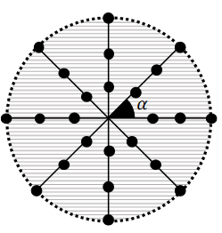

     参数挖掘发现只有目标事件影响传感器读数的传感器放置区域。然而，在某些情况下，可能不存在不受其他事件影响的清晰区域。为了解决这个问题，作者采用了网格搜索办法，以找到目标事件与其他事件相比具有最高影响的位置，即搜索输出目标事件的影响与来自其他事件的聚合影响的比率，当这个比率大于1时，可以放置。

4. **Robust Physical Fingerprint Generation**:为了防止对EVS的规避攻击，必须至少有一个传感器能够区分每一个事件。因此，物联网服务提供商需要为每个脆弱事件安装一个新的传感器或将现有的传感器转移到已识别的放置区域。第一种方法允许保持现有传感器的位置不变，第二种方法是只利用现有传感器的成本效益方法。然而，重新定位一个传感器在某些情况可能会导致另一个事件的指纹变脆弱，比如这个传感器是用来区分那个事件的。因此需要一个权衡。

   在传感器添加/迁移后更新EVS指纹，以防止逃避攻击。我们首先移除从重新定位的传感器读数中提取的指纹，因为它们会根据新的位置发生变化。接下来，我们修改指纹，以反映添加或重新定位的传感器的预期传感器读数。与EVS指纹提取类似，这需要在事件发生时收集传感器读数。这可以通过进行实验或使用自动机来实现，自动机模拟每个事件对传感器读数的影响。第一种方法（添加设备）使用真实世界的数据来学习新的指纹，但这需要额外的实验。第二种方法（重新定位）不需要实验，而是依靠自动机正确性。

## 7. Limitations and Discussion

### 7.1. Deploying Our Defenses in Different Smart Homes

本文定义了通用流函数，但也可以有传感器测量不同的通道。在这种情况下，新的流量函数可以(1)由设备制造商提供，或者(2)由控制理论(control theory)定义

然后，我们的防御需要执行具有三个特定于每个智能家居设备的参数的自动机，用于参数挖掘和圆形网格搜索。首先，为了设置距离参数，我们使用Lumos定位工具[65]，这需要用户用手机或平板电脑走进智能家居。Lumos在30分钟内准确识别设备位置，包括27分钟的无线嗅探和3分钟的步行。其次，设置最小/最大输出参数是根据所安装传感器的最高和最低可能读数。然后传感器位置补丁输出放置区域，物联网服务提供商必须重新安置或添加最小数量的传感器。

### 7.2. Concept Drift

事件和传感器读数之间的关系可能随时间动态变化(例如，由于环境噪声和季节变化)，在事件指纹中产生概念漂移[35]。随着时间的推移，这可能会导致EVS中的假阴性(错过攻击)和假阳性(错误标记攻击)。

为了解决这一问题，EVS通过差分去除其他因素对传感器的影响，隔离事件的影响。然而，在极少数情况下，概念漂移可能发生在EVS中(例如，由于设备老化)。为了处理这些问题，EVS可以集成复杂的概念漂移检测机制。

### 7.3. Fully Overlapped Events

在极少数情况下，执行器放置得非常近，一个事件对传感器测量的影响总是低于其他事件。在这种情况下Location Patching可能无法识别该事件传感器对的放置区域。因此，这些事件必须通过具有其他模式的传感器来区分。

### 7.4. Number of Detected Events

为了防止规避攻击，传感器位置补丁通过最小化其他事件对传感器测量的影响，确保至少一个传感器能够唯一地区分一个事件的影响。这可能导致传感器能够检测单个事件，然而，用户可能希望他们的传感器测量多个事件。为了确保传感器检测到的事件数量最大，同时防止规避攻击，物联网服务提供商可以选择多个事件影响重叠，但目标事件影响最高的传感器放置区域。

### 7.5. Immovable Sensors

在智能家居中，可能会有附加在特定执行器上的传感器(例如，门或窗接触传感器)，这些传感器无法移动到其他位置。为这些传感器使用我们的位置补丁是不实际的。然而，这些传感器已经可以区分它们所连接的执行器的事件，因此，它们可以防止对这些事件指纹的规避攻击。