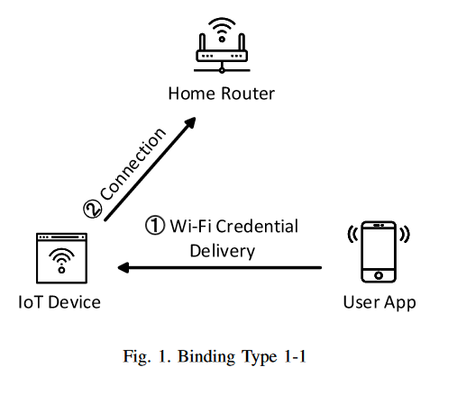
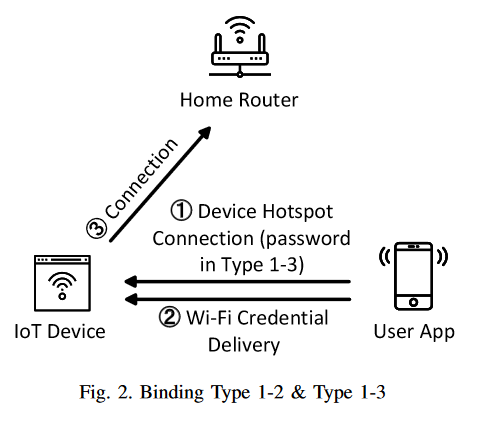
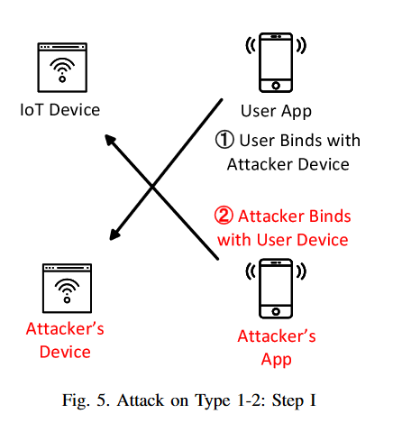
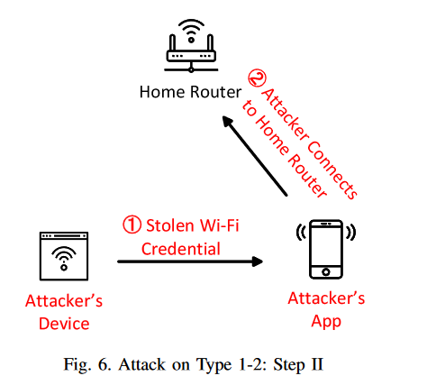
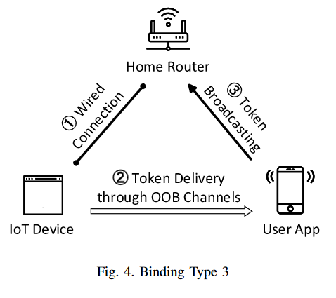

# Security Analysis of Device Binding for IP-based IoT Devices

本文系统地描述了设备绑定阶段的技术，并分析了各类型技术存在的攻击面和攻击实例。

## 文章信息

作者：Jiongyi Chen, Menghan Sun, Kehuan Zhang---Chinese University of Hong Kong

发表于：[2019 IEEE International Conference on Pervasive Computing and Communications Workshops (PerCom Workshops)](http://ieeexplore.ieee.org/xpl/conhome/8718765/proceeding)

## 攻击者模型

攻击者为nearby attacker（例如邻居），包括wireless attackers和LAN attackers。

* wireless attackers可以嗅探到本地的WIFI，并将自己的WIFI信号进行广播（广播的信号能够传达到受害者的设备）。
* LAN attackers可以访问受害者的局域网，并且嗅探数据包

## 绑定模式及攻击

### Type1: binding with wireless devices through manual identification.

#### 绑定模式

此模式共有两种绑定类型：**自动发现设备**和**手动发现设备**

在**自动模式**中，设备扮演WiFi hotspot角色，持续向周围广播待绑定信息，并开启监听模式，监听来自APP的消息。------ 用户选择家庭中的WiFi信息，并将WiFi密码输入。------ 之后APP会将家庭WiFi信息（credential）进行广播，该内容是周围任何处于监听模式的设备都会收到。------ 当设备收到WiFi内容后会连接WiFi，此时用户APP和设备会连接到同一个home WiFi中。

在**手动模式**中，设备可以通过SSID来进行绑定。设备扮演WiFi Hotspot，用于APP连接（大部分设备是不需要密码就可以连接的，有些厂商在实现的时候会以基于PIN的方式进行验证，只有拥有PIN的用户才能连接到设备上） ------ 用户成功连接到设备后，依旧是将WiFi信息输入 ------ APP**定向**将WiFi的credential发送到设备上 ------ 设备收到信息，连接WiFi

#### 攻击方式

对于**自动模式**：攻击者同时在附近设置一个自己的设备（与受害者的设备是同一个类型），也调到监听模式，此时APP就有可能会随机自动绑定到攻击者的设备上。

对于**手动模式**：当用户手动添加时，会发现有同样名字（如TP-LINK SMART PLUG）但是不同SSID的两个设备。此时用户可能无法区分哪个是恶意设备（用户基本上都是通过名称来区分设备的），就有可能绑定到攻击者的设备上。即使用户的设备需要PIN进行验证，但如果用户连接的是恶意设备，攻击者能够接收到正确的PIN，同样也能通过用户设备的验证（所以该防御方式对于此时的攻击方式无效）。

最终就造成了用户的WiFi credential可能会被攻击者窃取（因为攻击者的设备收到了这些信息），与此同时，攻击者还可以利用自己的APP去绑定用户的设备，进行操作重放等，这样用户就无法察觉自己绑定的设备是恶意的。

### Type2: binding with wireless devices through OOB channels.

有些设备是使用的OOB通道进行信息交换，攻击者无法在绑定之前或者绑定过程中获取对应的信息（例如绑定摄像头时，需要使用摄像头扫描APP上的二维码进行绑定、传递消息，此时攻击者就无法获取消息）。

### Type 3: binding with wired devices through OOB channels.

#### 绑定模式

对于一些没有NAS等无线模块的设备，首先通过网线连接到家用路由器，同时用户需要将app连接到同一个家用路由器(Wi-Fi) ------ 扫描设备标签上的二维码(这里的OOB通道为视觉)获得一个token进行绑定 ------ 稍后，应用程序将广播一个带有令牌的请求来发现设备 ------ 一旦设备验证了这样一个令牌，它就会用一个确认响应应用程序。

#### 攻击方式

这种设计在本地网络上存在主动攻击者时遭受重放攻击。如果从应用程序发送的设备令牌不是随机的，攻击者可以通过简单地重放token来绑定受害者的设备，从而执行中间人攻击。

首先，攻击者捕获token并响应用户的应用程序，并返回确认。然后，攻击者可以简单地重放(或广播)捕获的token以与用户的设备绑定。

### 总结

作者能够确认所有12类设备和一个3类设备都遭受中间人攻击，并且在现有的主流设计中，这种攻击也可能发生。这是因为开发人员不信任环境，并且没有安全实现本地绑定的指导方针。有以下结论：

1. 在进行本地绑定时，用户通过确认设备声明的设备名来验证目标设备。安全认证的缺乏为附近的攻击者打开了大门，他们可以悄悄地控制受害者的设备并获得家庭Wi-Fi证书。不幸的是，这样一个根本的弱点不能通过采用设备Wi-Fi密码来简单地解决。
2. 通过OOB通道绑定相对安全，但需要在无线物联网设备上安装特定的外围设备(如摄像头、音频接收器)。此外，如果没有精心设计(例如，验证令牌不是随机的)，它仍然容易受到中间人攻击。