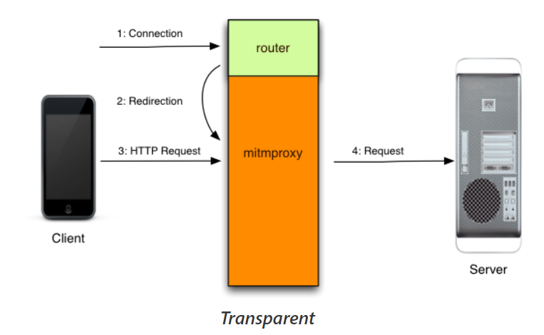
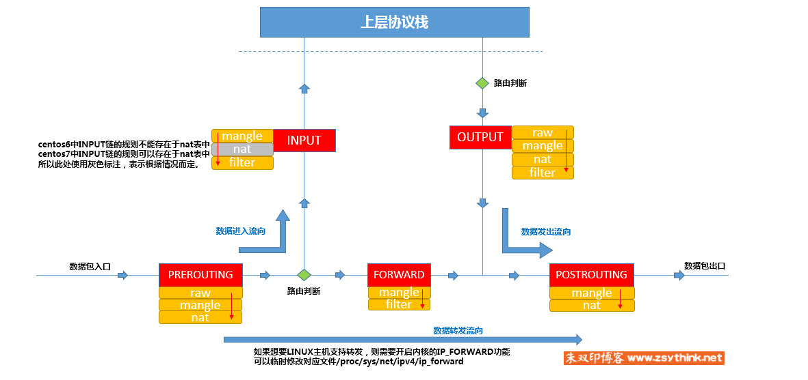

# 基于mitmproxy+iptables+SSL pinning绕过技术+wireshark的安卓APP流量（包括HTTP、HTTPS和非HTTP）捕获

​		由于本人毕设的关系，需要捕获某APP的数据包，以分析其交互流程。在网上找了很多分享的博客，内容都是那种比较简单的情况，走了不少弯路，所以想要写一下这篇文章来分享一下本次环境配置的流程，也方便以后自己备用吧。本博客主要参考的内容来自文章：[双网卡+mitmproxy+iptables搭建SSL中间人（支持非HTTPS协议） ](https://www.cnblogs.com/ascii0x03/p/9001777.html)

> 文章内容中的链接如果打不开，可能是404了，也可能是需要科学上网


## 设备需求

无线网卡（用来作为AP）、已root手机一台、PC（带有ubuntu虚拟环境，不建议在主机上做）


## 1. mitmproxy

这是一个作为中间人代理的工具，功能非常强大，我目前也只是粗略的学习了一下，达到了我现在能够使用的程度，详细内容推荐学习[官方文档](https://docs.mitmproxy.org/stable/)。同时由于安卓7之后的版本在证书校验方面增加了一些机制，仅是将mitm的证书安装到user层是无法得到认可的，我们需要将证书安装到system层次下，安装过程可以参考[Configuring Burp Suite With Android Nougat](https://blog.ropnop.com/configuring-burp-suite-with-android-nougat)（在后续的SSL pinning绕过中的参考链接里也会提到）。

在网上搜索大多数的教程都会以`mitmproxy`命令直接启动程序，这种启动只能捕获HTTP和HTTPS的流量，但是我们本次实验中需要捕获的还有非HTTP流量（如TCP），并且APP可以检测出此时手机是否经过代理，如果检测到经过代理则可以选择拒绝服务或者干脆不走系统代理，这种机制会对我们开启代理抓包造成一定阻碍，所以我们需要使用mitmproxy的**透明模式**，启动指令为`mitmproxy --mode transparent --tcp-host '.*'`（具体请参考官方文档，可能会因为版本不同有所改变）。下图为mitmproxy在透明模式下的工作原理示意图（图源：mitmproxy官方文档）：



在透明模式下，我们不需要像网上搜的一般性教程那样在手机上设置系统代理，此时mitmproxy更像是一个临时的Sever，为APP提供一个连接的平台或者是路由器，对于Client是透明（不可见）的。但是这里要注意的是，启动mitmproxy时默认监听的是8080端口，如果需要监听其他某个端口则需要在启动时提供相关指令`-p port`。或者还有一种方法是将想要监听的端口内容转发到8080端口上，相对来说比较推荐这种方式，但是这种方式需要额外的配置，在之后iptables内容中会进行设定。

环境搭建时，只需要让手机连上启动mitmproxy的热点即可。在这里我是使用的ubuntu虚拟机+无线网卡配置的热点，ubuntu配置热点非常简单，在命令行中输入`nm-connectin-editor`，之后在启动的UI界面中设置，后续的配置操作网上有喝多教程，这里就不赘述了。


## 2. iptables

由于APP中是可以自定义是否经过系统代理的，有的APP在设置之后会选择不走系统代理，那么此时我们需要在网络层甚至链路层进行转发，以达到监听的目的。关于iptables的内容，有一位大佬在自己的博客中写的非常浅显易懂，我也是看着他的博客学习的，这里附上他的博客地址：[朱双印个人日志—iptables](https://www.zsythink.net/archives/tag/iptables/)。在看的时候，推荐从第一篇开始慢慢看，尤其是不太理解工作机制时，看完第一篇再去看后面的会有助于理解和记忆。

在他的博客中有一张图画得非常好，我认为是理解并记住iptables工作方式的关键图，这里贴过来一下



我在实验时设置的iptables规则如下：

```bash
#!/bin/bash
# 需要监听的无线网卡
WIRELESS_CARD="wlxc01c30151c62"

# 开启相关的转发服务
sudo sysctl -w net.ipv4.ip_forward=1
sudo sysctl -w net.ipv4.conf.all.send_redirects=0


# 设置iptables的规则
# 将之前的规则清空（这里要慎用，具体内容参见上文中的博客）
sudo iptables -F PREROUTING -t nat -i $WIRELESS_CARD
# 设置端口转发(MQTT: 8883, HTTP: 80, HTTS: 443)
sudo iptables -t nat -A PREROUTING -i $WIRELESS_CARD -p tcp --dport 80 -j REDIRECT --to-port 8080
sudo iptables -t nat -A PREROUTING -i $WIRELESS_CARD -p tcp --dport 443 -j REDIRECT --to-port 8080
sudo iptables -t nat -A PREROUTING -i $WIRELESS_CARD -p tcp --dport 8883 -j REDIRECT --to-port 8080
```


## 3. SSL pinning绕过

关于安卓如何校验SSL的说明、什么是SSL pinning技术的介绍网上有很多，就不多赘述了。这里我主要是想分享一下我自己使用的两种方式（也是在网上找到的，可以参考这篇[Hail Frida!! The Universal SSL pinning bypass for Android applications](https://infosecwriteups.com/hail-frida-the-universal-ssl-pinning-bypass-for-android-e9e1d733d29)，侵删）。

虽然说是两种方式，但是都需要使用Frida，只是一个使用外置脚本，另一个是使用已经集成在Frida中的工具，两种应该是差不多的工作方式（我没有细看hook的代码，但既然都是比较通用的方法，可能是差不多的）。

**注：以下这两种方式仅适合没用使用自定义校验方式的程序，如果APP在内部实现了自定义的校验，则需要手动逆向APP并将其绕过。且默认如下两种方式都已经在手机上启动了frida-server**

### 3.1. 外置脚本

hook的脚本如下：

```js
/* 
   Android SSL Re-pinning frida script v0.2 030417-pier 

   $ adb push burpca-cert-der.crt /data/local/tmp/cert-der.crt
   $ frida -U -f it.app.mobile -l frida-android-repinning.js --no-pause

   https://techblog.mediaservice.net/2017/07/universal-android-ssl-pinning-bypass-with-frida/
   
   UPDATE 20191605: Fixed undeclared var. Thanks to @oleavr and @ehsanpc9999 !
*/

setTimeout(function(){
     Java.perform(function (){
          console.log("");
          console.log("[.] Cert Pinning Bypass/Re-Pinning");
 
          var CertificateFactory = Java.use("java.security.cert.CertificateFactory");
          var FileInputStream = Java.use("java.io.FileInputStream");
          var BufferedInputStream = Java.use("java.io.BufferedInputStream");
          var X509Certificate = Java.use("java.security.cert.X509Certificate");
          var KeyStore = Java.use("java.security.KeyStore");
          var TrustManagerFactory = Java.use("javax.net.ssl.TrustManagerFactory");
          var SSLContext = Java.use("javax.net.ssl.SSLContext");
 
          // Load CAs from an InputStream
          console.log("[+] Loading our CA...")
          var cf = CertificateFactory.getInstance("X.509");
          
          try {
               var fileInputStream = FileInputStream.$new("/data/local/tmp/cert-der.crt");
          }
          catch(err) {
               console.log("[o] " + err);
          }
          
          var bufferedInputStream = BufferedInputStream.$new(fileInputStream);
             var ca = cf.generateCertificate(bufferedInputStream);
          bufferedInputStream.close();
 
           var certInfo = Java.cast(ca, X509Certificate);
          console.log("[o] Our CA Info: " + certInfo.getSubjectDN());
 
          // Create a KeyStore containing our trusted CAs
          console.log("[+] Creating a KeyStore for our CA...");
          var keyStoreType = KeyStore.getDefaultType();
          var keyStore = KeyStore.getInstance(keyStoreType);
          keyStore.load(null, null);
          keyStore.setCertificateEntry("ca", ca);
          
          // Create a TrustManager that trusts the CAs in our KeyStore
          console.log("[+] Creating a TrustManager that trusts the CA in our KeyStore...");
          var tmfAlgorithm = TrustManagerFactory.getDefaultAlgorithm();
          var tmf = TrustManagerFactory.getInstance(tmfAlgorithm);
          tmf.init(keyStore);
          console.log("[+] Our TrustManager is ready...");
 
          console.log("[+] Hijacking SSLContext methods now...")
          console.log("[-] Waiting for the app to invoke SSLContext.init()...")
 
              SSLContext.init.overload("[Ljavax.net.ssl.KeyManager;", "[Ljavax.net.ssl.TrustManager;", "java.security.SecureRandom").implementation = function(a,b,c) {
                   console.log("[o] App invoked javax.net.ssl.SSLContext.init...");
                   SSLContext.init.overload("[Ljavax.net.ssl.KeyManager;", "[Ljavax.net.ssl.TrustManager;", "java.security.SecureRandom").call(this, a, tmf.getTrustManagers(), c);
                   console.log("[+] SSLContext initialized with our custom TrustManager!");
              }
     });
 },0);
```

使用方式：将以上脚本文件命名为`fridascript.js`，并将其放到与手机连接的adb程序同目录下，通过指令`frida -U -f 包名 -l ./fridascript.js`启动脚本，此时在手机上我们可以看见应用程序被启动，同时命令行上出现了Log打印，基本上就表示SSL pinning绕过成功了。

### 3.2. objection工具

我也是后来偶然才发现还有这个内置工具可以使用，这个的使用方式我也没有学习太多，这里只是使用了和我的操作相关的语句。

同样是在启动了frida-server的环境下，在命令行中输入`objecion -g 包名 explore`，可以看见手机上的应用程序启动，同时cmd窗口进入到控制界面，在控制界面中输入`android sslpinning disable`即可禁用相关的功能。


## 4. mitmproxy + wireshark

有的时候mitmproxy的命令行交互界面操作起来还是不太方便，并且有些内容可能无法显示或者是观看不方便，我选择的方式是使用mitmproxy作为中间人代理的工具进行TLS解密等操作，以获取交互密钥，并同时使用wireshark进行抓包。只需要将mitmproxy捕获到TLS密钥交换过程中生成的随机数导入到wireshark中就可以看见明文内容了。操作方式也比较简单，可以参考官方文档中关于[Wireshark and SSL/TLS Master Secrets](https://docs.mitmproxy.org/stable/howto-wireshark-tls/)段落进行导出和设置即可。


## 一些踩坑的地方

1. 使用了上述SSL pinning绕过方式后，手机上的抓包工具仍然是用不了的（如Packet Capture）。因为这些工具的工作原理相似，都是作为代理进行转发，而APP是可以检测到代理并选择拒绝服务的。个人建议还是使用上文中利用电脑抓包的方式的。

2. APP还可以检测是否存在系统代理，并且选择不经过系统代理。之前我的解决方式是尝试其他的工具，如ProxyDroid等，可能是我没有设置好，依旧没能达到效果。这里还是建议学习一下iptables，简单而且高效。

3. 在使用一些工具时，**一定一定一定**要去学习一下他的工作原理、使用文档，否则连出错都不知道是什么错，也不知道要怎么解决。网上很多的教程都太简单了，都是一些基础使用方式的说明（而且还是一篇文章复制来复制去，内容都不带变的）且可能由于版本更新有些无法使用了。**请务必去学习官方文档，请务必去学习官方文档，请务必去学习官方文档**，我就是因为偷懒没去学习，在一个内容上卡了差不多一周，很不值得。