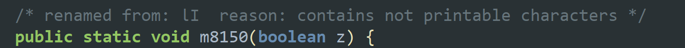

# 使用Frida去hook一些奇奇怪怪的函数名

> 起因是本人在尝试逆向分析某APP时，使用jadx等工具逆向发现其java类内的函数名是用的Unicode进行编码，普通的Frida hook方式无法成功，在网上找了很久根本找不到任何解决方法。最后在老师的帮助下，终于找到了一个合适的hook方式（虽然这个方式稍微有点麻烦，需要人工去看对应的位置，但都做逆向了，自然是不会太在意这点时间），现在将这个方法记录一下。

本次感悟：**不仅要知其然，更要知其所以然。尤其是在面对一个自己不熟悉的领域、工具时，只有知其所以然了才能明白这个工具究竟要怎么使用**


## 某个函数样例

```java
public static void ƖΙ (boolean z) {
        return;
    }
```

通过jadx等工具在逆向时会看见有类似上面这样的一个函数，这个函数的函数名非常奇怪，不是通常我们见到的 `functionName()` 这种样子。如果是使用的jadx工具，我们看到的大概是这个样子：



## 原始方法尝试

jadx告诉我们这个是一个不可打印字符（事实上这个应该是一个Unicode编码的函数名），如果此时我们按照老方法使用Frida进行hook：

```javascript
Java.perform(function(){
    // hook not exact function
    var Cls = Java.use('com.example.clazz');
    Cls.ƖΙ.implementation = function(arg1){
        console.log('[[test hook unicode]]');
        console.log();
        console.log();
    }
});
```

看上去很完美，实际上并不行。


## utf8编码尝试

之后我尝试将函数名进行 `encode` ，给他转成utf8编码格式，再利用utf8编码进行调用（下面这个例子的utf8并不对应上面的样例，但想法和操作是相同的）。

同样我们再次编写js的脚本

```javascript
Java.perform(function(){
    // hook not exact function
    var Cls = Java.use('com.example.clazz');
    Cls.\xc7\x83.implementation = function(arg1){
        console.log('[[test hook unicode]]');
        console.log();
        console.log();
    }
});
```

很遗憾的是，不论是使用 `\xc7\x83` 还是使用 `'\xc7\x83'` 都不行，甚至直接就是语法错误了。

到这里我其实就不知道要怎么解决了，期初我的一个想法就是搞清楚他是如何解析 `Cls.functionName.implementation` 的，换言之就是他到底是个怎么样的类型。后续的解决方案确实是按照这个思路来的，不过我一开始在查的时候有些跑偏了，我想的是搞清他到底是怎么样的一个编码，然后利用对应的编码进行调用，也是找了很久没找到解决方法。

后来在老师的帮助下，差不多一个半小时左右找到了合适的解决方式（真的佩服老师，居然这么快就能有一个比较合适的思路，太强了）。那么接下来介绍一下解决的方案。


## 解决方法

通过对js语言的进一步理解我们发现，其实 `var Cls = Java.use('com.example.clazz');` 这一句返回的 `Cls` 是一个 `objiction` 类型，这个类型里有很多属性。其中，Java层面的类里的成员变量、函数，在这个 `object` 里都是作为属性的 `key` 存在的，而这个 `key` 是可以通过类似数组下角标**和**python中字典的方式获取的。如此，其思路就是想办法获取到 `object` 里面的 `key` ，利用获取到的 `key` 再作为索引获取对应的 `value` ，也就是所谓的属性（在这里就相当于获取到了函数）。

在js的这里面，我们可以用如下的方式去理解一个类：

```javascript
Object myClass = {
	value1 : 4,
	func1(){
		return;
	},
}
```

其中 `myClass` 就是类名，`value1` 是类内的一个成员变量，`func1` 是类内的一个函数。而实际上，通过之前我们调用 `Cls.functionName.implementation` 这里我们可以类比一下，`Cls` 是一个 `object` ，我们用 `.` 的范方式访问了其中的一个 `functionName` ，之后我们以同样的方式去访问了一个 `implementation` ，那是不是说明这个函数其实也是一个 `object` 呢？很幸运，经过尝试以后发现确实如此。

那么此时的问题就是如何获取到类中的所有信息。这个其实也很简单，把这个类枚举一遍就行了（这也就是我一开始说的需要人工去看对应的位置，就是枚举了之后看他在 `object` 里排第几，后面我们用角标去索引），枚举的方法就直接for循环就好。

经过上面的步骤，得到了想要hook的函数在类内的序号，之后就是从类中拿出这个 `key` ，这里我们采用的方式是用反射机制（具体有关反射机制的介绍可以百度一下，挺多的）。利用反射机制可以得到 `Reflect.ownKeys(Cls)[index_number]` ，之后再用字典的形式去访问就可以得到我们想要的 `object` 了。

综上，可以得到改进后的hook脚本：

```javascript
Java.perform(function(){
    // hook not exact function
    var Cls = Java.use('com.example.clazz');
    Cls[Reflect.ownKeys(Cls)[index_number]].implementation = function(arg1){
        console.log('[[test hook unicode]]');
        console.log();
        console.log();
    }
});
```

经过实验验证可行。


# 写在最后的话

哇，这个问题真的困扰了我好久，其实一开始我就是想着直接用hook的方式去进行动态的检测，但是发现这种字符无法直接使用以后就放弃了，选择人工静态逆向某APP。静态的时候真的也是吃了不少苦，到最后要验证自己逆向时的正确性时，依旧还是逃不过hook此类函数。

为了找相关的解决方式，真的是感觉翻遍了网上的Frida教程、Js教程啥的，都没能解决。最后老师来帮忙一起解决这个问题时，他所出发的角度就是要先搞清楚这个函数名到底在js里是个什么样的存在，搞清楚了这个东西的存在形式之后就可以想办法利用其他方式来导出这样的存在形式，进而解决问题。

不得不说这个方式确实比较累，但是是稳扎稳打的解决方式。之前在配置mitm的时候其实也是类似的样子，当时我也是找遍了教程、直接搜相关问题都无法解决，最后还是要去学习iptables这个工具他的工作原理到底是什么，只有搞懂了这些才能真正明白自己到底应该怎么做才是对的、之前究竟错在了什么地方。

另外：这某APP到底是怎么想的啊，搞这么复杂，究竟是在麻烦谁呢？？？
