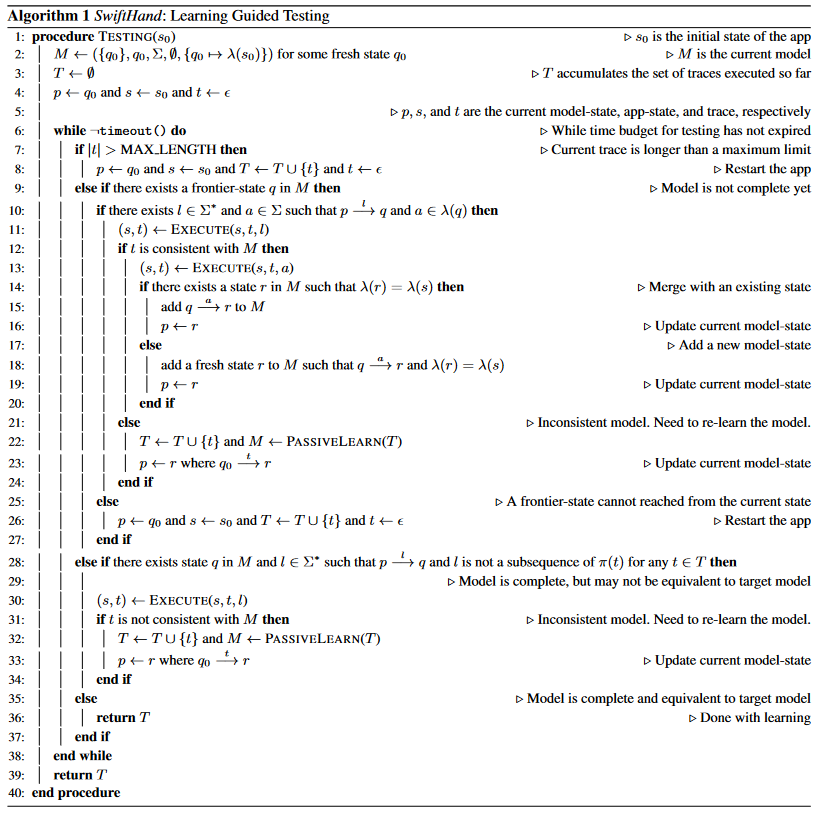

# Guided GUI Testing of Android Apps with Minimal Restart and Approximate Learning

## Information

Authors: Wontae Choi, George Necula, Koushik Sen

Year: 2013

Conference: Proceedings of the 2013 ACM SIGPLAN international conference on Object oriented programming systems

Paper Link: [SwiftHand](https://dl.acm.org/doi/10.1145/2509136.2509552)

## Abstract

    Smartphones and tablets with rich graphical user interfaces (GUI) are becoming increasingly popular. Hundreds of thousands of specialized applications, called apps, are available for such mobile platforms. Manual testing is the most popular technique for testing graphical user interfaces of such apps. Manual testing is often tedious and error-prone. In this paper, we propose an automated technique, called SwiftHand, for generating sequences of test inputs for Android apps. The technique uses machine learning to learn a model of the app during testing, uses the learned model to generate user inputs that visit unexplored states of the app, and uses the execution of the app on the generated inputs to refine the model. A key feature of the testing algorithm is that it avoids restarting the app, which is a significantly more expensive operation than executing the app on a sequence of inputs. An important insight behind our testing algorithm is that we do not need to learn a precise model of an app, which is often computationally intensive, if our goal is to simply guide test execution into unexplored parts of the state space. We have implemented our testing algorithm in a publicly available tool for Android apps written in Java. Our experimental results show that we can achieve significantly better coverage than traditional random testing and L∗-based testing in a given time budget. Our algorithm also reaches peak coverage faster than both random and L∗-based testing.

## Target

    测试目标：安卓GUI界面测试

    优化目标：尽量减少Model Learning时重启APP的次数（因为重启APP一般是需要进行重装，重装耗费的时间占比很大）

    测试想法：利用代码覆盖率进行引导，加速测试（文中认为，在GUI层面上代码覆盖率其实和User Interface Coverage效果是等价的，所以引导方式可以换成User Interface Coverage进行引导）

## Algorithm

算法伪代码如下图所示：

主要学习方法：主动学习和被动学习相结合。主动学习用于扩展状态机的状态；被动学习用于纠正状态机的问题。

### 运行思路：

1. 每次迭代运行都希望能够发现一个新的app-state
2. 首先寻找一个frontier-state *(q)*，然后找到能够从当前state移动到 *q* 的路径（User input sequence），并找到 *q* 状态下的一条enabled input *(a)* ；如果没找到这么一条移动路径，就重启APP（经过观察发现，其实大部分的Acitivity之间的相互转换都是能不经过重启的，能够通过内部操作进行转移---**这里感觉我们可以学习**）
3. 在当前状态*s*输入在2中找到的路径
   1. 如果状态没有移动到 *q* ，则认为之前的学习是有问题的（比如状态合并存在问题），存在不一致的情况，此时利用被动学习算法对至今为止经历的路径进行重新学习
   2. 如果状态确实移动到了*q* ，则认为之前学习的应该是没问题的，进入到步骤4
4. 在状态*q* 下执行输入*a* ，得到一个新的状态
   1. 如果新得到的状态的model-state和之前存在的某个model-state是一样的，则将这两个进行合并；如果后续发现合并的状态实际上并不一样，那么就使用被动学习进行重新学习（即3.1）
   2. 如果不存在一样的model-state，则可以得到一个新的model-state，更新状态机

### 结束条件：

    如果在运行中发现找不到frontier-state，则认为此时所有的未知路径都已经被探索完成，表示状态机的学习已经完成。但是此时的学习仍然可能存在问题，**需要进行一致性查询（和L\*中的类似）。** 同时为了确保状态机的学习不会陷入到无限递归的状态，可以设置一个最大长度限制，当到达这个最大长度限制之后就进行重置

### 一致性检查：

选择任意的一条序列（该序列不是状态机中实际存在的任何序列的子序列）作为输入，这个序列应当引导状态移动到model中的某个状态p。对于这条序列的存在性：

1. 如果不存在，则表示通过本次一致性查询
2. 如果存在，需要继续运行当前路径，看运行的结果和模型是否一致
   1. 如果查找到了不一致，就需要重新学习现有的所有执行路径
