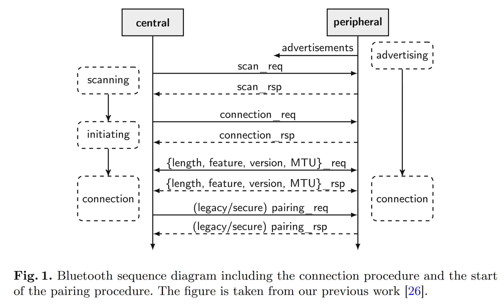
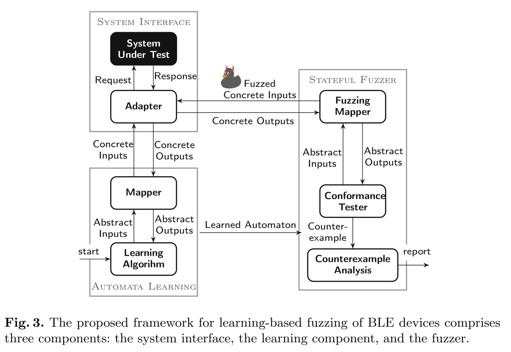

# Stateful Black-Box Fuzzing of Bluetooth Devices Using Automata Learning

这篇文章是给BLE设备进行建模、Fuzz的文章，[原文链接](https://link.springer.com/chapter/10.1007/978-3-031-06773-0_20)。

# 1. Imformation

**Author:** Andrea Pferscher, Bernhard K. Aichernig

**Year:** 2022

**Publish:** NASA Formal Methods

# 2. Abstract

Fuzzing (aka fuzz testing) shows promising results in security testing. The advantage of fuzzing is the relatively simple applicability compared to comprehensive manual security analysis. However, the effectiveness of black-box fuzzing is hard to judge since the internal structure of the system under test is unknown. Hence, in-depth behavior might not be covered by fuzzing. This paper aims at overcoming the limitations of black-box fuzzing. We present a stateful black-box fuzzing technique that uses a behavioral model of the system under test. Instead of manually creating the model, we apply active automata learning to automatically infer the model. Our framework generates a test suite for fuzzing that includes valid and invalid inputs. The goal is to explore unexpected behavior. For this, we test for conformance between the learned model and the system under test. Additionally, we analyze behavioral differences using the learned state information. In a case study, we evaluate implementations of the Bluetooth Low Energy (BLE) protocol on physical devices. The results reveal security and dependability issues in the tested devices leading to crashes of four out of six devices.

# 3. 知识点

## 3.1. Bluetooth Low Energy(BLE)

BLE是蓝牙4.2版本的一个部分，该协议支持蓝牙在低功耗设备上使用。与普通蓝牙协议不同，该协议具有不同的协议栈。

上图是BLE的工作流程示意图

## 3.2. Methodology

整体框架分为两部分：Model Learning和Fuzzing Test，共有3个component：系统接口(system interface)，

### 3.2.1 System Interface

使用一个能够和其他BLE设备进行交互的设备，作为测试发起方，可以通过该设备向SUT发送数据包进行交互。（The device used in the adapter is controlled by us and enables the transmission of manually crafted BLE packets to the SUT）

其中有一个假设：BLE的连接(connection)是能够通过指令断开的 `termination_ind`或者 `scan_req`，并认为在terminate之后，BLE设备就会回归到advertising状态（即能够进行reset）。在状态机学习的阶段，为了确保确实是已经回到了advitersing状态，作者会利用`scan_req`指令进行检查（**那么在这里，我们是不是也能找到一种通过指令的方法进行reset，并检查reset的状态**）

### 3.2.2 Automata Learning

文中有两个mapper，一个是`abstract input`，负责提供high level的符号（如MQTT的CONNECT）；还有一个是`concrete input`，负责提供具体参数的值（如MQTT中的topic）。

由于L* 算法需要是确定性的、可以重置的(resettable)，但是无线通讯中会存在有non-deterministic的表现和比较麻烦的reset操作，所以本文使用了**之前工作中[26]**提出的一个改进版reset implementation，同时也能容忍处理non-deterministic表现。

本文认为non-deterministic的表现主要是因为网络原因，会导致类似timeout之类的情况，所以本文尝试的方法是多次发送取众数的方式

### 3.2.3 Stateful Fuzzer

本文中所谓的stateful fuzzing就是在不同的state下进行fuzz操作，并且这里他只是寻找和原始model不一致的情况。fuzz的sequence分为`p·f·s`三个部分，其中

- `p`为前缀，负责将测试从初始状态引导到对应状态，且为abstact输入。**是合法的输入，类似learning阶段的input**；
- `f`为fuzzing input，是从abstract input里随机挑选的，**然后在随机的某个field随机挑选数值（给定范围内），作为fuzz的输入（For some fields, a set of possible values is given, whereas others are limited by minimum and maximum values），同时如果某个字段受到最大最小值的限制，则在fuzz的时候会更加偏向选择边界值**
- `s`为测试序列的后缀，也是随机选择的输入，**是合法的输入，类似learning阶段的input**。

### 3.2.4 Counterexample Analysis

Counterexample: 文章中说的是非预期的状态转换（但是不知道他这个非预期是不是仅包含原有状态机之外路径的转换），比如说是某条消息导致意外的重置之类的（进入到inititial state）

# 4. 没看懂的地方

文章中Methodology最后一部分提到了一个概念：`characterization set`，说实话没看懂这个玩意到底是指代的什么。原文相关内容如下：

Based on the W-Method [9], we use the characterization set to calculate possible different state transitions between I and H. The characterization set contains input sequences that generate a unique set of output sequences for every state. By the execution of input sequences of the characterization set, we aim to identify if an unexpected output leads to a different state. Since the characterization set might change for the extended fuzzing input alphabet, we extend the characterization set always by the input alphabet. The advantage of performing an L∗-based learning algorithm in advance is that the characterization set can be automatically derived from the data structures used during learning. Note that this counterexample analysis only hints at a possible target state. For example, a BLE connection might terminate on an invalid request. In this case, we would observe a transition to the initial state. To check the actual state equivalence, a more comprehensive conformance test would be required. The counterexample analysis is also limited by ncex repetitions in the case of connection errors or non-deterministic behavior.