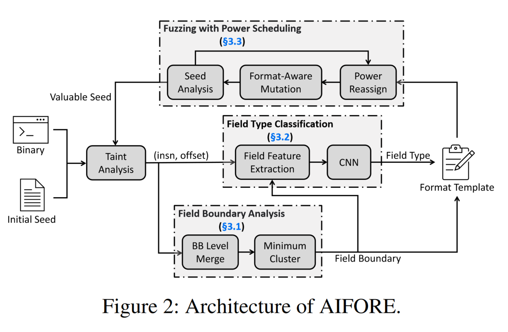
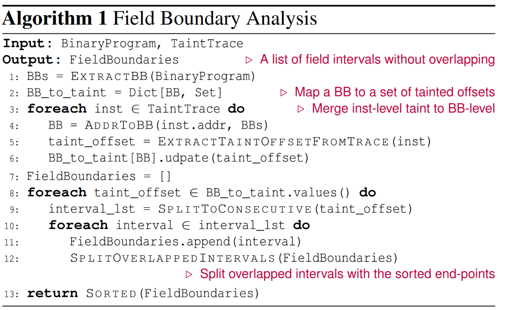
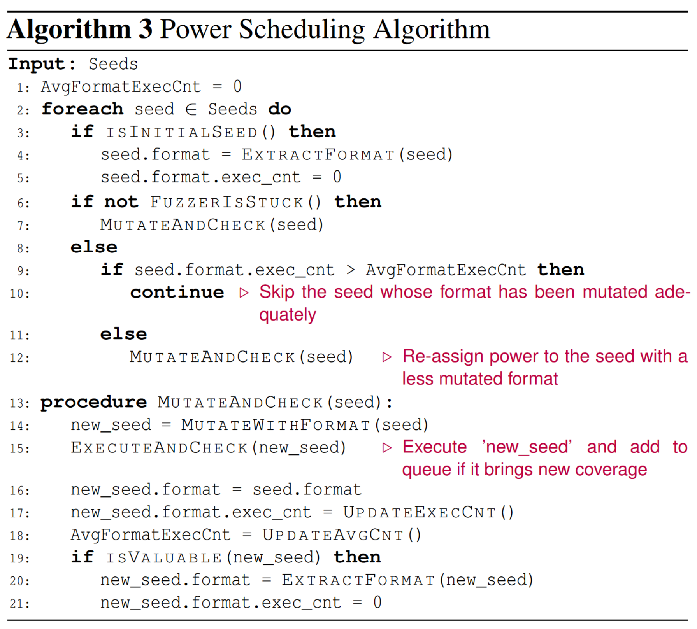

# AIFORE: Smart Fuzzing Based on Automatic Input Format Reverse Engineering

本文尝试对input的format进行解析，以basic block为单位进行污点分析、划分input fields，之后利用CNN学习、预测input field的semantic type。得到了input knowledge后，提出了一种新的power schedualing of fuzzing。[原文链接](https://www.usenix.org/conference/usenixsecurity23/presentation/shi-ji)

## Information

Author:  **Ji Shi, Zhun Wang**, Zhiyao Feng, Yang Lan, Shisong Qin, Wei You, Wei Zou, Mathias Payer, and **Chao Zhang**

Year: 2023

Publich: USENIX Sec

## Abstract

Knowledge of a program's input format is essential for effective input generation in fuzzing. Automated input format reverse engineering represents an attractive but challenging approach to learning the format. In this paper, we address several challenges of automated input format reverse engineering, and present a smart fuzzing solution AIFORE which makes full use of the reversed format and benefits from it. The structures and semantics of input fields are determined by the basic blocks (BBs) that process them rather than the input specification. Therefore, we first utilize byte-level taint analysis to recognize the input bytes processed by each BB, then identify indivisible input fields that are always processed together with a minimum cluster algorithm, and learn their types with a neural network model that characterizes the behavior of BBs. Lastly, we design a new power scheduling algorithm based on the inferred format knowledge to guide smart fuzzing. We implement a prototype of AIFORE and evaluate both the accuracy of format inference and the performance of fuzzing against state-of-the-art (SOTA) format reversing solutions and fuzzers. AIFORE significantly outperforms SOTA baselines on the accuracy of field boundary and type recognition. With AIFORE, we uncovered 20 bugs in 15 programs that were missed by other fuzzers.

## Contributions

1. We propose a field boundary recognition method, which utilizes taint analysis to identify relationships between input bytes and BBs, as well as a minimum cluster algorithm to split indivisible input fields.
2. We present a novel deep learning–based solution to predict the type of input fields processed by BBs.
3. We present a novel format-based power scheduling algorithm to explore infrequent types of inputs
4. We implement a novel smart fuzzing solution AIFORE and systematically evaluated it on a wide range of input formats and programs. Results show that it has a much better performance on input format recognition and format-aware fuzzing than SOTA solutions

## Knowledge

### Limitations of existing methods

1. 在指令(intruction)层面拆分field是不合适的。例如某个指令可能会读取多个field，并交个不同的block处理，而从指令级划分会错误地将这几个划分成一个field；
2. 现在大多数对field中变量类型的识别都是依靠人工提取代码模板，这种方式费力还不能覆盖到复杂的情况，例如一个input field type可能会有多个不同类型的bb；
3. 现有的formataware fuzzing在能量调度上有限制（power schedulng）。例如ProFuzzer只分析了他认为有价值的种子，并提取格式知识；但是他没有重新考虑这些有价值的种子在fuzzing时候的power。

### Architeture of AIFORE's Design

整体架构如上图所示，共分为三个组件：污点分析、类型预测（CNN）、fuzz

#### 1. Field Boundary Analysis

此组件利用minimum cluster算法从block level对input bytes进行划分，相关算法伪代码如下：

1. 将binary code划分成不同的Basic Blocks(BBs)；
2. 将inputs的bytes在每个BB中进行收集、合并；
3. 基于每个block的污点特征（包括general BBs和field-specific BBs）划分fields，其中每个MC中被作为一个整体在BB中进行处理的连续bytes会被划分为一个field。

这种方法能够应对绝大部分情况，但是有一些比较特殊的情况无法处理：例如checksum这种field可能会**被逐byte进行处理，而不是作为一个整体**。这种情况的话就会将每个字节视为一个field，本方法就不再适用。

#### 2. Field Type Classification

利用卷积神经网络（CNN）对代码片段(code snippet)进行分类，让其识别当前代码片段处理的field type。这里的type是指的semantic type(offset, checksum)，而不是本身变量的类型(int, string)，这种语义上的类型对fuzz更加有帮助。

##### 2.1. Field Type

本文仅考虑6种常用语义：Size, Enumeration, Magic number, String, Checksum, Offset

##### 2.2. Trainning Data Collection

利用一些已经知道的ground truth进行训练，收集到具有field type和相关对应BB的信息，其中BB是利用程序污点分析+前向切片划分

##### 2.3. Data Vectorization

1. instructions的语义信息是比较重要的，能够告诉我们程序将如何处理input field，因此第一步是将instrucions组成的BB进行向量化。这个地方的操作就是将每个instruction转换成IR，然后进行one hot编码；
2. 同时对standard libary的调用信息也是一个比较重要的语义信息。因此，对一些常见的库函数的调用(memcpy, strcpy, malloc等)也会记录到one hot编码中；
3. BB中使用的format string信息也会被记录，如%x, %s等。

这三部分信息将会被拼接在一起，形成一个feature vector(FeatureOffset += (ir_feature,call_feature,str_feature))，交给网络训练的pair为（feature vector, field type）

#### 3. Fuzzing with Power Scheduling

待解决的两个问题：

1. 什么样的seed值得提取format信息？
2. 如何在运行过程中合理分配power？

相关伪代码如下：

算法步骤：

1. 分析初始种子的format，建立format model(line 3 - 5)；
2. 基于刚刚分析的内容mutate seed(line 7)；
3. 如果新生成的种子是有价值的，就对这个种子的format进行分析(line 19 - 21)；
4. 当fuzzer进入停滞状态了（fuzzer在给定时间内不能够再产生新的coverage时），重新分配power，将以前没有充分mutate的种子分配更多的power(line 8 -12)。

##### 3.1. Power scheduling for format analysis

不是所有的seed都有价值去参考，本文认为种子为Valuable：the input can reach more new BBs and likely belong to an unseen format variant. 即本文的fuzzing引导方式是BBs coverage

##### 3.2. Power scheduling for mutation

对于每个类型的字段会分配不同类型的mutator，例如size部分可以用interesting size value、string部分可以进行insert或者delete bytes**（这里在我们的项目里可以借鉴，毕竟我们不是做内存漏洞，而是想要做逻辑漏洞，那么bitflip可能就不是太有必要）。**而那些没有format信息的就用以前AFL那种随便变异就行了。

当出现两个相近的valuable seed时，说明先出现的那个没有充分的mutate。（？？？）

## Limitation

1. 由于本文的方法在使用动态污点分析的基础上实现的，所以key limitation就是程序如何解析input，如果处理过程中并没有涉及到对某个field的操作，那么就无法提取出该field的format knowledge；
   还有一个是如果某个field会被分开进行处理，那么AIFORE可能就会将其错误地划分成多个fields。不过这个问题可以解决：在多个能够处理这个field的不同的progrem中处理就行，这样能尽量避免特例；
2. 本文是在byte粒度上进行处理的，对于一些支持bit粒度处理的程序可能不太适用。从技术上来说，本方法是能扩展到bit粒度的，只是需要进一步分析；同样的，本方法还无法支持text-based input
3. 如果input是加密的或者经过混淆，则本方法难以处理。