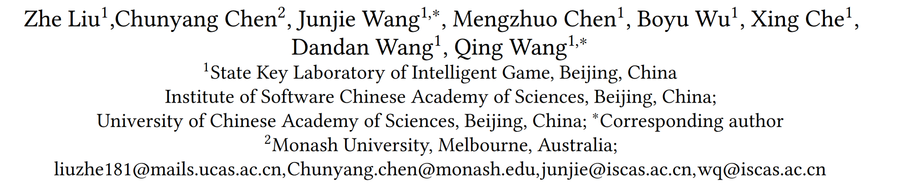

# Make LLM a Testing Expert: Bringing Human-like Interaction to Mobile GUI Testing via Functionality-aware Decisions

利用大语言模型去做安卓GUI界面测试的文章

## 作者信息

## Abstract

Automated Graphical User Interface (GUI) testing plays a crucial role in ensuring app quality, especially as mobile applications have become an integral part of our daily lives. Despite the growing popularity of learning-based techniques in automated GUI testing due to their ability to generate human-like interactions, they still suffer from several limitations, such as low testing coverage, inadequate generalization capabilities, and heavy reliance on training data. Inspired by the success of Large Language Models (LLMs) like ChatGPT in natural language understanding and question answering, we formulate the mobile GUI testing problem as a Q&A task. We propose GPTDroid, asking LLM to chat with the mobile apps by passing the GUI page information to LLM to elicit testing scripts, and executing them to keep passing the app feedback to LLM, iterating the whole process. Within this framework, we have also introduced a functionality-aware memory prompting mechanism that equips the LLM with the ability to retain testing knowledge of the whole process and conduct long-term, functionality-based reasoning to guide exploration. We evaluate it on 93 apps from Google Play and demonstrate that it outperforms the best baseline by 32% in activity coverage, and detects 31% more bugs at a faster rate. Moreover, GPTDroid identify 53 new bugs on Google Play, of which 35 have been confirmed and fixed.

##核心工作

本文的核心工作是提出了一种名为GPTDroid的自动化移动应用程序GUI测试方法。该方法利用大型语言模型（LLM）来模拟人类测试员的行为，通过理解GUI语义信息并自动推断可能的操作步骤，从而完成整个应用程序的测试。GPTDroid的关键特点包括功能感知的记忆机制，使LLM能够更多地关注移动应用程序的全局和功能视角。通过在93个流行的Android应用程序上进行实验，GPTDroid展现出了优越的活动覆盖率、代码覆盖率和缺陷检测能力，同时也在实际应用中发现了大量新的缺陷并促成了它们的修复。这些结果表明了GPTDroid在自动化移动应用程序测试领域的潜在应用前景。

## 方案架构

在这篇文章中，作者提出了一个名为GPTDroid的框架，它将自动化移动应用程序GUI测试问题视为一个问答（Q&A）任务，并利用大型语言模型（LLM）来进行移动GUI测试。GPTDroid的实现框架包括以下步骤：

1. 提取应用程序和GUI页面的语义信息，包括应用程序的功能和GUI页面的元素。
   为了将应用程序和GUI界面的视觉信息转换为相应的自然语言描述，GPTDroid首先通过反编译目标应用程序和查看层次结构文件来提取应用程序和GUI页面的语义信息。然后，GPTDroid设计了语言模式来将这些信息编码为LLM的提示。具体来说，GPTDroid提取了GUI页面的微观层面语义信息，即所有小部件的内在含义，以便LLM能够提供与这些小部件相关的可操作操作步骤。提取的信息包括“文本”、“提示文本”和“资源ID”字段（按顺序选择第一个非空字段）、“类”字段和“可单击”字段。为了避免小部件的文本字段为空，GPTDroid还提取了附近小部件的信息，以提供更全面的视角，包括父节点小部件和同级节点小部件的“文本”。
2. 设计语言模式来将这些信息编码为LLM的提示。
   在GPTDroid中，作者设计了三种语言模式来提示LLM，分别是**测试提示**、**反馈提示**和**启动提示**。这些提示是根据应用程序和GUI页面的语义信息生成的，以便LLM能够理解当前状态并生成下一步操作。
3. 使用少量的演示来帮助LLM生成所需的执行命令。
4. LLM与移动应用程序进行交互，生成测试脚本并迭代该过程以提高应用程序质量。

在交互过程中，GPTDroid还使用了功能感知的记忆来帮助LLM记住历史探索，以便更好地探索应用程序的各个页面。此外，GPTDroid还使用了一些启发式策略来避免测试过程中的局部陷阱。

### 设计挑战

本文中提到了几个挑战点：

1. 本文提到了在交互式问答GUI测试过程中存在的两个主要挑战之一是“本地困境”。与基于LLM的程序修复或单元测试生成主要针对确定的软件部分不同，GPTDroid将GUI测试视为一个多轮任务，LLM面对不断变化的GUI页面，即在LLM和移动应用程序之间进行交互，探索应用程序的各个页面。在交互过程中，LLM**很难清楚准确地记住历史探索**，特别是发生在很久之前的探索。
   解决措施：作者通过在GPTDroid框架中引入功能感知的记忆提示机制来解决第一点挑战，即“本地困境”。这一机制使LLM能够保留整个测试过程的知识，并进行长期的、基于功能的推理以指导探索。具体来说，GPTDroid在内部循环中构建了一个测试序列记忆器，用于记录所有详细的交互测试信息，例如探索的活动和小部件。在这个过程中，记忆器还存储了测试的功能级进展，例如正在测试哪个功能，这是通过查询LLM获得的，并且是为了使LLM能够自行进行明确的推理。同时，还设计了语言模式，将信息编码为功能感知的记忆提示，以使LLM具备保留整个测试的知识和进行长期推理的能力。这种机制使LLM能够更好地理解应用程序的功能和结构，从而更好地指导测试过程，提高测试的准确性和效率。

2. 另一个挑战是在自动化GUI测试中存在低活动覆盖率和可能错过关键缺陷的问题。尽管自动化GUI测试取得了很大进展，但仍然存在低活动覆盖率的问题，可能会错过关键的缺陷。
   解决措施：作者通过在GPTDroid框架中引入功能感知的记忆提示机制来解决第二点挑战，即低活动覆盖率和可能错过关键缺陷的问题。具体来说，GPTDroid的功能感知的记忆提示机制使LLM能够保留整个测试过程的知识，并进行长期的、基于功能的推理以指导探索。这种机制使LLM能够更好地理解应用程序的功能和结构，从而更好地指导测试过程，提高测试的准确性和效率。通过这一机制，GPTDroid能够生成类似人类操作的行为，从而更全面、更有效地进行应用程序测试，提高活动覆盖率并检测更多的缺陷。

这些挑战点突显了自动化移动应用程序GUI测试领域的一些困难和限制，同时也为本文提出的GPTDroid方法的创新性和重要性提供了动力。

## 实验效果

为了评估GPTDroid的有效性和实用性，作者在93个流行的Android应用程序中进行了实验，共发现了143个缺陷。与10个常用和最先进的基线方法相比，GPTDroid在活动覆盖率和代码覆盖率方面分别提高了32%和20%，达到了75%的活动覆盖率和66%的代码覆盖率。由于GPTDroid能够覆盖更多的活动，因此该方法可以比最佳基线方法更快地检测到31%的缺陷。除了GPTDroid的准确性外，作者还在Google Play中检测了未见过的崩溃缺陷，共发现了53个崩溃缺陷，其中35个已被开发人员确认和修复，其余仍在等待确认。作者进一步对实验结果进行了定性分析，总结了4个发现，包括通过长时间的有意义的测试跟踪进行功能感知的探索，功能感知的优先级，有效的文本输入和复合操作。

### 实验发现

当作者对实验结果进行定性分析时，总结了4个发现，具体如下：

1. 通过长时间的有意义的测试跟踪进行功能感知的探索
   GPTDroid的功能感知的记忆提示机制使LLM能够保留整个测试过程的知识，并进行长期的、基于功能的推理以指导探索。作者发现，通过长时间的有意义的测试跟踪，GPTDroid能够更好地理解应用程序的功能和结构，从而更好地指导测试过程，提高测试的准确性和效率。

2. 功能感知的优先级
   GPTDroid的功能感知的记忆提示机制还使LLM能够更好地理解应用程序的功能和结构，从而更好地指导测试过程。作者发现，GPTDroid能够根据应用程序的功能和结构，自动确定测试的优先级，从而更全面、更有效地进行应用程序测试，提高活动覆盖率并检测更多的缺陷。

3. 有效的文本输入
   GPTDroid的语言模式能够将GUI页面的微观层面语义信息转换为相应的自然语言描述，从而使LLM能够提供与这些小部件相关的可操作操作步骤。作者发现，GPTDroid能够有效地生成文本输入，从而更全面、更有效地进行应用程序测试，提高活动覆盖率并检测更多的缺陷。

4. 复合操作
   GPTDroid的语言模式还能够将GUI页面的微观层面语义信息转换为相应的自然语言描述，从而使LLM能够提供与这些小部件相关的可操作操作步骤。作者发现，GPTDroid能够生成复合操作，从而更全面、更有效地进行应用程序测试，提高活动覆盖率并检测更多的缺陷。
