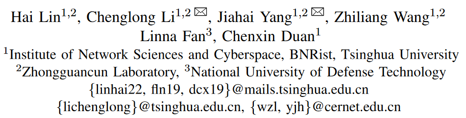

# CP-IoT: A Cross-Platform Monitoring System for Smart Homes

一个用来检测跨平台规则冲突的应用，使用到了NLP、图、embedding、BERT等

## 作者信息

## Abstract

Today, smart home platforms are widely used around the world and offer users automation to define their daily routines. However, individual automation rule anomalies and cross-automation threats that exist in different platforms put the smart home in danger. Recent researches focus on detecting these threats of the specific platform and can only cover limited threat plane. To solve these problems, we design a novel system called CP-IoT, which can monitor the execution behavior of the automation and discover the anomalies, as well as hidden risks among them on heterogeneous IoT platforms. Specifically, CP-IoT constructs a centralized, dynamic graph model for portraying the behavior of automation and the state transition. By analyzing two kinds of app pages with different description granularity, CP-IoT extracts the rule execution logic and collects user policy from different platforms. To detect the inconsistent behavior of an automation rule in different platforms, we propose a selflearning method for event fingerprint extraction by clustering the traffic of different platforms collected from the side channel, and an anomaly detection method by checking the rule execution behavior with its specification reflected in the graph model. To detect the cross-rule threats, we formalize each threat type as a symbolic representation and apply the searching algorithm on the graph. We validate the performance of CP-IoT on four platforms. The evaluation shows that CP-IoT can detect anomalies with high accuracy and effectively discover various types of cross-rule threats.

## 详细内容

见[汇报PPT](../pdfs/CP-IoT.pdf)

