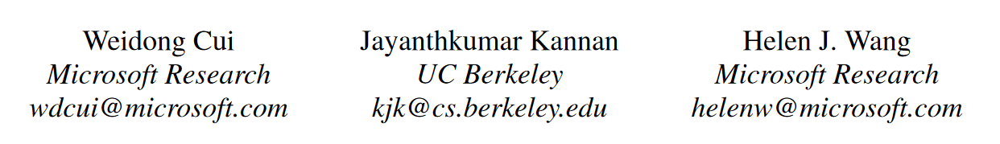
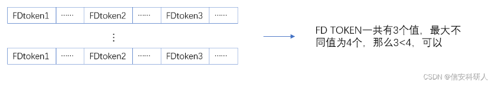
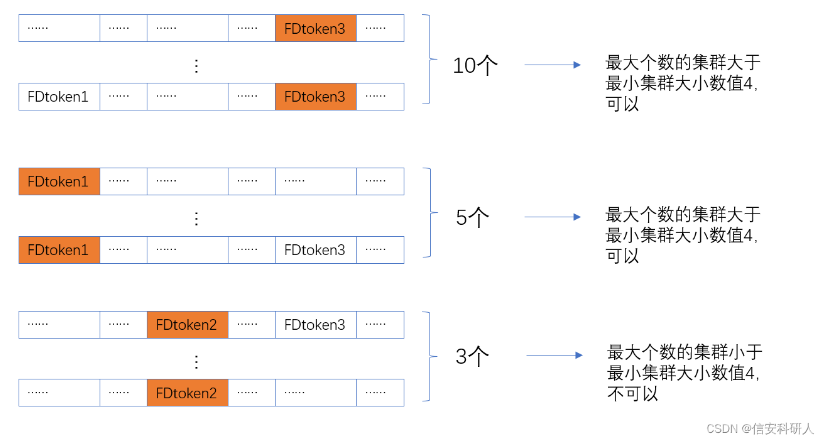

# Discoverer: Automatic Protocol Reverse Engineering from Network Traces

发表在2007年的USENIX，是协议逆向工作的**开山鼻祖**

按照字节序列的方式**推断协议格式**，设计了一个token来进行协议聚类、预分类，以token为单位进行对齐（可以忽略text的长度）

对我们工作中的算法有改进参考

编写本文时参考了[CSDN文章](https://blog.csdn.net/qq_40229814/article/details/124075697)

## 作者信息

## Abstract

Application-level protocol specifications are useful for many security applications, including intrusion prevention and detection that performs deep packet inspection and traffic normalization, and penetration testing that generates network inputs to an application to uncover potential vulnerabilities. However, current practice in deriving protocol specifications is mostly manual. In this paper, we present Discoverer, a tool for automatically reverse engineering the protocol message formats of an application from its network trace. A key property of Discoverer is that it operates in a protocol-independent fashion by inferring protocol idioms commonly seen in message formats of many application-level protocols. We evaluated the efficacy of Discoverer over one text protocol (HTTP) and two binary protocols (RPC and CIFS/SMB) by comparing our inferred formats with true formats obtained from Ethereal [5]. For all three protocols, more than 90% of our inferred formats correspond to exactly one true format; one true format is reflected in five inferred formats on average; our inferred formats cover over 95% of messages, which belong to 30-40% of true formats observed in the trace.

## Design

忽略协议中的文本部分和二进制部分，对二者进行统一处理。主要还是二进制协议里可以会有文本，文本协议里可能也会有二进制（比如HTTP可能用来传输图片）

### Tokenization

这个过程主要是将原本协议中的Bytes转换成Tokens进行表示，token分为两种：text token和binary token

#### text token

文本token旨在跨越地表示某些文本的单个消息字段的几个字节（例如 HTTP 请求中的“GET”）。

识别方式：

1. 对比ASCII，printable的是
2. 如果是unicode编码，也应该要认为是
3. 将夹在两个二进制字节之间的文本序列视为文本字段
4. 认为文本的token通常会有一个最短长度，小于这个最短长度的认为是binary

识别结束以后，利用分隔符（空格，tab等），将这些文本序列划分成几个token

#### binary token

**真的很难找到token的边界**。 在这里仅仅是将单个字节视作一个二进制token。这个过程可能会出现如下的错误：

* 具有可打印字符的 ASCII 值的连续二进制字节被错误地标记为文本标记；
* 短于最小长度的文本字符串被错误地标记为二进制标记；
* 由一些空白字符组成的文本字段被错误地划分为多个文本标记。

不用着急，在discoverer的合并阶段解决这个问题。（文章里是这么说的）

### Initial Clustering

利用刚刚的token进行简单的聚类。聚类方式：将token和发送方向组合形成一个元组（即形成特征），拥有相同元组的则认为是一类。

需要注意的是，初始聚类是粗粒度的，因为具有不同格式的消息可能具有相同的token 模式。 例如，SMTP 命令通常有两个文本标记（“MAIL 接收者”、“RCPT 发件人”、“HELO 服务器名称”）。

discoverer将在递归聚类阶段，通过递归识别 FD（format distinguisher） token 和 递归聚类来提高这种聚类的粒度。

### Recursive Clustering

这一阶段的核心是识别FD token，为了找到这个FD需要format inference 和 format comparision

#### Format Inference

这一阶段主要是推断出消息内容中更详细的信息，如语义、属性等。引入token属性是因为无法推断每个token的语义含义，并且某些token属性对于描述消息格式很有用。

**属性推断。**token属性包括：

* 二进制与文本
* 常量与变量。

也就是两大类，第一类表示token的类别，第二类决定令牌是在相同格式消息中采用相同的值还是可变的值。同时，对于标记的type，定义为语义和属性的总和。

第一类在前面已经表明；第二类也比较好判断

**语义推断。**就是常见的语义：长度、偏移量、cookie之类的，看怎么识别

* **长度：**直观认为如果是长度的表示，这个地方变就会引起message或者后面的token长度不同
* **偏移量**：这一个部分的值应该是和后面某些token的偏移量会相关

#### Format Comparision

主要是推断两个Message的格式是否相同。给定两种format，left-to-right and token-by-token逐个扫描，如果所有的都匹配（一致）就认为是相同格式的。

当然这只是理想情况，还是有一些没有语义的token存在，此时需要比较token的具体value：如果variable token和constant token比较，v中至少有一次包含c，则这俩是match的；如果两个v之间有重叠，也是match的。

#### Recursive Clustering by Format Distinguishers (Main)

识别FD token的方法如下：

1. 首先对一个cluster里的messages使用**格式推断**；
2. 接着，从左到右以token为单位逐个扫描message的格式，以识别FD TOKEN。

认为是FD token的标准：

1. 首先检查该token在一组消息中采取的独特值的数量是否小于一个阈值，那么将这个阈值称为FD token的最大的不同值。 这是因为fd token的取值通常与不同格式的总数相对应。
   

   这张图我感觉不太对，应该是FD token2 的值有3<4，所以认为是可以的（应该纵向比，而不是他这样的横向）

2. 对于满足第一个标准的token，进行的第二次测试。将整个集群按照这个token的不同取值分为几个子集群。也就是每个子集群由候选FD TOKEN所采取的特定的值分成。认定最大的子消息集群的大小超过了一个阈值，这个阈值被称为最小集群大小。这么做可以至少在一个子集群中的格式推断有效果，否则这么划分什么都得不到。比如，一个子群如果只有一个消息，那我推断个锤子。
   

3. 当候选FD TOKEN过了第二关，调用上一节的**格式比较**来判断这些子集群之间的格式是否两两不同。然后合并那些相同的格式的子集群并保持其他完整不变，那么未合并的token与其他token互相独立成为其对应的格式代表，以达到一种识别格式区分符的目的。

**这个过程在每个子集群上递归执行，因为一条消息可能有多个 FD token。** 通过向消息的右侧（末尾）进一步向下扫描消息来找到下一个 FD token。 这就需要一直扫描到最后，因为需要识别所有的 FD 以获得较完善的聚类和格式推断。

**在查找下一个 FD token时，会再次对每个子集群中的消息集调用格式推断。** 这是因为推断的token属性和语义可能会因为消息集变得更小而改变，并且有可能拥有更强的属性。 例如，以前可变的token现在可能是常量令牌； 以前可变的令牌现在可能被标识为长度字段。

### Merging with Type-Based Sequence Alignment

在标记化和递归聚类阶段，算法保守地确保**格式推理过程**在一组相同格式的消息上正确地运行。 然而，这导致了过度分类的新问题，**即相同格式的消息可能分散到多个集群中**。 

#### Insight

合并阶段背后的关键是，虽然序列比对不能用于对相同格式的消息进行聚类，但它可以用于对齐格式以识别不同聚类中的相似消息。 这是因为可以利用在递归聚类阶段推断出的多样化的token类型（即语义和属性），例如，知道一个特定的token是一种格式中的一个长度字段，就需要它在另一种格式中的对应物也是一个长度字段，这两种格式才能被认为是匹配的。 那么，本文将用于对齐格式的算法称为**基于类型的序列对齐**。在基于类型的序列比对中，只允许同一类（二进制或文本）的两个标记相互比对。同时声称如果两个对齐的标记具有`相同的语义`或`共享至少一个值`，则它们是匹配的。

#### Use Gap to Align

为了补偿标记化阶段错误，**允许在基于类型的序列比对中存在gap**。除了使用**差距惩罚**来控制差距之外，本文还引入了额外的约束来避免过度的差距。

1. 首先，一种消息格式的连续二进制token如果在对齐中位于另一种消息格式的文本token之前或之后，则允许与gap对齐，并且二进制token的数量最多为文本token的大小，如果文本token与gap对齐，或者如果与另一个文本token对齐，则为大小差异。此约束用于处理将二进制token序列误认为是文本token或反之亦然的情况。
2. 其次，允许文本token与gap对齐，但最多允许两个此类gap。此约束用于处理由一些空白字符组成的文本字段被错误地划分为多个token的情况。

#### Merge

当对齐和比较两种消息格式以决定是否合并它们时，首先检查是否可以满足间隙约束。如果不满足，停止并声称这两种格式不匹配；否则，继续检查不匹配的数量。如果最多有一对对齐的token不匹配，声称这两种格式匹配并合并它们。请注意，这是一种比较保守的方式，因为不匹配的token可以被视为变量token，它从涵盖两种格式的新集合中获取值。

## Inspired

### Limitation of Our Work

1. 受限于the same length of payload，如果出现长度不一样（比如一个字段是seq number，其中一个Payload是9，另一个是10，会导致错误划分到不同的类型）
2. 随机性阈值的设置可能还是有点问题

### Something We Can Use

1. token的概念，我们在划分的时候在基于之前header的基础上也找一些依据进行划分，看属性是否一致。
2. 增加property，比如HTTP里就可以利用他自己的字段名称作为token的属性。如果是tcp那种，有的感觉可能就没必要判断？
3. 增加对齐的想法（也能在一定程度上避免错位的问题）
