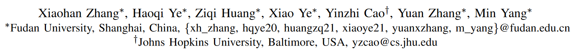
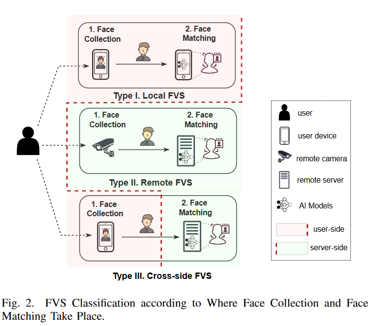
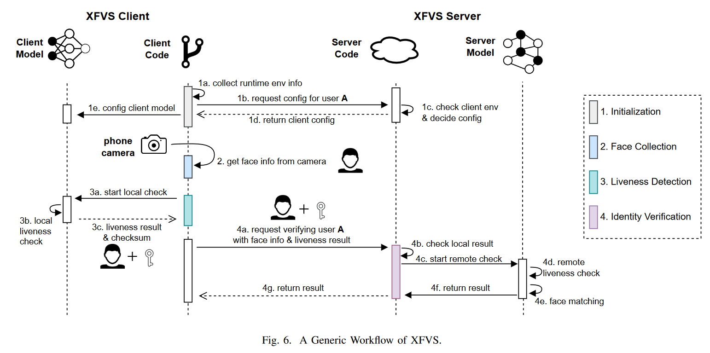

# Understanding the (In)Security of Cross-side Face Verification Systems in Mobile Apps: A System Perspective

从系统的角度讲述了当下使用比较广泛的cross-side人脸识别系统的布置与安全隐患，相对偏向于测量。[原文链接](https://ieeexplore.ieee.org/document/10179474)，发表在2023年S&P。

## 作者信息

## Abstract

Face Verification Systems (FVSes) are more and more deployed by real-world mobile applications (apps) to verify a human’s claimed identity. One popular type of FVSes is called cross-side FVS (XFVS), which splits the FVS functionality into two sides: one at a mobile phone to take pictures or videos and the other at a trusted server for verification. Prior works have studied the security of XFVSes from the machine learning perspective, i.e., whether the learning models used by XFVSes are robust to adversarial attacks. However, the security of other parts of XFVSes, especially the design and implementation of the verification procedure used by XFVSes, is not well understood.

In this paper, we conduct the first measurement study on the security of real-world XFVSes used by popular mobile apps from a system perspective. More specifically, we design and implement a semi-automated system, called XFVSCHECKER, to detect XFVSes in mobile apps and then inspect their compliance with four security properties. Our evaluation reveals that most of existing XFVS apps, including those with billions of downloads, are vulnerable to at least one of four types of attacks. These attacks require only easily available attack prerequisites, such as one photo of the victim, to pose significant security risks, including complete account takeover, identity fraud and financial loss. Our findings result in 14 Chinese National Vulnerability Database (CNVD) IDs and one of them, particularly CNVD2021-86899, is awarded the most valuable vulnerability in 2021 among all the reported vulnerabilities to CNVD.

## Types of FVS

1. Local FVS: 人脸数据和验证都在客户端（本地）进行，例如苹果的FaceID和安卓自带的人脸识别等。
2. Remote FVS: 收集人脸信息、验证都在远端进行，如安防中利用摄像头采集信息，并由server验证。
3. **Cross-side FVS (XFVS): 用户端收集人脸数据（如手机等），服务端验证身份（如云平台）。**这种在生活中经常使用，如手机上要求进行人脸识别，也是本文研究的重点

##XFVS Workflow

1. Initialization (初始化): 在启动人脸识别功能之前，需要先初始化当前环境、确认用户信息（是哪个用户要进行验证等）、收集环境信息（如是否root、是否使用custom ROM等）；
2. Face Collection (收集用户人脸信息)：通常这一步是调用系统的相机来收集当前用户信息，不通的系统收集的信息不同，有的是拍一张照片，有的是录一段视频。收集来的信息用于后续验证；
3. Liveness Detection (活体检测): 检测当前是否为活体（防止攻击者使用提前录好的视频或者照片伪装），该检测可以在本地进行也可以在远端进行（上传视频等）。理论上，由于客户端结果不可信，因此应该在服务器端执行活动检查。但是，如果将所有图像和视频发送到服务器进行活动检查，则可能会导致巨大的服务器端资源消耗以及隐私问题。因此，大多数sdk都有客户端活体检查，或称为本地活动检查，作为过滤的第一层，以阻止明显不是由真人发起的请求。检测方式按照安全等级逐次递增为：
   1. 固定动作检测：
   2. 固定动作检测：按照固定的流程，如向上看、转头、张嘴；
   3. 随机动作检测：随机动作检测，安全系数高。
4. Identity Verification (身份验证): 这一步的目标是根据提供的人脸数据验证用户A的身份，以及客户端检查结果，检查这些数据以确保它们不被篡改(4a和4b)。然后执行服务器端活跃性检查，进一步确认要验证的人确实是一个活跃性的人(4d)。然后进行人脸匹配，检查提供的人脸是否与用户A之前注册的参考人脸(4e)匹配。人脸匹配与否决定了验证结果，然后将验证结果返回给客户端。

## XFVS Security Properties

1. Reliable Environment.  可靠的环境属性是为了确保XFVS客户端的代码、数据和机器学习模型不被本地攻击者篡改。为了满足这一特性，XFVS应用程序应该能够抵御以下威胁:
   1. 对操作系统级可靠性的威胁，包括根操作系统、模拟器和自定义rom。例如，攻击者可能使用带有修改过的网络api的自定义ROM，这样XFVS客户机和服务器之间的通信数据就可以被攻击者控制。
   2. 对静态代码完整性的威胁，包括重新打包的apk和打过补丁的二进制文件。例如，攻击者可以通过静态地插装SDK的本机共享库来控制XFVS客户端代码的逻辑(如.so)如果没有得到很好的保护。
   3. 对动态代码完整性的威胁，包括调试和Hook。例如，攻击者可能会使用诸如Frida[44]和Xposed[45]等Hook工具来改变本地活体检测结果。
2. Camera Security. 摄像头安全属性是确保要验证的人脸数据应该直接来自物理摄像头镜头，而不是注入的数据流。攻击者可能会操纵相机api和相机驱动程序(通过违反SP1)，甚至物理修改硬件，将准备好的图像或视频(例如deepfake视频[46])注入XFVS应用程序。由于目前大多数移动设备不支持tee级或芯片级的安全摄像头，这种安全性能很难满足，使得SP2成为木桶中最短的木板。
3. Reliable Liveness. 可靠的活动性属性是准确地确定收集的面部数据是否由真人呈现，而不是假的或合成的面部。此安全属性的主要目的是对抗表示攻击的威胁。例如，攻击者可以使用打印的图片[47]、显示受害者图像或视频的屏幕[48]，甚至戴上精心制作的3D面具[49]。
4. Data Consistency. 用于确保XFVS数据(包括收集的数据面、活动配置和验证结果)在客户机和服务器的所有步骤之间保持一致。最重要的是，服务器应该自己验证数据一致性，而不是盲目地相信来自客户端的结果。例如，图1中的应用程序并不能保证用于活体检测和人脸匹配的人脸数据是一致的。从S1到S4，所有XFVS步骤都应该满足SP4。

