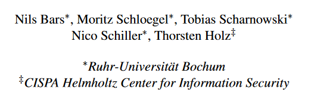
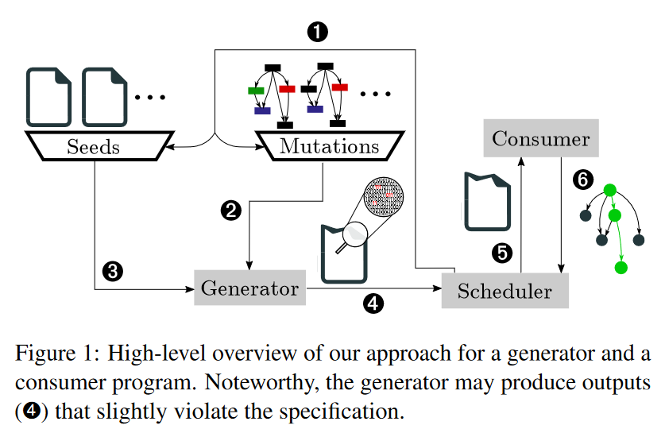
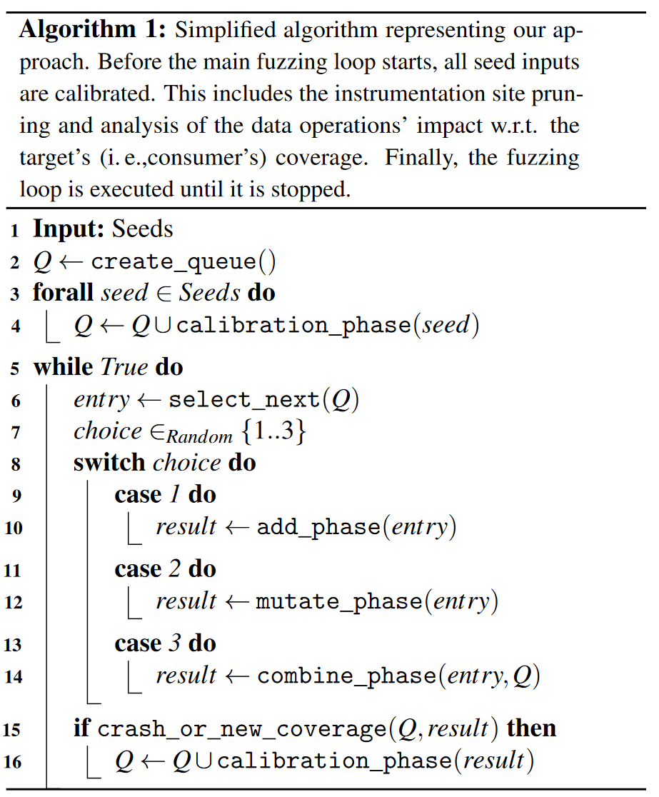

# Fuzztruction Using Fault Injection-based Fuzzing to Leverage Implicit Domain Knowledge

该文章从程序的角度、利用对生成文件的程序注入实现生成的文件不同进而fuzz接收文件的目标程序，角度非常新颖，是23年USENIX的**Best paper**。

[原文链接](https://www.usenix.org/conference/usenixsecurity23/presentation/bars)，发表在2023年USNIX。

## 作者信息

## Abstract

Today’s digital communication relies on complex protocols and specifications for exchanging structured messages and data. Communication naturally involves two endpoints: One generating data and one consuming it. Traditional fuzz testing approaches replace one endpoint, the generator, with a fuzzer and rapidly test many mutated inputs on the target program under test. While this fully automated approach works well for loosely structured formats, this does not hold for highly structured formats, especially those that go through complex transformations such as compression or encryption.

In this work, we propose a novel perspective on generating inputs in highly complex formats without relying on heavyweight program analysis techniques, coarse-grained grammar approximation, or a human domain expert. Instead of mutating the inputs for a target program, we inject faults into the data generation program so that this data is almost of the expected format. Such data bypasses the initial parsing stages in the consumer program and exercises deeper program states, where it triggers more interesting program behavior. To realize this concept, we propose a set of compile-time and run-time analyses to mutate the generator in a targeted manner, so that it remains intact and produces semi-valid outputs that satisfy the constraints of the complex format. We have implemented this approach in a prototype called FUZZTRUCTION and show that it outperforms the state-of-the-art fuzzers AFL++,S YMCC, and WEIZZ.F UZZTRUCTION finds significantly more coverage than existing methods, especially on targets that use cryptographic primitives. During our evaluation, FUZZTRUCTION uncovered 151 unique crashes (after automated deduplication). So far, we manually triaged and reported 27 bugs and 4 CVEs were assigned.

## Design
一般来说，为了能让fuzz的输入探索到目标程序的更深层，需要对目标程序能够接受的输入有个比较深刻的理解，需要知道该输入需要满足什么样的格式、有哪些逻辑单元等，识别这些通常也是非常困难的，现在仍有很多研究人员在尝试做这些工作。

本文则是尝试从另一个角度进行fuzz工作：如果说要fuzz的目标其能够接受的输入是pdf文件格式，自己去利用约束构造符合目标格式的文件是相对较为困难、复杂的（pdf还是比较常见的格式，如果是其他的自定义格式会更加复杂、难以构造），那么如果此时有一个其他的软件，这个软件能够生成pdf格式的文件，而且这个软件的输入相对比较简单（甚至可以不需要输入），那么此时就可以利用这个软件去生成各种pdf格式文件。但这个软件生成的pdf格式文件可能相对较为固定、合规，如何能 让这个软件生成的格式不那么合规呢？这时候就可以对这个软件进行注入，修改其指令执行的效果，从而达到扰乱、生成随机的pdf格式目标。

从上述描述中不难看出，以往的fuzz工作通常都是聚焦在pdf文件上，自己尝试对pdf文件进行如bit conflit等，如果是其他的格式，就需要fuzzer自己构造符合目标格式的文件。而这个工作是直接利用现有的能够生成的工具进行构造，就不需要担心生成的输入会不符合目标的输入格式。当然不免会担心这种生成软件是否都会存在、方便获取，这点可以不用担心，基本任何一个能够接收输入的系统都会存在对应的，比如某个系统是接收符合固定格式的消息，这个系统如果要正常运行，总是会有一个对应的系统生成这样格式的消息。
在本文中生成test case的软件称为generator，接收的软件称为consumer。

整体结构如下图：

### Generator
本质上，generator可以被认为是一个种子生成器，用于生成针对模糊目标(consumer)定制的输入，直接在generator程序中注入faults便能达到这个目标。更准确的说，需要识别和变异用于生成test case的data operations。

**需要注意的是：有的时候有些generator自己可能还需要提供某个输入（或者不需要），因此此时的seed应当还需要有generator的input。**

#### Data operations
要实现上述fuzz，首先的一个挑战就是需要识别和变异data operations。在本文中，**所有读、写内存的instruction都认为是data operation**，这一步利用静态分析就能完成。这基于一个相对简单的常识：几乎所有要生成的output在程序中都会在内存里进行处理、存储。

然而，一个程序里的data operation有非常多，其中可能只有一部分是用来构造output的，甚至可能对于给定generator的输入，这一部分里只有一小部分的data operations会被使用到，则这一小部分被称为*cover*到的data operations。另外，在cover的这一部分里，可能只会有再小一部分的data operations会修改内存中的数据（如有的operation可能只是从一块内存放到另一部分，但是不会修改其内容；而有的则是经过operation处理以后会发生改变），则这部分会修改的data operations称为*mutated*，即可以进行变异。

这些操作在程序中无处不在，从而产生了许多潜在的有趣操作。因此，我们不能记录每一个实例。相反，必须确定数据操作的子集，使能够最大限度地控制处理的数据，同时最小化不利的运行时影响，例如崩溃。除了数量之外，还有几个因素决定了一条指令的相关性:

1. **Impact**: 这条指令是否修改了相关数据，即对输出有明显影响的数据？修改与生成的数据无关的指令对于为我们的模糊测试目标生成有趣的输入文件没有任何好处。
2. **Type**：修改后的数据表示的值是否可能导致生成器的崩溃？例如一个函数指针，修改指针而不是实际值很容易导致应用程序崩溃，而不是产生有趣的值。
3. **Data-flow Dependecy**：数据是否依赖于先前指令已经修改过的值？直观地说，不希望多次修改相同的数据，因为初始修改已经可以产生任何可能的值;在最坏的情况下，第二次更改可能会取消第一次更改。这并不适用于部分依赖。

为了解决这些问题，本文将编译器设计为只传递加载或存储值类型的仪表指令，而避免传递指针类型。此外，使用编译器可用的数据流信息来检测被修改的数据值的第一个实例。但是静态分析的能力有限，不能准确识别在运行时的Impact，因此在实际执行fuzz之前需要对选择出来的data operations进行识别和剪枝。

***

**Instrumentation Site Pruning & Impact Analysis**
如果在所有的data operations上直接注入fault，会有很多的无效操作，极大影响fuzz效率，因此需要对data operations进行剪枝。
这些data operations中，将特定输入以及其执行的那一小部分instrumentation sites称为*dead*（原文没看太明白是什么意思，原文是这么说的：For example, a given input file exercises only a specific path in the (potentially mutated) generator’s code, which commonly only includes a fraction of all instrumentation sites. We call these sites dead w.r.t. a specific input and (mutated) version of the generator.）；与之相对的是*alive*，这些intrumentation sites可能没有实际的影响（impact），即即使对这些注入了fault，也不会引起consumer的code coverage发生变化。（Even alive (i. e., not dead) instrumentation sites may have no actual impact. This means that, for a given combination of input and generator version, injecting a fault into this instrumentation site will not lead to any coverage change in the consumer.）

然后原文说是要避免对dead instrumentation sites和without a visible impact的进行变异，和前面说的又不太一致，就理解成那些1. 不会走的sites 2. 没有显著影响的sites吧。由此，剪枝部分分为两步：1. 删掉那些不走的；2. 分析剩下部分的影响。分析方法就是对alive instrumentation sites注入faults，看是否引起consumer的code coverage发生变化。
通过上述步骤，能够得到有影响的instrumentation sites per seed file和mutated generator application的list（同时还会记录指令调用次数，在后面变异的时候会使用）。

> 看到后面感觉这里原文是说反了，不走的应该是dead，走的是alive，但是在alive中有一些可能没有显著影响。这就和之前阅读得到的是一样的。

***
**Mutations**
在得到上述list后，突变方式就变成了：随机选择一个seed file（input for the generator）和1个或者多个instrumentation sites，然后对每个instrumentation sites处理的数据进行bit-level mutation。由于在程序执行过程中，例如在循环中，这些站点可以被多次访问，因此可以始终应用相同的突变，或者选择以每次访问不同的独立突变的形式（利用上面记录的调用次数）进行更细粒度的控制。有一些极端情况是修改了数值可能会导致control flow发生变化，此时对于比观察到的更多的次数不能应用任何进一步的变异，而是返回未修改的数据值。

### Consumer
这里就没什么好说的了，记录code coverage作为反馈信息就行。

### Scheduler
调度则分为两个部分：1. Queue；2. Phases。

**Queue**中保存的是queue entries，每个entry有两个信息
1. 要给generator的seed input；
2. 所有**已经**在generator上应用的mutations。

**Phase**则是作为整个fuzzing loop里的具体内容（一个fuzzing loop分为多个phases）。根据阶段类型的不同，阶段中的步骤在模糊测试期间对于每个新的队列条目(calibration phase)只执行一次，或者执行多次。在启动模糊测试活动时，所有种子文件都被添加到队列中，从而进行校准。

1. Calibration Phase：我们将输入传递给(可能发生突变的)generator，并记录执行期间访问的instrumentation sites(instrumentation site pruning)。对于目标的每个instrumentation site，进一步评估其对consumer覆盖率的影响(impact analysis)。此信息与输入和突变一起存储在队列条目中。重要的是，这个阶段是常规模糊迭代的一部分。

在主模糊循环期间，我们重复选择一个队列条目并选择以下阶段之一：

1. Add Phase：选择多个instrumentation site并应用突变。我们更喜欢那些在consumer中已经成功产生新代码覆盖的instrumentation site。此阶段向队列条目添加新的突变，扩展突变数据操作的实例。
2. Mutate Phase：将固定数量的突变应用于所选队列条目的所有突变数据操作。与添加阶段相反，此阶段不添加任何新的数据操作，而是改变现有的数据操作。
3. Combine Phase：对于每个发生突变的数据操作，我们检查其他队列条目是否也发生了突变。如果是这样，我们就尝试它们的突变。这与传统模糊技术中的剪接类似，可以从已经证明会影响覆盖范围的突变中获益。

如果在主模糊测试循环期间观察到新的代码覆盖率，我们需要为新的队列条目执行校准阶段，创建队列条目是为了表示产生新覆盖率的输入和突变的组合。
> 与AFL的主要区别在于，本文章更喜欢包含很少观察到的数据操作的队列条目;AFL没有类似的概念，因为该方法根本不观察数据操作。

Phase中的伪代码如下：

### Combined Fuzzing
本文方案由于涉及到对程序的修改注入等，会比传统的fuzz要慢，并且缺少了对于input seed的突变检查。为了弥补这些缺失的操作和性能影响，我们的方法可以与传统的fuzzer(如afl++)串联使用。这种方法类似于QSYM **\[原文参考文献5\]**、SYMCC **\[原文参考文献6\]** 或DRILLER **\[原文参考文献14\]** 等模糊器，它们使用AFL进行常规模糊测试，并通过提供解决普通突变无法解决的模糊测试障碍的新输入来增强。

***
*关于原文具体如何真正在程序上实现这些的可以去看原文的impletation，里面有详细的描述。*

## Conclusion
这篇文章的角度非常新颖，本质上来说都是想办法生成符合格式要求的test cases，但是本文脱离了向以前工作那样的直接对case进行约束分析、突变，而是另辟蹊径：有能够已经很好生成满足约束的generator了，只需要对其中数据处理阶段的data operations注入fauls让其发生变化，就能引起最终生成的output发生变化，从而达到了满足格式约束的fuzz，非常非常好的角度，不愧是best paper。

这也给了一个提示和思考的角度：对于一整个系统进行分析时，要弄清楚该系统的流程，可以对系统流程中的任何一个组成部分进行分析，同时也可以关注该系统的附加组件（或者说是更多能够对该系统造成影响的组件），这些附加组件有时也是能有insteresting的观察的）。