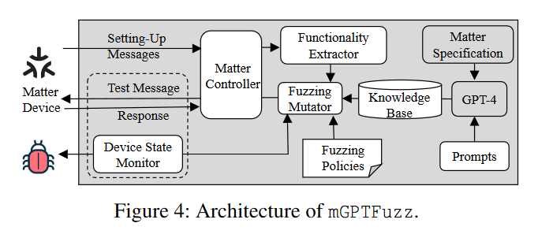
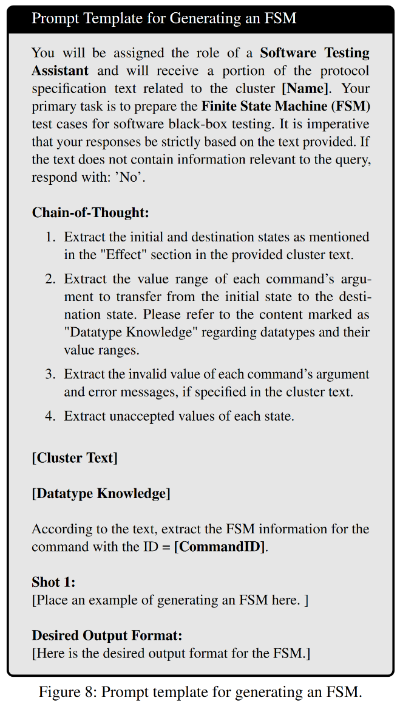

# From One Thousand Pages of Specification to Unveiling Hidden Bugs: Large Language Model Assisted Fuzzing of Matter IoT Devices

Matter协议是一种专为物联网设备设计的开放标准，该协议旨在实现跨品牌和平台的互操作性。它基于现有的互联网协议，并支持多种无线通信技术，如Wi-Fi、Thread和以太网等。该文章利用大模型对Matter device进行fuzz，是最近比较火的LLM for Securtiy(fuzz)方向的文章，发表在24年USENIX。

[原文链接](https://www.usenix.org/conference/usenixsecurity24/presentation/ma-xiaoyue)

## 作者信息

## Abstract

Matter is an IoT connectivity standard backed by over two hundred companies. Since the release of its specification in October 2022, numerous IoT devices have become Mattercompatible. Identifying bugs and vulnerabilities in Matter devices is thus an emerging important problem. This paper introduces mGPTFuzz, the first Matter fuzzer in the literature. Our approach harnesses the extensive and detailed information within the Matter specification to guide the generation of test inputs. However, due to the sheer volume of the Matter specification, surpassing one thousand pages, manually converting human-readable content to machine-readable information is tedious, time-consuming and error-prone. To overcome this challenge, we leverage a large language model to successfully automate the conversion process. mGPTFuzz conducts stateful analysis, which generates message sequences to uncover bugs that would be challenging to discover otherwise. The evaluation involves 23 various Matter devices and discovers 147 new bugs, with three CVEs assigned. In comparison, a state-of-the-art IoT fuzzer finds zero bugs from these devices.

## Challenge of Fuzzing Matter Devices
一般来说，为了提高fuzz的效率，需要对目标有足够的了解，知道如何构造输入等。Matter协议有一个官方的说明文档，该文档中详细描述了这个协议的各种接口、接口规范等，能够很好的为fuzz提供知识。按理来说，这个说明文档已经能提供非常多的knowledge了，但是在真正使用的时候还是会有一定的挑战：

1. **C1: Sheer volume of specification.** 官方的说明文档有1258页，人工将这些human-readable的文字转换成machine-readable的信息是非常不可行的，工作量太大。
2. **C2: Stateful bugs.** 有些指令只有在特定状态下才能执行，只有在特定状态下能够出发的bug称之为stateful bug。在之前的黑盒测试工作中（IoTFuzzer, SNIPFUZZ）忽略了状态的影响，没有学习完整的state space of IoT devices。
3. **C3: Non-crash bugs.** 物联网设备难以fuzz的其中一点困难是难以获得、修改固件中程序，进而不能获得到设备固件中的执行状态。一般来说只能靠观察设备是否crash来看是否触发了bug，但是有部分的bug是不会造成设备的crash的，此时无法直接观察出。
4. **C4: Command coverage.** 理想状态下，fuzz应该是对设备的所有command都进行测试，但是手动理解设备的用户手册以派生命令列表往往是不精确和不可扩展的。先前的工作SNIPUZZ收集了物联网供应商披露的测试脚本，但它们是不完整的，很少有供应商提供。

由此，本文尝试利用LLM来解决C1和C2，将human-readable的文字转换成machine-readable的information，在本文中利用FSM来表现这些内容；为解决C3，尝试利用语义来看是否存在bug，例如，如果命令的执行需要按照规范修改特定的设备属性，则fuzzer会查询相应的属性。另一方面，如果要拒绝命令，则预计会出现错误消息。对命令语义信息的精确提取保证了该方法的有效性；为解决C4，作者准备建立一个特殊的Matter controller来在设备注册阶段收集当前设备能够支持的所有command。这里有两个角度：1. 自己注册一个设备，用设备去和其他设备进行通讯；2. 实现一个类似hub的东西，将所有设备连接到自己身上。然而在Matter中有一个特性：认证不是双向的，即controller会对设备进行严格认证；但是设备不会来验证controller。如此建立一个controller会更加容易。

## Related Work and Background
### LLM Assisted Fuzzing
在这之前已经有很多工作都在尝试使用LLM进行fuzz的工作了，如TitanFuzz, FuzzGPT, Fuzz4ALL, LLM4Fuzz, ChatAFL, ChatFuzz等，这些工作综合证明了LLM在fuzz领域是有作用的。

### Matter
Matter协议构建在IP层之上，并将其用作与基于IP的网络(如WiFi、以太网和Thread)通信的通用工具。在Matter协议中，1）一个device称为*node*，2）在一个设备上有很多的*endpoints*，每个*endpoint*表示设备上的一个逻辑端点，代表设备上的不同功能或接口。一个Node可以有多个Endpoints，每个Endpoint可以有不同的角色和功能。例如，一个智能门锁可能有一个Endpoint用于控制锁的状态，另一个Endpoint用于报告电池电量。Endpoint使得一个物理设备可以通过不同的逻辑接口与其他设备进行交互。3）一个endpoint上可以有1个或者多个*clusters*，Cluster是一组相关的命令和属性的集合，定义了设备之间如何交换信息。每个Cluster都有一个唯一的标识符，并在设备间提供一种标准化的通信方式。例如，开关Cluster包含打开和关闭设备的命令，而传感器Cluster包含读取传感器数据的命令。通过使用Clusters，Matter设备可以以一种通用的方式相互理解和通信。4）*Attribute*是存储在设备上的数据值，用于描述设备的状态或特性。每个Attribute都有一个唯一的标识符，并且可以被读取或写入。例如，一个智能插座的开关状态可以是一个Attribute，表示插座是开还是关。Attributes提供了一种机制来获取和设置设备的状态，使得设备能够共享其当前的状态信息。5）*command*指设备之间用于通信和控制操作的指令。命令是实现设备功能的关键部分，它们定义了设备可以执行的动作以及如何响应特定的请求。

## Overview
### Threat Model
一共有两种类型的攻击者：1）攻击者可以利用其控制下的设备进行攻击；2）攻击者没有认证、控制Matter设备的权限，但是能利用漏洞增加malicious device到目标环境中(target Matter fabric)，然后利用他能控制的设备和其他设备通讯

### Limitations of a SOTA IoT Fuzzer
1. Manually Collecting Testing Programs.
2. Low Command Coverage.
3. Neglecting the Rich Information in Specification.
4. Cannot Handle Encrypted Messages.

### System Architecture

如上图所示一共由4个部分组成，1）一个定制的Matter Controller，负责发送、接收测试消息；2）Functionality Extractor，当一个Matter设备刚被添加进来时，这个组件负责提取setting-up messages，学习设备能够支持的command和attributes。3）Knowledge Base，存放利用通过prompt engineering的LLM将Matter specification转换后的内容。4）Fuzzing Mutator，根据Fuzzing Policies生成测试消息。5）Device State Monitor，负责监视设备运行情况，其结果用来引导fuzz。

## Design
### Learning Functionality of Matter Devices
首先，需要学习设备的信息，在Matter specification中有两个部分：Matter Core Specification and Matter Application Cluster Specification。前者提供关于用于建立和维护通信的基础集群(如组密钥管理和网络诊断集群)的信息。后者提供了有关应用程序集群的信息，详细说明了设备如何通过特定的应用程序数据和命令进行交互。提取设备的cluster信息则是利用设备在连接controller时产生的setting-up message提取。

### Learning Knowledge Base via LLM
然后，利用LLM学习Matter中的相关信息。这应该是文章中比较关键的部分，这一部分详细阐述了如何利用LLM来提取大型文档中的信息、生成FSM

#### Information Extraction
难点：LLM具有创造性、生成性，如何保证LLM能提取出准确且稳定的信息？

解决方法：

1）一般来说使用、配置LLM的时候可以有一个参数，让模型的输出是更具有创造性还是更加准确，可以将其设置到“精准模式”；

2）利用In-context few-shot learning，确保提取出的信息能够精准且按照预期格式。

3）利用自身一致性检查，多次输出确保最终结果一致。

具体还有一些提供的模板、需要提取的内容等等见文章详情。

#### FSM Generation
对每个给定的cluster，为每个command发起请求，并生成FSM specific to command，然后将所有的FSM进行合并，形成综合的状态机。*这里可以学习的是他如何利用LLM来学习状态机，主要学习他的描述方式等*。

> 注意：这里构建的状态机是基于文本构建的，即为理想下Matter协议的状态机

然后同样的是会进行自一致性检查、参数设置为0等，与前面基本相同。

### Fuzzing Policies
本文工作的fuzz是基于FSM状态构造输入，即stateful fuzzing，构造策略如下：

1. 对于FSM上的每个边，1）改变参数的值，修改为edge指定的值(*这里有点没看懂，edge指定的是什么？意思是改成原本文档中测试或者提供的示例值吗？*)；2）如果有效的值是一个范围，修改为极端值；3）为每个指令提供有效的随机值；4）如果是string类型的值，修改长度（出发buffer overflow）；5）给string置空--empty；6）设置为NULL或者是给数组、集合等只设置一个值。

2. 修改参数类型。如某个参数类型为t，则随机设置为类型t'。

3. 修改参数的数量：设置为n+1或者n-1。

4. 尝试不支持的clusters和commands。这里使用指令的时候，使用默认的，就不再另外生成了。用来检查unexpected commands是否会造成crash。

### Constructing Test Messages
紧接着构造要发送给设备的信息，这里和之前其他工作类似，在message packing procedure修改信息。原文说是他们的工作和之前不一样，之前需要针对每个设备找到对应的调用，他们是只需要找一次，就能针对所有的设备（感觉应该是再底层一点的接口）。commands可以分为两种类型：

1. Ordinary commands. 有一些普通指令，直接利用chip-tool(controller)中提供的InteractionModelCommands::SendCommand这个接口就能发送。

2. Write-Attribute. 这类指令能够修改cluster的attribute，则是利用chip-tool中的InteractionModelCommands::WriteAttributes发送。

### Device State Monitor
一般来说，如果crash了，设备就会断连或者一段时间内无响应；而non-crash的bug则是会在unexpected state执行unexpected command，进而引起FSM的意外转换。

而bug也可以分为stateful和non-stateful，其中stateful表示只有设备在特定的state下才能触发，non表示在每个状态都能触发对应的bug。

## Evaluation
具体的实验结果、Implementation见原文，这里就不展示了，他们主要是使用的GPT4-Turbo和chip-tool来做实现。

