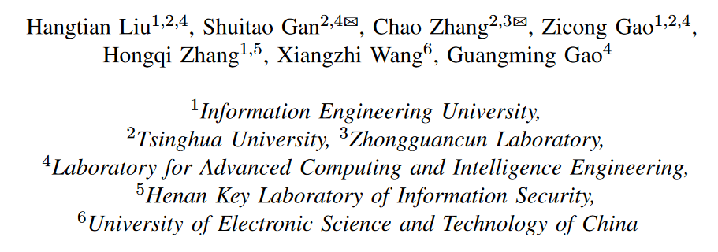
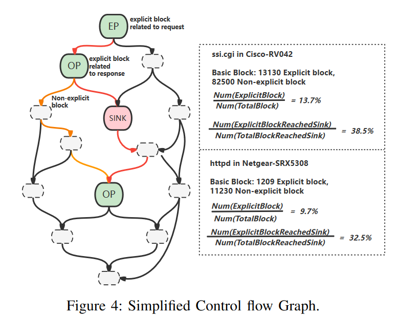
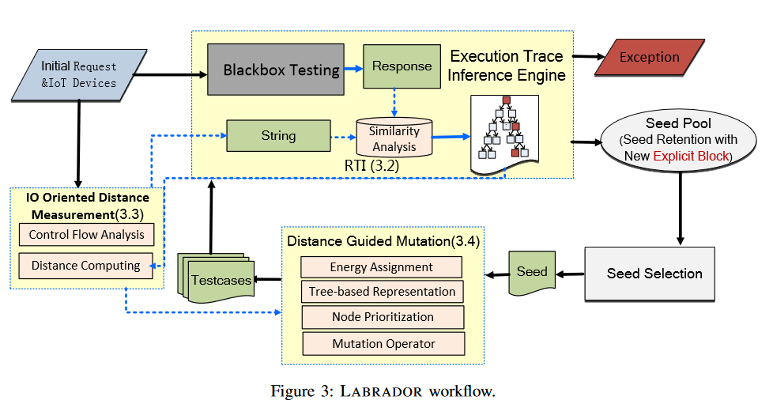
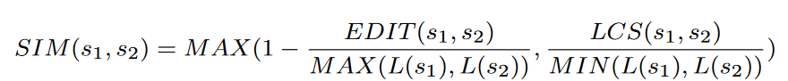
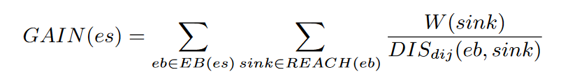
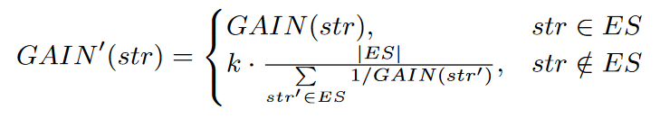
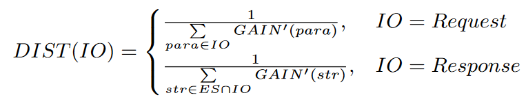
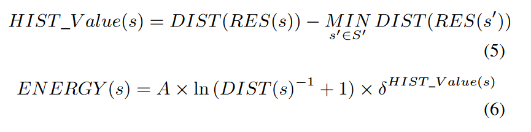
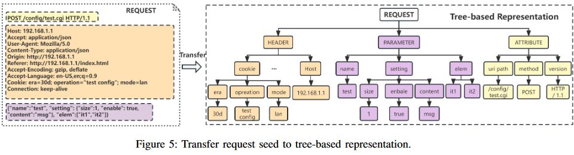
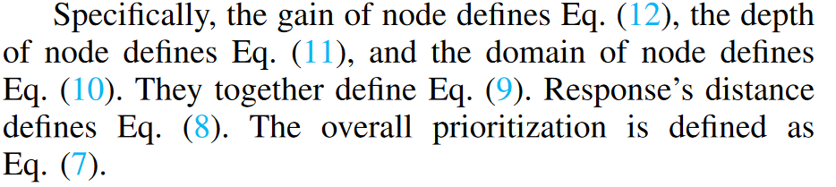

# LABRADOR: Response Guided Directed Fuzzing for Black-box IoT Devices
利用IoT web service 的response中包含有显示字符串来作为fuzz的指导，进而尝试解决IoT设备黑盒fuzz的挑战。**本文的黑盒貌似是能获得固件并进行静态分析得到其CFG的，但是不能进行插桩等操作直接得到固件内部的执行情况，相较于完全黑盒还是差了一点**。

[原文链接](https://ieeexplore.ieee.org/document/10646723)

## 作者信息

## Abstract

Fuzzing is a popular solution to finding vulnerabilities in software including IoT firmware. However, due to the challenges of emulating or rehosting firmware, some IoT devices (e.g., enterprise-level devices) can only be fuzzed in a black-box manner, which makes fuzzers blind and inefficient due to missing feedbacks (e.g., code coverage or distance). In this paper, we present a novel response guided directed fuzzing solution LABRADOR, able to test black-box IoT devices efficiently. Specifically, we leverage the network response to infer the execution trace of firmware and deduce the code coverage of testing. Second, we leverage the test case (i.e., request) and its response to estimate the distance to the target sensitive code (i.e., sink). Lastly, we further leverage the distance to guide test case mutation, which efficiently drives directed fuzzing toward candidate vulnerable code. We have implemented a prototype of LABRADOR and evaluated it on 14 different enterprise-level IoT devices. Results showed that LABRADOR significantly outperforms state-of-the-art (SOTA) solutions. It finds 44X more vulnerabilities than SNIPUZZ, BOOFUZZ and FIRM-AFL and 8.57X more vulnerabilities than SaTC. In total, it discovered 79 unknown vulnerabilities, of which 61 were assigned with CVEs.

## Background

### Web Interface of IoT Device
在物联网设备中，存在一个与物联网设备进行交互的接口：Web serves，这个接口是和物联网设备进行交互的主要途径之一，由前端-后端组成，采用人机交互模式(详见附录A)，需要引入大量自然语言属性来表示request所需参数或者response，以便人类可读。由此可见，后端其中一部分功能就是“接收消息-解析（处理）消息-输出消息”，在这些过程中，遍布着许多人类直接可读的*显式字符串*，同时后端的二进制代码中，可能会存在*显式的block*（超过50%）和*显式的function*（接近70%）。

### Execution Trace Inference
从前面可以知道：web interface能够导致显式字符串出现在response中，而这些显式字符串在处理过程中会经过后端二进制的block，由此可以得到“explicit string --- block”的对应关系，进而可以尝试利用字符串来推断程序具体执行到了哪些block、execution trace。

### IO Oriented Distance Measurement
Fuzz guide的目的是希望能探索到目标代码块，本文提出了一个基于IO的距离推测方式，其中从request推断出的explicit block称为EP，从reponse推断出的explicit block称为OP，目标代码块/function（一般可能为dangerous）称为SP（sink point）。具体方法是在简化过后的CFG上进行距离测算，其中简化是指在这个CFG图中，只包含EP, OP, SP和一些其他连接的blocks。

## Design
### Overview

### Response-based Execution Trace Inference
要让response之类的成为引导，首先第一步是尝试利用response推测出他的执行路径。在本文作者的实证研究中，他们探索了40个web back-end binaries，发现exclipit block占14.3%，explicit function占35.8%，而能够到达的dangerous calls占62.2%。上述数据表明能够尝试利用相应中的显式字符串来推断explicit blocks。

#### Execution Trace Interence
推断执行路径的前提就是推测出经历的block set，本文采用字符串的相似度分析进行推断，分别推断字符串和response的相似度以及和code block的相似度，具体有两种推算方式：

1. 两个字符串长度相似时，利用编辑距离推断相似度（EDIT）；
2. 两个字符串长度显著区别但包含相同显式字符串时，利用最长子字符串计算相似度（LCS）。

最终得到的相似度SIM如下：

而得到显式字符串的方式就是利用静态分析后端二进制代码中的parsing和disassembling operations。

### IO Oriented Distance Measurement
紧接着就是利用IO来测量与目标SP的距离。首先需要利用静态控制流分析并与request、response、sink无关的节点后得到SCFG。

#### Control Flow Analysis
对于给定的一个初始时静态分析得到的inter-process CFG，首先需要利用相似度分析对每个basic block标记属性(EP、OP、SP、other)，然后利用可达性分析排除掉那些无关、不可达的，得到SCFG。其中inseure function一般会作为SP，这些函数都是人工经验得来。有时函数名字会发生改变，一样利用相似度分析进行推断。

#### Distance Computing
得到了要检测的SCFG后，推断距离来看种子的价值。对于给定的种子，从两个角度来计算
1. 从request到sink；此时为静态分析，即在实际执行之前就能推算出距离，是用来推算种子的潜在价值。
2. 从response到sink；此时为动态分析，需要在实际执行之后才能推算，用来获得更准确的deal，并帮助LABRADOR及时更新评估。

上述公式描述了某个种子在经过的explicit block EB(es)和能够到达的sink REACH(eb)之间的距离。同时考虑到不同的sink可能会有不同的威胁程度，给每个sink赋予权重W(sink)

同样的，在request中可能还会有很多非显式字符串（non-explicit strings），也需要纳入到考虑中，此时得到的最终得分为：

最终，得到距离估计为：

### Distance Guided Mutation
有了上述的计算方式后，需要具体讨论如何利用这样的计算来引导fuzz
#### Energy Assignment
首先是种子的mutation power分配，其计算方式根据request的距离静态计算，再加上response的动态调整共同得到。最终计算公式为：

#### Tree-based Respresentation
这一步是将Request拆分成树状结构进行表示，这样能够知道那些字段是比较重要的。对于任何一个request，其可以被分为三种属性：header, parameter, attribute。其中1）header包括有例如content, type, cookie, user agent等的标准信息；2）parameter则是主要的fuzz对象；3）attribute包含有method, URI path, HTTP version等，有较低的变异优先级。

如上图所示，会表示成很多的节点，每个节点就代表了对应的token string in request，他们有两个属性：sink type和data type。其中sink type是可以到达sinks的相对脆弱的属性，可能会引入漏洞，用于选择在这些sinks上触发。而data type则是表示类似numeric, string or boolean等，用来引导变异策略

#### Node Prioritization
不是所有的节点都应该倾斜资源进行突变，其考虑的内容有：1）Gain of node. gain越大，优先级越高；2）Depth in the tree. 一般来说，越深的节点其能探索到的处理代码会更深；3）Domain in the tree. 对于不同的domain，其处理的部分应该是不一样的，需要单独进行考虑；4）Dynamic distance of response. 上面三种都是静态分析的方案，需要有动态的策略进行调整。通常来看，距离response越近，其优先级应该越高。其具体计算公式可以见原文：

#### How to Mutate
具体而言，有两种mutation operator等级：type和structure。
type operator根据节点的属性(包括接收和数据类型)修改节点的值。例如，如果接收类型是命令注入(CI)， LABRADOR倾向于将CI相关的有效payload嵌入到值中;如果数据类型是数字，LABRADOR倾向于将其更改为极端值，如0，-1或大数;
structure operator通过复制、添加、删除或替换子树来修改树的结构，对应于对请求参数的相同修改.