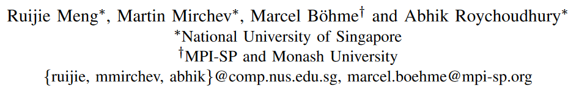
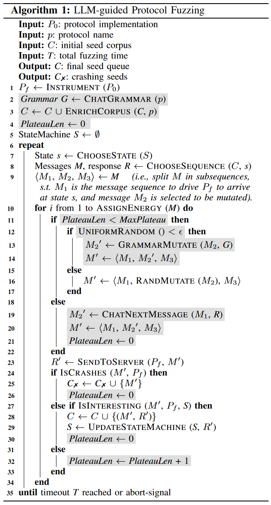
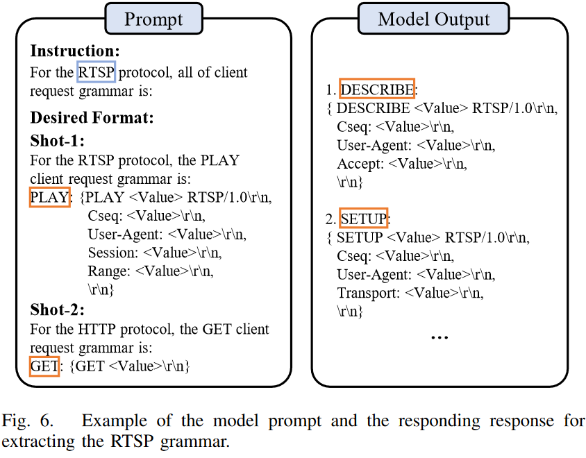
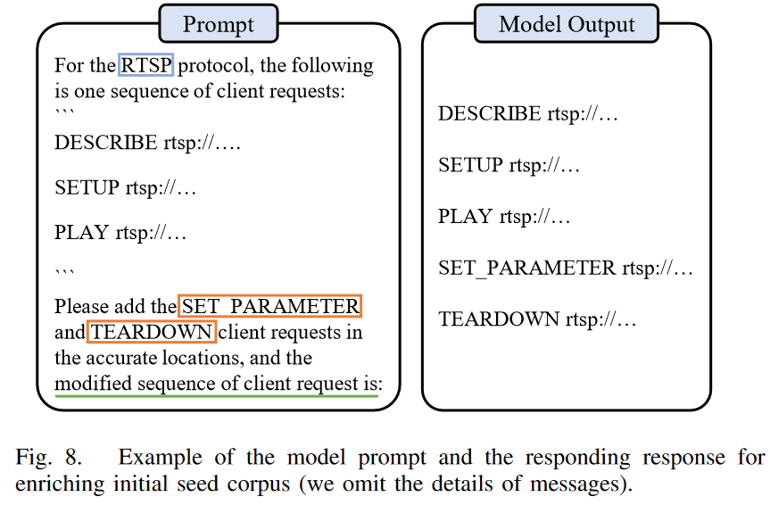
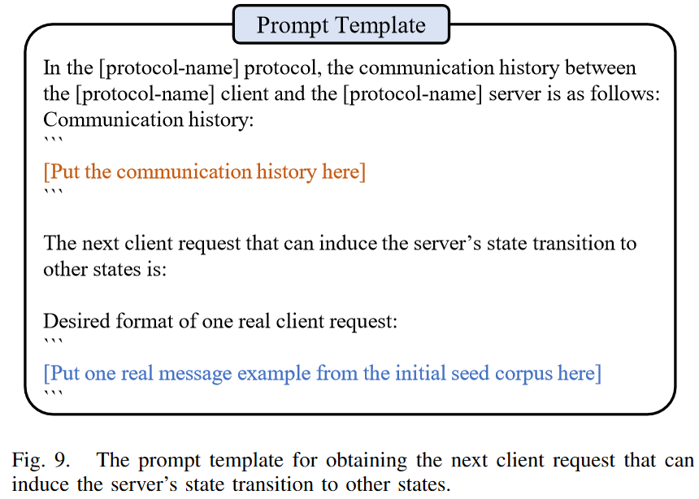

# Large Language Model guided Protocol Fuzzing
利用LLM来引导协议模糊测试的文章，其中LLM扮演的角色为：协议模板提取、初始种子多样化、fuzz阶段瓶颈期突破。整体来说是一个将LLM的总结提取、理解创建的特点用在了模糊测试过程中丰富语料库、测试样例生成方面。

[原文链接](https://www.ndss-symposium.org/ndss-paper/large-language-model-guided-protocol-fuzzing/)

## 作者信息

## Abstract
How to find security flaws in a protocol implementation without a machine-readable specification of the protocol? Facing the internet, protocol implementations are particularly security-critical software systems where inputs must adhere to a specific structure and order that is often informally specified in hundreds of pages in natural language (RFC). Without some machine-readable version of that protocol, it is difficult to automatically generate valid test inputs for its implementation that follow the required structure and order. It is possible to partially alleviate this challenge using mutational fuzzing on a set of recorded message sequences as seed inputs. However, the set of available seeds is often quite limited and will hardly cover the great diversity of protocol states and input structures.

In this paper, we explore the opportunities of systematic interaction with pre-trained large language models (LLMs), which have ingested millions of pages of human-readable protocol specifications, to draw out machine-readable information about the protocol that can be used during protocol fuzzing. We use the knowledge of the LLMs about protocol message types for well-known protocols. We also checked the LLM’s capability in detecting “states” for stateful protocol implementations by generating sequences of messages and predicting response codes. Based on these observations, we have developed an LLM-guided protocol implementation fuzzing engine. Our protocol fuzzer CHATAFL constructs grammars for each message type in a protocol, and then mutates messages or predicts the next messages in a message sequence via interactions with LLMs. Experiments on a wide range of real-world protocols from PROFUZZBENCH show significant efficacy in state and code coverage. Our LLMguided stateful fuzzer was compared with state-of-the-art fuzzers AFLNET and NSFUZZ. CHATAFL covers 47.60% and 42.69% more state transitions, 29.55% and 25.75% more states, and 5.81% and 6.74% more code, respectively. Apart from enhanced coverage, CHATAFL discovered nine distinct and previously unknown vulnerabilities in widely-used and extensively-tested protocol implementations while AFLNET and NSFUZZ only discovered three and four of them, respectively.

## Background
### Protocol Fuzzing
这一部分就不过多介绍了，协议模糊测试的目的就是检测已经设计好的协议中是否存在漏洞，比如可能会造成RCE。协议模糊测试也有两种，基于突变的、基于生成的，其中生成的通常是基于给定模板，突变是基于已有message sequence样例。

**Challenges**：

1. Dependence on initial seeds.
2. Unknown message structure.
3. Unknown state space.

### Large Language Models
关于大模型的基础部分不赘述了，主要是LLM具有text generation等能力，能够利用prompt工程将human readable text转换成mechine readable text or executable code，从而辅助fuzz。对应到上述的challenges中则可以尝试：1）让LLM利用给定的seed message sequence生成随机的message，*但是真的能够增加消息的多样性吗？* 2）让LLM对每种消息类型生成machine-readable information about message structure，*但与ground truth相比，这些语法有多好？能涵盖哪些message类型？* 3）让LLM在fuzzer和protocol implementation之间改变消息序列，进而可能可以探索新状态，*但是这真的能够帮助探索新状态吗？* 

### Case Study
上面提出了3个疑惑，接下来用实验去尝试解答，具体验证数据省略，这里直接放结论：

1. The LLM generates machine-readable information for the structures of all types of RTSP client requests that match the ground truth, although there is some stochasticity.
2. The LLM is able to generate accurate messages and has the capability to enrich the initial seeds.
3. Of the LLM-generated client requests, 69% to 89% induced a transition to a different state, covering all state transitions for each individual state.

## LLM-Guided Protocol Fuzzing
上述结论证明了LLM在这些方面是能做的，接下来介绍具体是怎么使用的（相关伪代码如图所示）

### Grammer-guided Mutation
LLM的其中一个能力就是提取语法，因此利用LLM提取协议的grammer，并进一步引导fuzz。具体分为如下两部分：

#### Grammer Extraction
提取Grammer这一部分就是prompt工程，和LLM交互的语法如下：

上述方法用到的也是in-context few-shot learning（在之前一篇文章中也有用到），其中in-context用来提供环境进行微调；few-shot用来限制LLM，让他提供合适结构的输出。需要注意的是，在实际使用过程中，有的时候可能你说让LLM提供所有的语法结构，但实际上LLM只提供一部分，此时只需要重复询问就行。

> In-context learning serves as an effective approach to fine-tuning the model. 

> Few-shot learning is utilized to enhance the context with a few examples of desired inputs and outputs.

#### Mutation based on Grammar
以前的一个文章是每次生成突变的工作都交给LLM进行，让LLM来决定接下来的内容；本文则是一次性的，让LLM生成语法结构后，在本地利用语法结构进行突变（减少交互，降低开销）。

### Enriching Initial Seeds
有时初始的语料库中可能有一部分的message是不包含的，因此可以让LLM尝试扩充。扩充时有如下3点挑战：
1. 如何生成携带正确上下文信息的新消息(例如，RTSP协议中正确的会话ID)?——意外的发现LLM能够自动理解这点，能够自动按照规范生成；
2. 如何最大化生成序列的多样性?——在之前的内容中，已经获取了所有类型message的grammer，因此可以直接利用这个生成requests，只需要判断缺少哪些类型的即可。判断这个相对比较容易，文章中是利用的正则表达式直接匹配判断；
3. 如何提示LLM从给定的种子消息序列生成整个修改后的消息序列?——这一段我没太看懂，就直接贴原文了
> As for Challenge (iii), to ensure the validity of the generated message sequence, we design our prompt in the continuation format (i.e., “the modified sequence of client requests is:”). In practice, the obtained responses can be directly utilized as the seeds, with the exception of removing the newline character (\n) at the beginning or adding any missing delimiters (\r\n) at the end. An illustrative example is presented in Figure 8. In this case, we instruct the LLM to insert two types of messages, “SET PARAMETER” and “TEARDOWN”, into the given sequence. The modified sequence is shown on the right.

### Surpassing Coverage Plateau
这一部分其实比较好理解，简单来说就是设置一个阈值（时间或者fuzz轮数），当一定时间/轮数内都没有引起crash或者是state/code coverage增加，则认为是到了一个平台期(plateau)，此时把当前的前序序列发给LLM，让LLM生成他认为能够引起coverage增加的一个message，此时认为这个生成的message就是突变过后的，喂给fuzzer。具体prompt工程如图：

## Conclusion
以上便是所有理论内容，实验验证部分可以看文章原文。协议模糊测试本身就是一个难题。与文件处理应用程序相比，要模糊化的输入以文件的形式给出，协议通常是涉及系统和环境之间持续交互的反应性系统。这带来了两个独立但相关的挑战: a) 为了探索导致崩溃的不寻常的深层行为，我们可能需要生成有效事件的复杂序列，b) 由于协议是有状态的，这也隐含地涉及在模糊活动期间的动态状态推断(因为不是所有的动作都可以在一个状态中启用)。此外，模糊的有效性在很大程度上取决于初始种子的质量，而初始种子是模糊生成的基础。

这项工作证明，对于具有公开可用rfc的协议，llm证明在丰富初始种子，启用结构感知突变和帮助状态推断方面是有效的。我们在广泛使用的PROFUZZBENCH套件的广泛协议上评估了CHATAFL。结果非常有希望:与基线工具相比，CHATAFL在更短的时间内覆盖了更多的代码并探索了更大的状态空间。此外，CHATAFL发现了9个零日漏洞，而基线工具只发现了其中的3到4个。