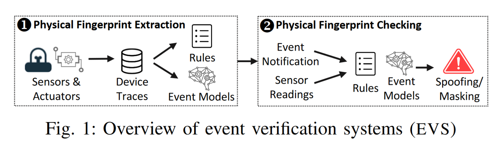
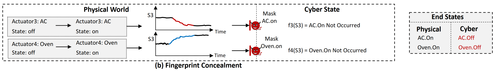
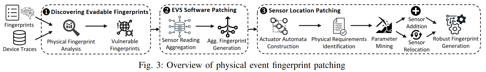
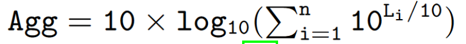

# Evasion Attacks and Defenses on Smart Home Physical Event Verification

一篇的文章，依旧是Z. Berkay Celik的团队做的，[原文链接](https://www.researchgate.net/publication/364562061_Evasion_Attacks_and_Defenses_on_Smart_Home_Physical_Event_Verification)

## 1. Information

**Author**: Muslum Ozgur Ozmen, Ruoyu Song, Habiba Farrukh, and Z. Berkay Celik

**Company**: Purdue University

**Publisher**: NDSS

**Year**: 2023

**Abstract**: In smart homes, when an actuator’s state changes, it sends an event notification to the IoT hub to report this change (e.g., the door is unlocked). Prior works have shown that event notifications are vulnerable to spoofing and masking attacks. In event spoofing, an adversary reports to the IoT hub a fake event notification that did not physically occur. In event masking, an adversary suppresses the notification of an event that physically occurred. These attacks create inconsistencies between physical and cyber states of actuators, enabling an adversary to indirectly gain control over safety-critical devices by triggering IoT apps. To mitigate these attacks, event verification systems (EVS), or broadly IoT anomaly detection systems, leverage physical event fingerprints that describe the relations between events and their influence on sensor readings. However, smart homes have complex physical interactions between events and sensors that characterize the event fingerprints. Our study of the recent EVS, unfortunately, has revealed that they widely ignore such interactions, which enables an adversary to evade these systems and launch successful event spoofing and masking attacks without getting detected. 

&emsp;In this paper, we first explore the evadable physical event fingerprints and show that an adversary can realize them to bypass the EVS given the same threat model. We develop two defenses, EVS software patching and sensor placement, with the interplay of physical modeling and formal analysis, to generate robust physical event fingerprints and demonstrate how they can be integrated into the EVS. We evaluate the effectiveness of our approach in two smart home settings that contain 12 actuators and 16 sensors when two different state-of-the-art EVS are deployed. Our experiments demonstrate that 71% of their physical fingerprints are vulnerable to evasion. By incorporating our approach, they build robust physical event fingerprints, and thus, properly mitigate realistic attack vectors.

## 2. Contributions

* 提出了一种算法，通过分析物理事件指纹(event fingerprints)是否能被其他事件的影响所包含或掩盖，来发现可逃避的fingerprints。
* 针对躲避攻击(Evasion Attack)，作者开发了两种防御方案，即EVS software patching和sensor location patching。Software patching是将新的物理指纹引入EVS的一种自动化方法。Sensor location patching是一种基于设计的安全(security-by-design)方法，与Software patching互补，它生成传感器位置，确保物理指纹对一个事件是唯一的。
* 通过部署在两个智能家庭中的两个独立的EVS评估作者的防御能力，这两个EVS共有12个actuator和16个sensor。作者的评估表明，71%的物理指纹容易受到Evasion Attack，作者的系统可以成功地阻止所有的攻击。
* 作者实验的系统发布在了[github](https://github.com/purseclab/EVS_Evasion)。<u>（目前好像是不能看，404了）</u>

## 3. Background

### 3.1. Event Spoofing and Masking Attacks

智能家居通常会有一个IoT hub作为控制中心，其能掌控着所有的IoT设备。在这里主要考虑两个部分：sensors和actuators。

* sensor: 该器件会周期性的测量物理通道，并输出（记录）下物理通道的数值（这个数值有两种，一个是读数，还有一个是bool型的变量如开/关）；
* actuators: 负责执行命令，从而对物理通道产生影响。

在本文中，event的定义是：通过物联网应用程序触发的执行器状态变化，即用户与执行器的直接物理交互或者配套应用程序和虚拟助手等用户界面。

先前的研究中发现智慧家居对于event spoofing和masking这两种攻击方式是脆弱的：

* Event Spoofing: 攻击者伪造某个event发生，但实际上没有发生；
* Masking: 攻击者掩盖某个event的发生，即event实际上发生了，但是被攻击者掩盖了；

以上两种攻击方式最终会造成<u>物理实际</u>和<u>IoT hub保存状态</u>的不一致。

### 3.2. Event Verification System（EVS）

为了对上述的攻击进行防护，先前有研究提出了EVS系统，该系统利用fingerprint进行保护。根据如何生成fingerprints，系统可以分为两种类型：Rule-based EVS(R-EVS)和ML-based EVS(ML-EVS)。这两个类型的EVS都分为如下图两个阶段：

1. **Physical Fingerprint Extraction.**这个阶段EVS需要收集每一个event对应的sensor的读数。

   * R-EVS: 以event(E)及其对sensor读数(S)的影响之间的统计相关性的形式从收集到的trace中提取规则，如`Rule: light-on --- {S1.Illum = High, S2.Illum = High}`。考虑到读数可能会受到环境的影响，直接用读数作为rule中的一部分会很冗杂，R-EVS经常将数值传感器测量映射为二元(如high/low或increase/decrease)，或者映射到几种类别(如high/medium/low)。
   * ML-EVS: 对每个event利用从sensor读数中提取的feature学习出一个模型。比如对于`light-on`这个event，提取光线传感器中的feature(max, mean, sum, stdev)进行学习。同样为了考虑环境噪声的影响，ML-EVS使用smoothing filters和signal processing(如moving averavge)的方式来降低噪声影响。

2. **Physical Fingerprint Checking.**EVS最终是使用刚刚形成的fingerprint进行两种攻击检测，具体如下：

   * R-EVS: 当收到相应的event notification时检查是否符合相应的rule。

     如：为了检查spoofing，当收到了`light-on`消息时，R-EVS会检查光线传感器S1和S2的读数看是否受到攻击（如果读数有偏差，则认为实际上应该没有执行`light-on`，也就是遭到了spoofing）。为了检查masking，R-EVS会定期查看sensor的读数，如果S1、S2读数变成了High，但是没有收到`light-on`的消息，则会认为是masking attack。

   * ML-EVS: 为了检查spoofing，ML-EVS根据学习到的事件模型，从运行时传感器读数预测物理事件是否发生。如果收到通知，但模型预测这个事件没有发生，则认为是spoofing；为了检查masking，他们持续从传感器读数中提取特征。如果事件模型预测发生了一个物理事件，但是没有收到它的通知，则认为是masking。

## 4. Threat Model

### 4.1. EVS Threat Model

在EVS的威胁模型中，他们假设攻击者可以实施的攻击有:event spoofing和event masking。攻击者可以通过(1) 影子设备（即用程序模拟真实设备，使得攻击者能够使用从真实设备偷来的credential远程与IoT hub进行通讯。偷取方式：官网上公开的数据或者是脆弱的IoT APP）和(2) 病毒App（这个APP可以利用物联网编程框架中的设计漏洞，不注入命令对物理设备控制，而是偷偷地执行spoofing或masking）。

之前的工作都认为sensor是可信的，原因有如下两点：

1. 许多传感器定期向集线器发送读数，这就要求攻击者不断地掩盖真实传感器的读数并欺骗注入的值；
2. 已经提出了各种系统来检测传感器攻击。然而如果攻击者能够欺骗所有事件和传感器读数，那么所有攻击都变得微不足道，因为攻击者可以逃避事件验证和传感器欺骗检测系统。

### 4.2. Threat Model of This Work

攻击者的目标是通过欺骗和掩盖事件而不被发现来逃避EVS。为此，作者假设攻击者可以<u>被动地嗅探智能家居通信，而不拦截或注入任何信息</u>。攻击者可以<u>通过现有的物联网网络分析工具，通过未加密或加密的设备通信实时识别事件</u>，这使得攻击者确定实施攻击的时间，最大限度地提高他们躲避EVS的可能性。为了确定要欺骗或掩盖某个事件，攻击者可以<u>预测事件对传感器测量的物理影响，并相应地欺骗或掩盖事件</u>。

## 5. Three Evasions

对于现有的EVS防御措施，有如下三种情况会无法检测。

### 5.1. Fingerprint Encapsulation

产生攻击的根本原因是一个事件(Ei)对传感器的影响包含了另一个事件(Ej)的影响。从形式上讲，当满足如下条件时R-EVS很容易受到这种攻击:

对于ML-EVS，如果Ej的指纹模型预测Ej已经在Ei物理发生时发生，则会发生这种攻击。

### 5.2. Fingerprint Concealment

如果R-EVS中有两个规则，其中这两个规则对相同的sensor产生相反的影响。当对手掩盖这些事件的任何通知时，R-EVS无法检测到，因为规则中的预期传感器值没有得到满足。虽然可以布置多个传感器来测量事件，但R-EVS通常不会在其规则得到部分满足时发出警报，以尽量减少误报。

在ML-EVS中，由于两个事件的影响相互抵消，则可能会产生对一个或者两个的事件都预测的是`event-not-occured`，此时就会存在威胁。

### 5.3. Fingerprint Indistinguishability

类似于第一种攻击方式，此时二者影响完全相同，此时R-EVS无法区分两个events。

对于ML-EVS也类似。

### 5.4. Aggregated Evasion Attacks.

在具有不同传感器和执行器的复杂智能家居中，多个事件对传感器读数的聚合(联合)影响也可能满足或隐藏事件的指纹，使对手能够进行逃避攻击。

对于ML-EVS也类似。

## 6. Solution: Physical Event Fingerprint Patching

### 6.1. Discovering Evadable Fingerprints

#### Fingerprint Satisfaction Analysis(Evasion1 and Evasion3)

* R-EVS：对于待检测event，检查其他单独或聚合的事件规则是否相同或封装了待检测事件的规则（伪代码3-4行）。为此，作者定义了一个规则聚合函数(Aggr)，它接受单个事件规则作为输入，并输出它们的聚合：如果两个事件影响不同的传感器，Aggr将它们的规则进行聚合；如果两个事件影响同一个传感器的读数，Aggr将它们类别的数值范围相加（我的理解是将范围进行扩大，如[50,100]和[70,120]变成[50,120]。原文是：If two events influence the same sensor’s readings, Aggr sums the numerical ranges of their categories.）
* ML-EVS：对于待检测event，检查从其他单个事件或其聚合事件中提取的特征是否能够使得模型将待检测event评估成`event-occured`。该方式类似R-EVS，只是利用Aggf函数将所有的feature进行聚合。

#### Fingerprint Concealment Analysis(Evasion2)

* R-EVS：如果另一个事件或多个事件的聚合以相反的方式影响传感器的读数，作者将一个事件的规则识别为脆弱的(第7-8行)。作者定义Opp函数，该函数以多个规则作为输入，并输出是否第一个规则与其他规则相反。
* ML-EVS：通过检查被分析事件与其他事件的聚合特征是否评估为事件未发生(第9-10行)来识别脆弱事件。

### 6.2. EVS Software Patching

1. **Sensor Data Aggregation**：将EVS数据收集过程中收集到的传感器读数进行聚合，以确定多个事件发生时的预期传感器读数。利用这些读数来了解聚集的指纹来对抗Evasion。在R-EVS中，需要根据事件的聚合影响调整类别。在ML-EVS中，需要训练数据来学习聚合的事件模型。为了解决这个问题，作者定义了一个传感器读取聚合运算符(Aggs)，它计算事件对传感器的联合影响。

   通常情况下sensor的读数都是线性的，但是有的是log，此时就用如下公式进行聚合

   

   还有的可能是bool型，此时的Aggs计算方式和`or`相同。

2. 