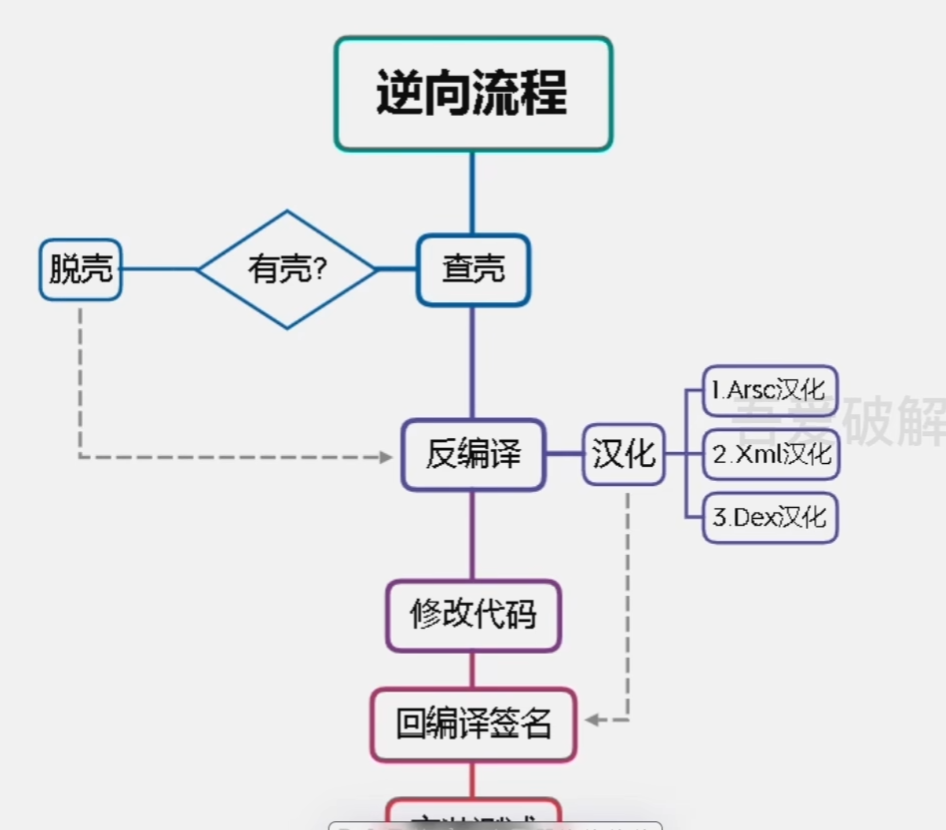

---

---

# 安卓逆向学习笔记

## 工具清单

* mt管理器：手机端上一个比较成熟的反编译工具（有的要会员）
* np管理器：类似mt，只是有的不用会员，交叉使用即可
* 开发者助手：可以用来查看界面资源

## 双开

一共有4种双开的原理

1. 修改包名

   原因：安卓开发中，以包名为唯一标识，即使内容一样，只要包名不同就会被认为是两个不同的东西。

   使用工具：mt管理器或者是np管理器即可。

   注意：但是此方法会改变应用的签名，如果厂商设置了签名检查，这种方法就失效了。

2. 修改Framework

   对于有系统修改权限的厂商，可以修改Framework来实现双开，如：小米自带多开

3. 通过虚拟化技术实现

   虚拟Framework层、虚拟文件系统、模拟Android对组件的管理、虚拟应用进程管理等一整套虚拟技术，将APK复制一份到虚拟空间中运行，例如：平行空间

4. 以插件机制运行

   利用反射替换，动态代理，hook 了系统的大部分与system- server进程通讯的函数， 以此作为“欺上瞒下”的目的，欺骗系统以为”只有一个apk在运行，瞒过插件让其“认为”自己已经安装。例如: VirtualApp 

## 汉化APK

