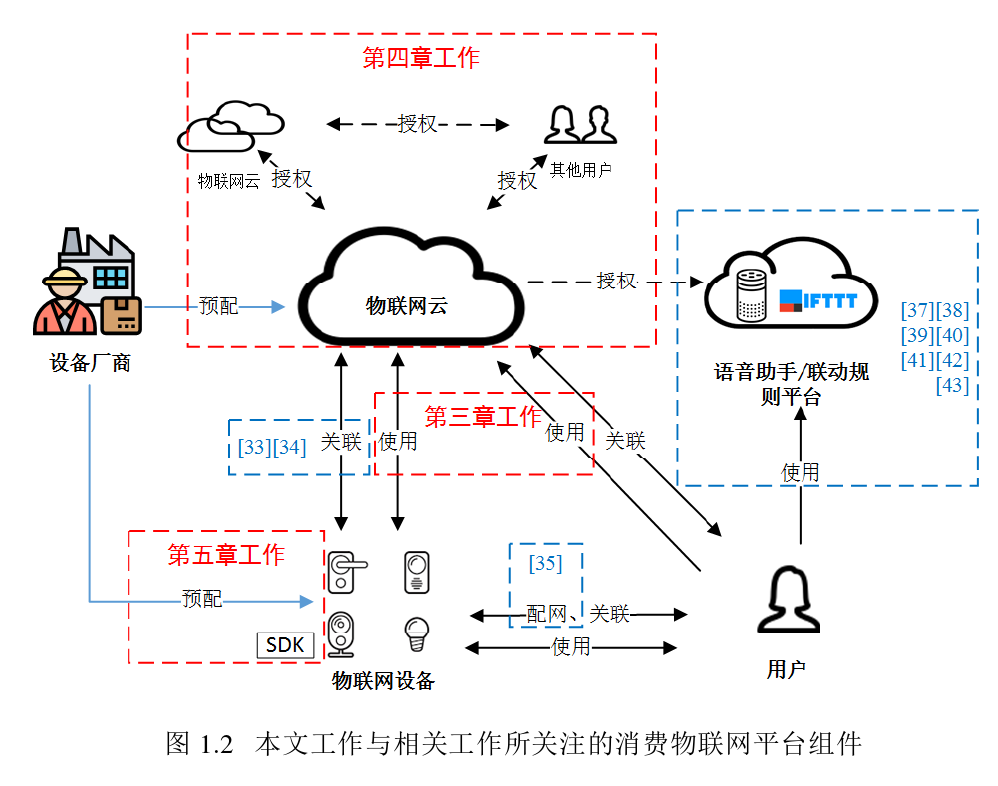

---

---

# 物联网平台关键组件安全研究

作者：贾岩

时间：2020年12月


## 文章贡献

1. 对消费物联网生态系统进行了总结与梳理。
2. 发现物联网平台在应用通用通信协议时的新安全问题，并提出了相应设计准则。
3. 发现物联网云间权限委派时的新安全问题，并实现了基于模型检测的半自动化漏洞检测工具。
4. 发现支持多管理通道的物联网设备的新安全问题，设计并实现了能够快速部署的临时解决方案。


## 缩略语对照表


## 第一章：绪论

```
物联网平台┬工业物联网（工业界应用）
		└消费物联网（消费者使用）┬联动规则平台(Trigger-action Platform)：让物联网设备根据预设规则自动化执行
				 			 └智能语音助手(Intelligent Virtual Assistant)：通常以智能音箱为载体，通过对话来控制智能家居设备
```

### 本文主要工作



本文工作重点关注物联网平台中尚未被广泛研究的关键组件，试图在实践中探索其中尚未被发现的安全问题。

本文所采取的工作的核心方法为实证研究(empirical study)，即通过观察和实验的经验事实来尝试揭示其中存在的安全问题。

### 结构安排


* 第三章关注关联完成后试用阶段用户、设备与云通信时由消息传输协议给访问控制功能带来的安全风险；介绍设备使用过程中物联网云平台部署MQTT协议时出现的新安全问题；
* 第四章关注物联网云与云间授权过程和用户授权过程的访问控制安全风险；
* 第五章关注设备厂商生产配置物联网设备时使用多设备管理通道引入的访问控制安全风险。

### 文章贡献

1. 对消费物联网生态系统进行了梳理和总结；
2. 发现物联网平台在应用通用协议时的新安全问题，并提出响应设计准则；
3. 发现了多个物联网云间权限委派时的新安全问题，设计并实现了针对该类问题基于模型检测的半自动化检测工具VerioT；
4. 发现了支持多管理通道的物联网设备的新安全问题，设计并实现了能够快速部署的临时解决方案CGuard。


## 第二章：消费物联网生态系统


* 用户：物联网设备直接使用者，通常是消费者。常见的用户有设备主人（所有者）和受人授权的临时用户；设备主人一般具有最高权限，并能随时撤销被授权人的权限。
* 厂商：设备厂商使用自己搭建的物联网平台，或使用其他第三方物联网平台提供的平台服务来构建解决方案，使设备接入物联网。
* 平台提供商：提供的服务包括云服务、接入云的协议方案、移动App开发模板、方便接入云的SDK等。


### 常见消费物联网技术架构


基于云的架构中，用户能远程控制物理网设备，通常云会接收用户使用控制台发来的命令，并在安全验证之后将指令发送到对应的物联网设备，物联网设备通常会配置云的域名或证书，**直接信任云端发送来的指令并执行，不再执行额外的安全检查。**

由于互联网不是每时每刻都很可靠，因此没有互联网参与的基于网关架构和用户控制台与设备直连通信架构也得到广泛支持。此模式的通信内容仅存在于本地网络中，提供了更好的隐私性，且在这种架构中，网关、设备本身承担起了相关的安全验证功能。


### 设备生命周期


1. 预配阶段：厂商在物联网平台云端对设备进行注册和设置，包括型号、权限、包含的功能等；同时，厂商将物联网平台提供的SDK集成进生产的设备中，进行相应的配置，如配置证书、云端节点、设备身份等。此外，用户还需要注册相应账号，一般还需要下载对应的App进行控制。
2. 关联阶段：一般情况下，用户在使用设备之前需要设备与自己的账户进行关联，具体可分为如下两步
   1. 对设备进行完网络配置使设备接入Internet；
   2. 设备、移动App和云三者进行交互，建立用户与设备的访问控制关系（也称绑定）；
   3. 使用阶段：用户通过控制台操控和查看自己的设备。有时用户还可以临时分享设备的访问权给其他用户，并随时取消分配的权限。甚至用户还可以将设备的权限分享至其他平台服务提供商。
   4. 在物理网设备的所有权需要转让或者设备主人放弃使用该设备时，用户需要进行解绑操作。


### 物理网平台简介

#### 通用型物联网平台

通用型物联网平台提供面向各种应用的物联网平台服务，包括终端认证、通信协议、云端访问控制、设备状态管理、后续数据分析处理等。由于平台设计为通用目的，因此厂商需要自行配置云端的访问控制策略等更具体的内容。平台提供商提供的设备SDK实现基本的通信功能，通常没有应用层的语义，设备厂商还需要自定义消息内容。该类平台能够被设备厂商定制来适应各种应用场景，如工业、农业等多个领域。

#### 智能家居物联网平台

智能家居是消费物联网中最具代表性的应用场景，物联网平台提供商专门为此应用设计了智能家居物联网平台。智能家居平台提供的服务通常包括了通用型平台的基本内容，但是为智能家居在应用层提供了更具体的标准，并封装了SDK，使得不同设备厂商能够更便捷地将传统家用电器变成智能家居设备。

通常，厂商接入此类平台需要经过与平台提供商洽谈并通过认证。通过认证之后厂商可以在平台中配置自己的设备，使用平台提供的SDK开发自己的设备并接入到平台的生态系统。

注意：平台提供商通常为用户提供统一的App，用户使用该App即可管控接入此生态系统中的任何厂商的设备。当然平台也支持厂商自行开发兼容的App。

#### 服务型物联网平台

上述两种类型的平台通常包含对设备和用户的认证与访问控制等核心功能，直接参与管理设备。此外，有些物联网平台只提供辅助的控制、自动化等服务，本文称其为服务型物联网平台，包括智能语音助手和联动规则平台。该类物联网平台专门针对消费物联网中智能家居领域特有的用户需求设计。

* 智能语音助手使得用户可以通过语音对智能家居设备进行控制。
* 联动规则平台允许用户设置自动化规则来控制不同厂商的物联网设备。

语音助手服务或联动规则平台的云- -般通过直接管理物联网设备的云控制设备，而非直接与设备通信，因此，该类平台无需给厂商设备提供SDK，仅提供了服务器之间的授权机制和其他业务API供厂商使用。用户需要在使用阶段将设备的权限通过OAuth等协议授权给语音助手服务云或联动规则平台。


## 第三章：物联网云平台消息传输协议安全风险分析

物联网云平台通常基于已有的通信协议来构建，如HTTP、AMQP、MQTT等，但是MQTT最初在设计时没有考虑到存在敌手的情况，仅提供了简单的认证机制，所有的保护机制都需要物联网云平台提供商自己开发。经研究发现，物联网平台对MQTT协议定制的安全措施普遍存在安全隐患，使得攻击者能够利用设计中的漏洞开展如下攻击：

1. 非法远程控制目标设备；
2. 窃取用户隐私信息，例如作息规律、位置、同居者等；
3. 大规模拒绝服务；
4. 伪造设备状态。

经评估，这些攻击将带来非常严重的后果，如通过收集平台上所有设备产生的时间信息，进而获取用户的个人可识别信息(Personally identifiable information, PII)。


### 相关工作

报告[56]发现公共网络中的MQTT服务器缺乏基础的认证和授权机制，敌手能随意地连接并订阅任何主题；

报告[57]也同样发现大量没有保护的MQTT服务器，经过对采集到的流量数据进行分析，还发现MQTT协议客户端与服务器软件库中的实现问题。


### 背景


云作为中心负责管理设备和App通信，云中部署有Message broker，用来转发指令、设备装状态。厂商只需要使用云提供的SDK进行简单配置，即可以实现开发、“入云”。整个系统中，云担任着保护用户与设备交互安全的核心功能，例如对设备和App（用户）进行认证与权限检查。


​        MQTT协议是一种低功耗、低带宽占用的即时通讯协议，在物联网中应用较广。其通讯方式为“发布——订阅”模式，位于OSI中的应用层，位于TCP/IP或者其他可靠的连接之上，如WebSocket。在这种模式中，发布者按照某种类型发布信息，而非直接发给接收方，接收方则根据需求选择接收（订阅）某类消息。

某个示例：


建立传输层连接 --> MQTT客户端（物联网设备和App）发送CONNECT至消息代理来建立一个MQTT会话（类似于HTTP中的cookie），MQTT会话被CONNECT消息中的ClientId字段唯一标识。ClientId仅在第一个CONNECT消息中携带，建立会话以后物联网设备通过发送SUBSCRIBE给消息代理来订阅其“关联主题“。整个MQTT的通信过程依赖于四个重要实体：身份（ClientId）、消息、主题、会话。因此需要对这四个进行保护。


### 物联网云平台的安全措施

#### 认证机制

MQTT可以工作与WebSocket和TLS之上，提供了认证上的方便；同时不同云平台会有不同的认证措施，或提供其他服务。

* Web认证机制。

  利用MQTT处于应用层的特点，使用Web技术中的认证机制在客户端开启MQTT会话之前就进行认证。如AWS IoT会在WebSocket建立连接时利用HTTP的cookie等信息进行认证。

* 客户端证书。

  在物联网设备出厂时内置一个受信证书，在建立TLS连接时使用TLS客户端认证模式来对客户端进行认证（验证证书）

* MQTT认证。

  利用MQTT协议在开始连接时CONNECT连接中的username和password机制进行认证。

#### 授权机制

由于MQTT是“发布——订阅“模式工作，因此要限制物联网设备只能够被授权用户访问，就需要限制客户端所能访问的”主题“，即限制其访问能力（如果某个客户端的能力没能够被限制，则会出现越权访问）。

不同的平台会提供不同粒度的能力来定制相应安全策略，有的云平台提供商提供了灵活的策略配置功能，允许厂商完全自定义每个终端访问哪些个具体的主题，如AWS IoT；有的平台提供安全策略模板，设备厂商只能基于特定预设模板进行配置，如IBM Waston IoT；还有的提供商对厂商屏蔽了具体细节，自动根据设备身份进行主题分配。


### 威胁模型

本章所有攻击假设敌手能够像普通用户一样注册设备厂商和物联网平台提供商的账号，并且**能逆向分析自己的设备和App终端软件，获得终端与云之间的通信流程**。但是，敌手不能获取其他用户(受害者)拥有的App和设备与云之间的通信内容，不能进行网络层的数据篡改和中间人攻击。受害者(设备主人)没有安装受攻击者控制的恶意移动App，目标设备的固件没有受到敌手篡改，云服务器向所有用户提供平等可信的服务。


## 一些准备后续查阅的文献

* 文献25：分析智能家居平台Samsung SmartThings并发现权限粒度过粗的访问控制设计问题
* 文献26-28
* 文献31：研究国内的JoyLink的安全和隐私问题
* 文献32：基于云的设备与用户绑定关系建立过程……
* 文献33：研究了物联网设备、移动App和云之间的交互流程，并重点关注了三者状态机相关的安全问题
* 文献34：配网过程


* 文献[25,26,29,30,33,37,62,63]对物联网平台系统开展了广泛的研究